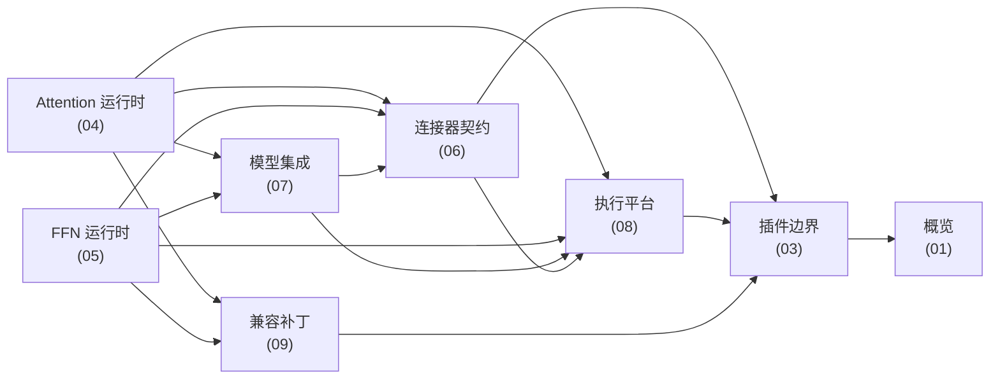

# Architecture

本页给出 AFD 插件的整体分层、模块地图、关键设计原则、入口点注册流程与跨层依赖方向。定位与支持矩阵见 [概览](01-Overview.md)，各层细节见后续页面。

## 整体分层

依赖方向：**角色/模型层 → 共享边界层 → 平台/兼容层 → 原生算子**。插件边界层是最低共享层，不得反向 import 设备运行时依赖（`docs/design/module/plugin_boundary.md:50`）。

```text
┌──────────────────────────────────────────────────────────────────────┐
│ 插件边界层  register_afd() 入口点  (afd_plugin/__init__.py)              │
│   配置: config.py / config_utils.py / validation.py / envs.py         │
└──────────────────┬───────────────────────────────────────────────────┘
                   │
┌──────────────────▼─────────────────────┐  ┌──────────────────────────┐
│ 角色运行时层  afd_plugin/v1/worker/     │  │ 模型层  model_executor/    │
│   GPU: attention/ffn worker+runner      │◄─►│  models/deepseek_v2.py     │
│        + cuda_graph / dbo / ubatch      │  │  forward_context.py        │
│   NPU: v1/worker/npu/*                  │  │  models/npu/* 变体         │
└──────────────────┬─────────────────────┘  └──────────────────────────┘
                   │  send/recv hidden states
┌──────────────────▼───────────────────────────────────────────────────┐
│ 连接器层  afd_plugin/connectors/  +  afd_plugin/distributed/            │
│   base.py(契约) factory.py metadata.py                                 │
│   gpu/p2p.py   npu/camp2p.py   npu/async_cam.py                        │
└──────────────────┬───────────────────────────────────────────────────┘
                   │
┌──────────────────▼─────────────────────┐  ┌──────────────────────────┐
│ 平台/兼容层  compat/                     │  │ 原生算子  csrc/            │
│   vllm.py 版本门禁                       │  │  csrc/npu: a2e/e2a ACLNN   │
│   npu/* Ascend 运行时兼容                │  │  csrc/gpu: 预留            │
│   patches/* 上游补丁 (PATCH START/END)   │  │                            │
└────────────────────────────────────────┘  └──────────────────────────┘
```

## 模块地图

| 层 | 目录 / 关键文件 | 职责与一行说明 |
| --- | --- | --- |
| 插件边界 | `afd_plugin/__init__.py` | `register_afd()` 入口点、`_DEEPSEEK_MODEL_REGISTRATIONS` 模型映射、模块级 `__getattr__` 惰性导出 |
| 插件边界 | `afd_plugin/config.py` | `AFDConfig` frozen dataclass、`SUPPORTED_AFD_*` 白名单、`_ALIASES` 兼容别名、`parse_afd_config`/`validate_afd_config` |
| 插件边界 | `afd_plugin/config_utils.py` | `coerce_extra_bool`/`coerce_extra_int` 类型归一化辅助 |
| 插件边界 | `afd_plugin/validation.py` | worker FQCN 常量、`afd_worker_qualname_for_platform_default` 自动选 worker、`assert_compatible_afd_stack` 栈校验 |
| 插件边界 | `afd_plugin/envs.py` | 诊断/调度环境变量名（`AFD_FORCE_BALANCED_TOPK_IDS` 等）与布尔 helper |
| 角色运行时 (GPU) | `afd_plugin/v1/worker/attention_worker.py` | `AFDAttentionWorker`（继承 vLLM `Worker`） |
| 角色运行时 (GPU) | `afd_plugin/v1/worker/attention_model_runner.py` | `AFDAttentionModelRunner`（继承 `GPUModelRunner`） |
| 角色运行时 (GPU) | `afd_plugin/v1/worker/ffn_worker.py` | `AFDFFNWorker`（继承 `Worker`） |
| 角色运行时 (GPU) | `afd_plugin/v1/worker/ffn_model_runner.py` | `GPUFFNModelRunner`（FFN 侧 runner） |
| 角色运行时 (GPU) | `afd_plugin/v1/worker/cuda_graph.py` | `AFDCUDAGraphPolicy`/`AFDGraphRunMode`，仅 `FULL_DECODE_ONLY` |
| 角色运行时 (GPU) | `afd_plugin/v1/worker/dbo.py` | Dual-Batch Overlap yield 自定义 op 注册 |
| 角色运行时 (GPU) | `afd_plugin/v1/worker/ubatch_wrapper.py` | `AFDUBatchWrapper`（继承 `UBatchWrapper`） |
| 角色运行时 (GPU) | `afd_plugin/v1/worker/__init__.py` | `_RUNTIME_EXPORTS` 惰性类路径导出表 |
| 角色运行时 (NPU) | `afd_plugin/v1/worker/npu/attention_worker.py` | `AFDNPUAttentionWorker` |
| 角色运行时 (NPU) | `afd_plugin/v1/worker/npu/attention_model_runner.py` | `AFDNPUAttentionModelRunner` |
| 角色运行时 (NPU) | `afd_plugin/v1/worker/npu/ffn_worker.py` / `ffn_model_runner.py` | NPU FFN worker 与 runner |
| 角色运行时 (NPU) | `afd_plugin/v1/worker/npu/forward_context.py` | NPU forward context |
| 角色运行时 (NPU) | `afd_plugin/v1/worker/npu/npu_ubatch_wrapper.py` / `ubatching.py` / `ubatch_utils.py` | NPU ubatch 封装与工具 |
| 角色运行时 (NPU) | `afd_plugin/v1/worker/npu/pcp_debug.py` | NPU 调试辅助 |
| 连接器 | `afd_plugin/connectors/base.py` | `AFDConnectorBase`/`AFDControlPlane`/`ConnectorExtraInfo` 核心契约 |
| 连接器 | `afd_plugin/connectors/factory.py` | `AFDConnectorFactory` 名称→实现惰性注册表 |
| 连接器 | `afd_plugin/connectors/metadata.py` | 传输数据结构族（`AFDDPMetadata`、`AFDA2FTransferPayload` 等） |
| 连接器 (GPU) | `afd_plugin/connectors/gpu/p2p.py` | `P2pNcclAFDConnector`（CUDA 同步 NCCL P2P） |
| 连接器 (NPU) | `afd_plugin/connectors/npu/camp2p.py` | `CAMP2pAFDConnector`（Ascend 同步 HCCL/CAMP2P） |
| 连接器 (NPU) | `afd_plugin/connectors/npu/async_cam.py` | `CAMAsyncAFDConnector`（Ascend 异步 DP） |
| 分布式 | `afd_plugin/distributed/afd_process_group.py` | AFD 专用进程组 |
| 分布式 | `afd_plugin/distributed/topology.py` | rank 排布（FFN ranks 排在 Attention ranks 之前）与 P2P 拓扑校验 |
| 模型层 | `afd_plugin/model_executor/models/deepseek_v2.py` | `AFDDeepseek*ForCausalLM` 包装类，按角色构造/加载组件 |
| 模型层 | `afd_plugin/model_executor/models/forward_context.py` / `model_utils.py` | forward context 与模型工具 |
| 模型层 (NPU) | `afd_plugin/model_executor/models/npu/deepseek_v2_async_cam_forward.py` | 异步 CAM forward 变体 |
| 模型层 (NPU) | `afd_plugin/model_executor/models/npu/deepseek_v2_attention_gate.py` | Attention 侧 gate 计算变体（`compute_gate_on_attention`） |
| 平台/兼容 | `afd_plugin/compat/vllm.py` | `TARGET_VLLM_VERSION="0.19.1"` 版本门禁 |
| 平台/兼容 | `afd_plugin/compat/npu/runtime.py` / `runtime_config.py` | Ascend 运行时与运行时配置兼容 |
| 平台/兼容 | `afd_plugin/compat/npu/ops.py` / `forward_context.py` | Ascend 算子绑定与 forward context |
| 平台/兼容 | `afd_plugin/compat/npu/profiler.py` / `feature_validation.py` | profiler 栈切换与特性校验 |
| 平台/兼容 | `afd_plugin/compat/npu/__init__.py` | `ensure_afd_ascend_ops_loaded` / `apply_afd_ascend_patches_if_needed` |
| 兼容补丁 | `afd_plugin/compat/patches/async_dp_engine.py` | 异步 DP engine 上游补丁 |
| 兼容补丁 | `afd_plugin/compat/patches/async_dp_forward_context.py` | 异步 DP forward context 上游补丁 |
| 兼容补丁 | `afd_plugin/compat/patches/config_validation.py` | 配置校验上游补丁 |
| 兼容补丁 | `afd_plugin/compat/patches/engine_core.py` | engine core 上游补丁 |
| 兼容补丁 (NPU) | `afd_plugin/compat/patches/npu/ascend_platform.py` / `force_load_balance.py` | Ascend 平台与强制负载均衡补丁 |
| 原生算子 | `csrc/npu/a2e/` | Attention→Expert/FFN AscendC 算子（`op_host`+`op_kernel`） |
| 原生算子 | `csrc/npu/e2a/` | Expert/FFN→Attention AscendC 算子 |
| 原生算子 | `csrc/npu/aclnn_torch_adapter/` | NPUBridge/NPUStorageImpl，把 ACLNN 接入 torch |
| 原生算子 | `csrc/npu/torch_extension/` | torch binding |
| 原生算子 | `csrc/npu/build.sh` / `build_aclnn.sh` / `CMakeLists.txt` | Ascend 算子构建脚本 |
| 原生算子 | `csrc/gpu/` | GPU 原生源预留位 |

## 关键设计原则

原则摘自 `AGENTS.md`，并结合代码体现：

1. **优先继承/组合而非补丁**。AFD 行为优先通过继承 vLLM model runner/worker 或组合自有组件实现（如 `AFDAttentionWorker(Worker)`、`AFDUBatchWrapper(UBatchWrapper)`）；补丁仅在必要时使用，存放于 `afd_plugin/compat/patches/` 与 `afd_plugin/compat/patches/npu/`（`AGENTS.md:110`）。
2. **补丁必须标注且签名对齐上游**。每处 AFD 差异用 `# ### PATCH START: ...` / `# ### PATCH END: ...` 标注；补丁函数签名与返回类型须与上游完全一致，新增参数需在函数上方注释中说明；补丁函数上方须有注释说明补丁原因与改动行为（`AGENTS.md:90`）。补丁基于固定 vLLM/vLLM-Ascend tag 开发，升级时复制新上游函数并重新应用标记差异（`AGENTS.md:101`）。
3. **直接访问上游属性**。使用 vLLM/vLLM-Ascend 数据结构时直接访问其函数与成员变量，避免 `getattr`/`hasattr`，以便 mypy/pyright 在上游改名/缺失时尽早暴露（`AGENTS.md:64`）。例如 `assert_compatible_afd_stack` 直接读 `parallel_config.worker_cls`（`afd_plugin/validation.py:127`）。
4. **无魔法数字**。用描述性命名的常量替代裸数字，如 `TARGET_VLLM_VERSION`（`afd_plugin/compat/vllm.py:12`）、`SUPPORTED_AFD_ROLES`（`afd_plugin/config.py:22`）。
5. **描述性命名**。类 `PascalCase`（`AFDAttentionModelRunner`），函数/变量 `snake_case`，常量 `ALL_UPPER_CASE`；命名描述功能而非实现细节（`AGENTS.md:54`）。
6. **避免新可变全局**。依赖通过参数显式传递；仅允许 `ALL_UPPER_CASE` 常量与不可变配置对象。`register_afd()` 中的 `_registered` 是受控的注册状态守卫，非业务可变状态。

## 入口点与注册流程

入口点 `afd = "afd_plugin:register_afd"`（`pyproject.toml:46`）指向 `register_afd()`（`afd_plugin/__init__.py:66`）。该函数进程内幂等，由 `_registered` 守卫。按顺序：

| 步骤 | 行号 | 行为 | 失败策略 |
| --- | --- | --- | --- |
| 1 | `__init__.py:75` | 已注册则直接返回 | no-op |
| 2 | `__init__.py:80` | 用 `find_spec("vllm")` 探测 vLLM；不存在则标记完成并返回 | 保留 CPU-only 可用 |
| 3 | `__init__.py:86` | `assert_vllm_version_supported(strict=False)` 版本检查 | 仅 debug 日志，继续 |
| 4 | `__init__.py:96` | import 四个核心兼容补丁：`async_dp_engine`、`async_dp_forward_context`、`config_validation`、`engine_core` | 尽力而为，同一 try 块 |
| 5 | `__init__.py:107` | `register_dbo_yield_custom_op()` 注册 DBO yield 自定义 op | 尽力而为，debug 日志 |
| 6 | `__init__.py:117` | `apply_afd_ascend_patches_if_needed()`；若探测到 `vllm_ascend` 再 import `force_load_balance` 补丁 | 尽力而为（CUDA 进程无需 Ascend） |
| 7 | `__init__.py:130` | 遍历 `_DEEPSEEK_MODEL_REGISTRATIONS`，向 vLLM `ModelRegistry.register_model("AFD"+arch, cls)` 注册 AFD 模型架构 | 必需：失败则抛出，`_registered` 保持 false |
| 8 | `__init__.py:133` | 标记 `_registered = True` | 后续调用 no-op |

注意第 4 步四个补丁共享一个 `try` 块，早期 import 失败可能跳过后续补丁造成部分应用；这是当前 best-effort 策略的已知特性（`docs/design/module/plugin_boundary.md:95`）。补丁风险与细节见 [兼容补丁](09-Compatibility-Patches.md)，模型映射见 [模型集成](07-Model-Integration.md)，Attention/FFN 运行时见 [Attention 运行时](04-Attention-Runtime.md) 与 [FFN 运行时](05-FFN-Runtime.md)。

## 跨层依赖方向

依赖从角色/集成模块流向共享边界；平台与兼容模块把边界适配到上游运行时。低层文档不得依赖角色实现（`docs/design/module/index.md:52`）。



要点：连接器契约是角色间 handoff 的汇聚点；平台/兼容层在角色、模型、连接器之下提供 CUDA/NPU 机制与上游适配；插件边界是所有上层的公共底座。数据如何在角色与连接器间流转见 [数据流](10-Data-Flow.md)，构建/打包/测试见 [构建打包测试](11-Build-Packaging-Tests.md)，术语见 [术语表](12-Glossary.md)。
