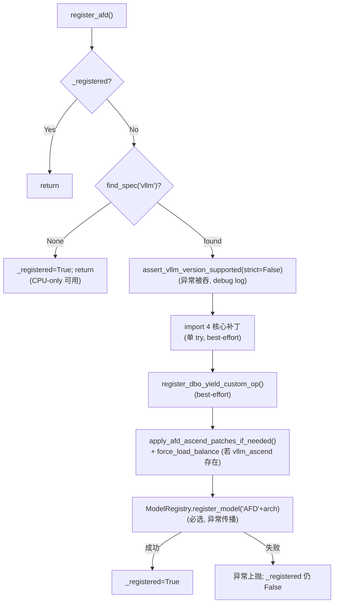

# 插件边界与配置

> 本页覆盖 AFD 插件的**入口点注册、配置形状与解析、校验体系、worker 自动选择、版本
> 门禁**，以及配置补丁在边界层挂的钩。补丁实现细节留给
> [09-Compatibility-Patches](09-Compatibility-Patches.md)；worker 运行时细节留给
> [04-Attention-Runtime](04-Attention-Runtime.md) 与 [05-FFN-Runtime](05-FFN-Runtime.md)。

"插件边界"是 AFD 最低的共享层：注册入口、公共类路径路由、AFD 配置与校验、CPU 安全
导入。它**不得**在 CPU 安全路径上导入 vLLM/CUDA/Ascend 设备运行时——这条不变量
（设计文档 `ENTRY-INV-001`）是本页一切设计的出发点。核心源码集中在
`afd_plugin/__init__.py`、`afd_plugin/config.py`、`afd_plugin/config_utils.py`、
`afd_plugin/validation.py`、`afd_plugin/envs.py`、`afd_plugin/compat/vllm.py`。

---

## 入口点机制

### entry point 声明

AFD 通过 vLLM 的 `vllm.general_plugins` 入口点组注册，声明在 `pyproject.toml`：

```toml
[project.entry-points."vllm.general_plugins"]
afd = "afd_plugin:register_afd"
```

- `pyproject.toml:45-46` 定义入口点 `afd = "afd_plugin:register_afd"`。
- `pyproject.toml:32` `dependencies = []`：包**无任何强制运行时依赖**。
- `pyproject.toml:36-37` vLLM 是可选 extra `vllm = ["vllm==0.19.1"]`；`pyproject.toml:34`
  注释：vLLM 故意保持 optional，让 macOS / CPU-only 开发机能跑 import/config 测试。

vLLM 启动时经 `load_general_plugins()` 枚举该入口点组并调用 `register_afd()`。

### 无 vLLM 安全 no-op 设计

`register_afd()` 的 docstring（`afd_plugin/__init__.py:67-72`）说明 vLLM 不可导入时
函数仍安全。实现见 `afd_plugin/__init__.py:80-83`：

```python
if importlib.util.find_spec("vllm") is None:
    _logger.debug("AFD plugin: vLLM not found, skipping runtime registration")
    _registered = True
    return
```

用 `importlib.util.find_spec("vllm")` 仅探测、不 import。vLLM 不存在时直接标记
`_registered = True` 返回。因此 macOS / CPU-only / 无 vLLM wheel 的机器上，
`import afd_plugin`、`afd_plugin.config`、`afd_plugin.validation` 均可正常工作，
`register_afd()` 被调用也不会因缺 vLLM 让宿主进程崩溃。这是"插件边界层 CPU 安全"的
核心保证：配置解析、校验、worker qualname 选择都不依赖设备运行时，从而能在无
GPU/NPU 的 CI 上跑单元测试。

### register_afd 注册步骤拆解

`register_afd()` 定义于 `afd_plugin/__init__.py:66-133`，进程内由模块级 `_registered`
（`afd_plugin/__init__.py:45`）做幂等保护。按源码顺序：

| 步骤 | 行号 | 行为 | 失败策略 |
| --- | --- | --- | --- |
| 0. 幂等守卫 | 74-77 | `_registered` 已 True 则 debug 日志后返回 | no-op |
| 1. vLLM 探测 | 80-83 | `find_spec("vllm") is None` → 标记完成并返回 | CPU-only 用法保持可用 |
| 2. 版本校验 | 85-93 | `assert_vllm_version_supported(strict=False)` | 异常被 `except Exception` 吞掉，仅 debug 日志，继续注册 |
| 3. 兼容补丁 | 95-104 | import 四个核心补丁：`async_dp_engine`、`async_dp_forward_context`、`config_validation`、`engine_core` | **单个 `try` 包裹**，任一 import 失败则整块跳过 |
| 4. DBO yield op | 106-114 | `register_dbo_yield_custom_op()` | best-effort，失败仅 debug 日志 |
| 5. Ascend 补丁 | 116-126 | `apply_afd_ascend_patches_if_needed()`；若 `find_spec("vllm_ascend") is not None` 再 import `force_load_balance` | best-effort；CUDA-only 进程不需 Ascend |
| 6. 模型架构注册 | 128-131 | 遍历 `_DEEPSEEK_MODEL_REGISTRATIONS`，`ModelRegistry.register_model("AFD"+arch,...)` | **必选**——异常向上传播，`_registered` 保持 False |
| 7. 标记完成 | 133 | `_registered = True` | — |



**步骤 3 风险点**：四个补丁模块共用一个 `try`（`afd_plugin/__init__.py:95-104`），靠前
的 `import` 抛异常会使排在后面的同样被跳过，可能造成补丁集合不完整。设计文档标记为
best-effort，需由受影响的运行时测试验证。补丁细节见
[09-Compatibility-Patches](09-Compatibility-Patches.md)。

**步骤 2 用 `strict=False` 的容错原因**：`register_afd()` 作为 general plugin 在 vLLM
启动早期被调用，若此处 raise 会直接中断 vLLM 进程启动——包括不用 AFD 的普通负载。故
版本不匹配时只发 `RuntimeWarning` 不 raise，让 vLLM 继续启动；硬校验留给后续配置校验
与 worker 装配（见下文"版本门禁"）。

### 模型注册表

`_DEEPSEEK_MODEL_REGISTRATIONS`（`afd_plugin/__init__.py:47-63`）映射上游架构名到
AFD 包装类，注册时统一加 `AFD` 前缀（`afd_plugin/__init__.py:131`）：

| 上游架构名 | AFD 注册名 | 目标类（`afd_plugin.model_executor.models.deepseek_v2`） |
| --- | --- | --- |
| `DeepseekForCausalLM` | `AFDDeepseekForCausalLM` | `AFDDeepseekForCausalLM` |
| `DeepseekV2ForCausalLM` | `AFDDeepseekV2ForCausalLM` | `AFDDeepseekV2ForCausalLM` |
| `DeepseekV3ForCausalLM` | `AFDDeepseekV3ForCausalLM` | `AFDDeepseekV3ForCausalLM` |
| `DeepseekV32ForCausalLM` | `AFDDeepseekV32ForCausalLM` | 复用 `AFDDeepseekV3ForCausalLM` |
| `GlmMoeDsaForCausalLM` | `AFDGlmMoeDsaForCausalLM` | `AFDGlmMoeDsaForCausalLM` |

详情见 [07-Model-Integration](07-Model-Integration.md)。

### 惰性导出 `__getattr__`

模块级 `__getattr__`（`afd_plugin/__init__.py:15-30`）把重量级运行时类的 import 推迟到
首次属性访问：

- `AFDAttentionModelRunner` / `AFDAttentionWorker` / `AFDFFNWorker` /
  `AFDUBatchWrapper` / `GPUFFNModelRunner` → 延迟 `from afd_plugin.v1 import worker`
  （`afd_plugin/__init__.py:16-25`）。
- `assert_compatible_afd_stack` → 延迟 `from afd_plugin.validation import ...`
  （`afd_plugin/__init__.py:26-29`）。

顶层 `__init__.py` import 阶段只 `from afd_plugin.config import ...`
（`afd_plugin/__init__.py:12`），而 `config.py` 自身不 import vLLM 运行时——这是 CPU
安全导入链的根。`__version__`（`afd_plugin/__init__.py:33-41`）三级回退
（`version()` → `setuptools_scm` → `"0.0.0+unknown"`），也不依赖 vLLM。

---

## 配置形状与解析

### canonical 配置形状

AFD 配置唯一入口是 vLLM 的 `VllmConfig.additional_config`，插件只读其中 `"afd"` 子键
（`AFD_ADDITIONAL_CONFIG_KEY = "afd"`，`afd_plugin/config.py:18`）。README
（`README.md:235-249`）给出的 canonical 形状：

```json
{
  "afd": {
    "role": "attention",
    "connector": "P2pNcclAFDConnector",
    "host": "127.0.0.1",
    "port": 1239,
    "num_attention_ranks": 2,
    "num_ffn_ranks": 1,
    "afd_role_rank": 0,
    "compute_gate_on_attention": false,
    "connector_extra_config": {}
  }
}
```

`async_dp` 未出现在示例中（默认 `False`）。`connector_extra_config` 是信封键，
**不存储在 `AFDConfig` 上**（见下文）。

### AFDConfig 字段

`AFDConfig` 是 `@dataclass(frozen=True)`（`afd_plugin/config.py:38-64`）：

| 字段 | 类型 | 默认值 | 含义 | 行号 |
| --- | --- | --- | --- | --- |
| `connector` | `str` | `P2pNcclAFDConnector` | 连接器工厂名，取自 `SUPPORTED_AFD_CONNECTORS` 白名单 | 48 |
| `async_dp` | `bool` | `False` | 是否启用 AFD async-DP 运行时补丁；当前仅对 `CAMAsyncAFDConnector` 合法 | 50 |
| `role` | `AFDRole`=`Literal["attention","ffn"]` | `"attention"` | 本进程角色：attention 发 hidden states，ffn 收 | 52 |
| `port` | `int` | `1239` | connector rendezvous/控制端口 | 54 |
| `host` | `str` | `127.0.0.1` | connector rendezvous/控制主机 | 56 |
| `num_attention_ranks` | `int` | `1` | 拓扑中 attention 角色组 rank 数 | 58 |
| `num_ffn_ranks` | `int` | `1` | 拓扑中 ffn 角色组 rank 数 | 60 |
| `afd_role_rank` | `int` | `0` | 本进程在其角色组内 rank | 62 |
| `compute_gate_on_attention` | `bool` | `False` | 是否在 attention 侧算 MoE gate 再发 ffn；当前实现仅 NPU 路径使用 | 64 |

只读兼容属性（字段别名 getter）：`afd_connector`（67-68）、`afd_role`（70-72）、
`afd_port`（74-76）、`afd_host`（78-80）。角色判定 `is_attention_server`（82-84）、
`is_ffn_server`（86-88）。`compute_hash()`（90-100）对 `connector / async_dp / role /
num_attention_ranks / num_ffn_ranks` 取 `sha256`，用于影响计算图的配置指纹——实现细节，
非完整序列化。`validate()`（102-103）委托模块级 `validate_afd_config`。

白名单常量：`SUPPORTED_AFD_ROLES=("attention","ffn")`（22）；
`SUPPORTED_AFD_CONNECTORS=("P2pNcclAFDConnector","CAMP2pAFDConnector","CAMAsyncAFDConnector")`
（23-27），其中 `AFD_ASYNC_CONNECTOR="CAMAsyncAFDConnector"`（19）。

### 别名 `_ALIASES`

`_ALIASES`（`afd_plugin/config.py:29-35`）把遗留键归一到 canonical 键：

| 别名 | 归一到 |
| --- | --- |
| `afd_connector` | `connector` |
| `afd_role` | `role` |
| `afd_port` | `port` |
| `afd_host` | `host` |
| `async` | `async_dp` |

> `async_dp_engine.py:19` 补丁注释仍写作 `additional_config["afd"]["async"]`，指的是
> 别名；canonical 键是 `async_dp`。

归一在 `_normalize_mapping`（`afd_plugin/config.py:106-155`）完成，规则：
1. 逐键查 `_ALIASES`（行 112）；`connector_extra_config` 走单独分支（113-117，见下文）。
2. 未知键直接 `ValueError`（118-123），提示 "put connector-specific values under
   'connector_extra_config'"。
3. **别名与 canonical 同时出现则 `ValueError`**（124-128）：如同时给 `afd_role` 和
   `role`，报 "duplicate AFD config field for 'role'"。
4. 类型强转：`async_dp` 经 `coerce_extra_bool`（131-135）；`port /
   num_attention_ranks / num_ffn_ranks / afd_role_rank` 经 `coerce_extra_int`
   （137-147）；`compute_gate_on_attention` 经 `coerce_extra_bool`（149-153）。

强转助手 `afd_plugin/config_utils.py`：`coerce_extra_bool`（8-24）接受 bool / int(0,1)
/ 字符串 `"1"|"true"|"yes"|"on"` / `"0"|"false"|"no"|"off"`；`coerce_extra_int`
（35-45）拒绝 bool 与 float 再 `int()`；另有 `coerce_extra_positive_int`（48-54）、
`coerce_optional_extra_positive_int`（57-66）、`coerce_extra_str`（27-32）。

### connector_extra_config 严格校验路径

`connector_extra_config` 是**信封键**：`_normalize_mapping` 遇到它时单独取出
（`afd_plugin/config.py:113-117`），要求必须是 `Mapping`，存入返回元组第二项，**不**
放进传给 `AFDConfig(**...)` 的字典。因此 `AFDConfig` dataclass 无此字段。

两条独立解析路径：
- `afd_config_from_mapping`（158-173）：只取第一项构造 `AFDConfig`，丢弃 connector extra。
- `connector_extra_config_from_mapping`（176-182）：只取第二项返回 `dict`，供连接器工厂
  后续做 typed 校验。`connector_extra_config_from_source`（261-265）对应 source 版本
  （source 可能是 `VllmConfig` 或 `Mapping`）。

连接器构造时由各自 parser 把 `connector_extra_config` 解析成 typed `ConnectorExtraInfo`：
P2P 只接受空 mapping；CAMP2P 与 CAM async 各有封闭 typed schema 并拒绝未知字段。详细
schema 属于 [06-Connectors](06-Connectors.md)。

设计文档（`docs/design/module/plugin_boundary.md:142-143`）提到"former `afd_extra_config`
alias and untyped `extra_config` field are no longer accepted"——已由源码确认：
`_normalize_mapping` 无任何对这两个遗留名的处理，会落入未知键 `ValueError`。

### source 抽象与解析入口

`_additional_config_from_source`（`afd_plugin/config.py:185-199`）接受 `Mapping` 直接
用，否则读 `source.additional_config`；`None` / 非 `Mapping` 各有明确报错。
`_afd_raw_from_source`（202-213）在此基础上取出 `additional_config["afd"]` 并校验其为
`Mapping`。

对外解析函数：

| 函数 | 行号 | 行为 |
| --- | --- | --- |
| `has_afd_config(source)` | 216-220 | 仅判断 `"afd"` 键是否存在（不校验） |
| `parse_optional_afd_config(source, *, validate=True, expected_role=None)` | 223-238 | 有则解析+（可选）校验，无则返回 `None` |
| `parse_afd_config(source, ...)` | 241-258 | 必选版本：`None` 时 `ValueError` `'AFD config requires additional_config["afd"]; omit it to disable AFD'` |
| `is_afd_active(source)` | 268-271 | = `parse_optional_afd_config(source, validate=True) is not None`（既存在又通过校验才算激活） |
| `is_afd_async_dp(vllm_config)` | 274-287 | 轻量选择器：`validate=False` 解析后判断 `async_dp and connector==AFD_ASYNC_CONNECTOR`；用于 import 期 async-DP 补丁 gating |

**激活语义**（设计文档 `CFG-INV-001`）：`additional_config["afd"]` 存在即激活信号；
`is_afd_active` 进一步要求通过 common 校验。运行时角色侧用 `parse_afd_config`（缺失就
报错）。要禁用 AFD 只需省略该键。

---

## 校验体系

`validate_afd_config`（`afd_plugin/config.py:290-344`）是 CPU 安全的纯值校验（docstring
强调 "without importing vLLM or CUDA modules"），按源码顺序检查：

| # | 校验项 | 行号 | 失败信息风格 |
| --- | --- | --- | --- |
| 1 | `role` ∈ `SUPPORTED_AFD_ROLES` | 297-300 | `AFD role must be one of (...), got ...` |
| 2 | 若给定 `expected_role`，`role` 必须等于它 | 301-304 | `AFD role mismatch: expected ..., got ...` |
| 3 | `connector` ∈ `SUPPORTED_AFD_CONNECTORS` | 305-309 | `AFD connector must be one of (...), got ...` |
| 4 | `async_dp=True` ⇒ `connector == AFD_ASYNC_CONNECTOR` | 310-313 | `AFD async mode requires connector='CAMAsyncAFDConnector'` |
| 5 | `connector=="P2pNcclAFDConnector"` ⇒ P2P topology 校验 | 314-322 | 委托 `afd_plugin.distributed.validate_p2p_topology` + `topology_from_config`（延迟 import，保持 CPU 安全） |
| 6 | `host` 非空 | 323-324 | `AFD host must be non-empty` |
| 7 | `0 < port < 65536` | 325-326 | `AFD port must be in 1..65535, got ...` |
| 8 | `num_attention_ranks > 0` | 327-330 | `num_attention_ranks must be positive, got ...` |
| 9 | `num_ffn_ranks > 0` | 331-334 | `num_ffn_ranks must be positive, got ...` |
| 10 | `0 <= afd_role_rank < rank_count`（rank_count 取自 p2p topology 或对应 role 数） | 336-344 | `afd_role_rank must be within this role's rank count (rank=..., count=...)` |

错误信息风格统一：英文短句，直接点出期望与实际值，不包含设备/平台上下文（因为是 CPU
安全层）。校验项 5 的 `validate_p2p_topology` 会进一步检查 P2P 拓扑约束（如
`num_attention_ranks` 须 ≥ `num_ffn_ranks` 且整除），细节属于
[06-Connectors](06-Connectors.md)。

校验项 10 的 `rank_count`：若走了 P2P topology 路径（项 5 产出的 `p2p_sizes`），则用
`p2p_sizes[0]`（attention）或 `p2p_sizes[1]`（ffn）；否则直接用
`config.num_attention_ranks` / `config.num_ffn_ranks`。

---

## Worker 自动选择

### FQCN 常量

`afd_plugin/validation.py:15-29` 定义了所有 worker / model runner 的 fully-qualified
class name：

| 常量 | 值 | 行号 |
| --- | --- | --- |
| `ATTENTION_WORKER_FQCN` | `afd_plugin.v1.worker.AFDAttentionWorker` | 15 |
| `FFN_WORKER_FQCN` | `afd_plugin.v1.worker.AFDFFNWorker` | 16 |
| `ATTENTION_MODEL_RUNNER_FQCN` | `afd_plugin.v1.worker.AFDAttentionModelRunner` | 17 |
| `FFN_MODEL_RUNNER_FQCN` | `afd_plugin.v1.worker.GPUFFNModelRunner` | 18 |
| `UBATCH_WRAPPER_FQCN` | `afd_plugin.v1.worker.AFDUBatchWrapper` | 19 |
| `NPU_ATTENTION_WORKER_FQCN` | `afd_plugin.v1.worker.npu.AFDNPUAttentionWorker` | 20 |
| `NPU_FFN_WORKER_FQCN` | `afd_plugin.v1.worker.npu.AFDNPUFFNWorker` | 21 |
| `NPU_ATTENTION_MODEL_RUNNER_FQCN` | `afd_plugin.v1.worker.npu.AFDNPUAttentionModelRunner` | 22-24 |
| `NPU_FFN_MODEL_RUNNER_FQCN` | `afd_plugin.v1.worker.npu.AFDNPUFFNModelRunner` | 25 |
| `VLLM_GPU_WORKER_FQCN` | `vllm.v1.worker.gpu_worker.Worker` | 26 |
| `VLLM_ASCEND_NPU_WORKER_FQCN` | `vllm_ascend.worker.worker.NPUWorker` | 27 |
| `VLLM_ASCEND_310P_WORKER_FQCN` | `vllm_ascend._310p.worker_310p.NPUWorker310` | 28 |
| `VLLM_ASCEND_XLITE_WORKER_FQCN` | `vllm_ascend.xlite.xlite_worker.XliteWorker` | 29 |

### 平台默认 worker 选择

`afd_worker_qualname_for_platform_default`（`afd_plugin/validation.py:70-99`）按平台
normalized worker qualname 选择对应 AFD worker：

| 条件 | 返回 | 行号 |
| --- | --- | --- |
| `is_cuda` 且平台 worker == `VLLM_GPU_WORKER_FQCN` | `expected_worker_qualname(role)` → `AFDAttentionWorker` / `AFDFFNWorker` | 80-81 |
| `device_type=="npu"` 且平台 worker == `VLLM_ASCEND_NPU_WORKER_FQCN` | `expected_npu_worker_qualname(role)` → `AFDNPUAttentionWorker` / `AFDNPUFFNWorker` | 82-86 |
| `device_type=="npu"` 且平台 worker ∈ {310P, Xlite} | **`ValueError`**：AFD 只支持标准 Ascend A2/A3 NPUWorker | 87-95 |
| 其余 | **`ValueError`**：`AFD automatic worker selection does not support the current platform: ...` | 96-99 |

辅助函数 `normalize_qualname`（32-33）把 `:` 分隔符统一成 `.`；`expected_worker_qualname`
（54-59）与 `expected_npu_worker_qualname`（62-67）按 role 映射到对应 FQCN，未知 role 报
`ValueError`。

310P（`NPUWorker310`）和 Xlite（`XliteWorker`）报错信息（91-94）明确说"AFD automatic
worker selection supports only the standard Ascend A2/A3 NPUWorker"。

### assert_compatible_afd_stack

`assert_compatible_afd_stack`（`afd_plugin/validation.py:102-159`）是运行时装配时的最终
一致性校验，用 duck typing（docstring 112-113 说明单测/本地 CPU 开发无需构造真实
`VllmConfig`）：

| 步骤 | 行号 | 检查内容 |
| --- | --- | --- |
| 1. 解析必选配置 | 118 | `parse_afd_config(vllm_config, expected_role=expected_role)`；缺失则报错 |
| 2. 判定 async 强制 NPU | 121-125 | 若 `connector=="CAMAsyncAFDConnector"`，`async_expected_worker = expected_npu_worker_qualname(role)` |
| 3. worker_cls 必须是字符串 | 127-132 | 非 str 报 `parallel_config.worker_cls must be a qualname string (got type ...)` |
| 4. 拒绝残留 `"auto"` | 133-138 | `worker_cls.strip()=="auto"` 报 `parallel_config.worker_cls remained 'auto' after AFD config normalization; ensure the AFD general plugin is loaded before VllmConfig is created` |
| 5. 计算 expected qualname | 140-144 | 优先级：`async_expected_worker` > `expected_worker_qualname_override` > `expected_worker_qualname(role)` |
| 6. 比对实际 vs 期望 | 145-157 | normalize 后不等则 `ValueError`，前缀区分 async（"CAMAsyncAFDConnector requires Ascend NPU worker class: "）与普通（"invalid worker class for AFD runtime stack: "），并提示 `remove --worker-cls to let AFD select it automatically, or pass --worker-cls {expected}` |

**"remained 'auto'" 报错含义**：`config_validation.py` 补丁会在 `VllmConfig.__post_init__`
里把 `"auto"` worker 替换成 AFD worker（见下文"配置补丁挂钩点"）。若到这里仍是
`"auto"`，说明补丁未生效——通常因为 general plugin 未在 `VllmConfig` 创建前加载。报错
信息直接给出修复方向。

### CAMAsyncAFDConnector 强制 NPU worker

步骤 2（121-125）是强制规则：`CAMAsyncAFDConnector`（async connector）将
`async_expected_worker` 设为 NPU worker qualname，**无论当前平台是 CUDA 还是 NPU**。
若用户在 CUDA 平台配了 `CAMAsyncAFDConnector`，步骤 6 会因期望 NPU worker、实际 GPU
worker 而报错，前缀为 "CAMAsyncAFDConnector requires Ascend NPU worker class: "。这从
边界层就阻断了"CUDA + async NPU connector"这种无意义组合进入设备初始化。

---

## 版本门禁

`afd_plugin/compat/vllm.py` 提供版本门禁：

- `TARGET_VLLM_VERSION = "0.19.1"`（`afd_plugin/compat/vllm.py:12`）。
- `_parse_release`（15-19）用正则取 `major.minor.patch`。
- `is_vllm_version_supported`（29-35）：installed 为 `None`（未装）返回 `False`；否则
  要求 `_parse_release(installed) == _parse_release(TARGET)`，即**精确匹配**三个版本号。
- `assert_vllm_version_supported(*, strict=True)`（38-50）：
  - 版本匹配 → 直接 return。
  - 不匹配 → 构造信息 `"AFD plugin currently supports exactly vLLM 0.19.1; installed
    vLLM version is ..."`。
  - `strict=True`（默认）：`raise RuntimeError`。
  - `strict=False`：`warnings.warn(message, RuntimeWarning, stacklevel=2)`，不 raise。

`register_afd()` 用 `strict=False`（`afd_plugin/__init__.py:88`），且整段包在
`try/except Exception`（85-93）里——连 `warnings` 之外的异常也吞掉只记 debug 日志。这
样即使版本检查自身崩溃也不影响 vLLM 启动。容错原因见上文：register_afd 作为 general
plugin 在 vLLM 启动早期运行，raise 会中断所有负载（含非 AFD）。

版本门禁是"软门禁"：它不阻止进程启动，只警告。真正的硬约束由后续的配置校验补丁
（`config_validation.py` 的 `_is_target_vllm_compatible`，188-200）在打补丁前检查版本
匹配——版本不匹配时补丁不打，AFD 功能自然不生效。

`_is_target_vllm_compatible`（`afd_plugin/compat/vllm.py` 无此函数；实现在
`afd_plugin/compat/patches/config_validation.py:188-200`）的判定逻辑：
- 取不到 `vllm.__version__` → `True`（兼容，照常打补丁）。
- 版本字符串含 `"dev"` → `True`（开发构建，宽容）。
- 否则要求 `startswith(TARGET_VLLM_VERSION)`。

---

## 配置补丁挂钩点

边界层通过两个配置补丁把 AFD 校验与 worker 选择挂进 vLLM 的 `VllmConfig` 构建流程。
补丁实现细节留给 [09-Compatibility-Patches](09-Compatibility-Patches.md)，这里只讲
"边界层挂了什么钩、挂在哪"。

### config_validation.py —— 挂钩 EngineArgs 与 VllmConfig

`afd_plugin/compat/patches/config_validation.py` 替换两个上游函数：

| 挂钩点 | 行号 | 上游原件 | AFD 补丁行为 |
| --- | --- | --- | --- |
| `EngineArgs.create_engine_config` | 44-76 | `vllm.engine.arg_utils.EngineArgs.create_engine_config` | 对 AFD 配置（`_should_relax_engine_args_backend`，144-165），在调用原函数期间临时把 `all2all_backend` 换成 `"deepep_low_latency"` 绕过 vLLM 原生 ubatching 的 DeepEP 断言，事后恢复真实 backend |
| `VllmConfig.__post_init__` | 88-115 | `vllm.config.vllm.VllmConfig.__post_init__` | 两件事：(a) 记录 `worker_cls` 是否为 `"auto"`（92-94），对 AFD 配置同样临时绕 backend 断言（98-109）；(b) 若原为 `"auto"`，调 `_select_afd_worker_for_auto`（123-141）用 `afd_worker_qualname_for_platform_default` 替换为角色化 AFD worker |

补丁采用 `_original_*` 委托模式（`config_validation.py:29-33` 保存原件），因为上游
`create_engine_config` / `__post_init__` 是大型配置构建器，补丁只 own AFD 校验绕过与
worker 归一两段窄逻辑。这是 AGENTS.md "Expansion exception" 规则的应用实例。

挂钩效果：
1. **worker 自动选择在此生效**——`VllmConfig.__post_init__` 结束后
   `parallel_config.worker_cls` 已从 `"auto"` 变成角色化 AFD worker FQCN。这也是
   `assert_compatible_afd_stack` 检测到残留 `"auto"` 时报错"ensure the AFD general
   plugin is loaded before VllmConfig is created"的原因。
2. **backend 校验绕过**让 AFD ubatching（由 plugin connector 实现）不被 vLLM 原生
   DeepEP all2all backend 断言拦下。绕过条件（`_should_relax_*`）同时校验版本兼容
   （`_is_target_vllm_compatible`）与 AFD 配置存在性，非 AFD 配置完全不受影响。

补丁注册在模块 import 时执行（`config_validation.py:203-229`）：若版本兼容，保存原件
到模块属性（幂等保护 `_ORIGINAL_*_ATTR`），再替换。`register_afd()` 步骤 3 import 本
模块即触发挂载。

### engine_core.py —— 挂钩 EngineCore 生命周期

`afd_plugin/compat/patches/engine_core.py` 替换 `vllm.v1.engine.core` 的四个方法，让
FFN 角色以 connector daemon 模式运行而非正常请求调度 EngineCore：

| 挂钩点 | 行号 | AFD 补丁行为 |
| --- | --- | --- |
| `EngineCore.__init__` | 37-188 | 若 `_is_afd_ffn_config`（538-540，role=="ffn"）：只建 model executor + 设占位属性后 return，跳过 KV cache / scheduler 初始化（45-58） |
| `EngineCore._initialize_kv_caches` | 222-291 | FFN 配置：准备 late-loaded 占位 + 返回 `_AFDFFNKVCacheConfig`（223-229） |
| `EngineCore.shutdown` | 196-215 | FFN engine：停 connector worker loop + 关 executor + `gc.unfreeze`，跳过 scheduler/KV 清理（197-208） |
| `EngineCoreProc.run_busy_loop` / `DPEngineCoreProc.run_busy_loop` | 299-371, 560-561 | FFN engine：运行 `_run_ffn_busy_loop`——调 `collective_rpc("start_ffn_server_loop")` 启动 connector 循环并轮询 `raise_ffn_loop_error_if_any`（300-306, 488-509） |

补丁用 `_is_afd_ffn_config`（538-540）判断：`role=="ffn"` 即走 daemon 路径；非 AFD 或
attention 角色走原始上游逻辑。FFN daemon 的 `_get_afd_config`（543-554）优先读已缓存
的 `vllm_config.afd_config`，否则 `parse_optional_afd_config(validate=False)`。

挂钩效果：从边界层看，这个补丁把"FFN 不做请求调度"这一 AFD 核心不变量注入 vLLM 生命
周期。它与 `config_validation.py` 的 worker 选择配合——FFN 进程拿到的是 `AFDFFNWorker`
（或 NPU 版），其 `start_ffn_server_loop` 等 RPC 方法由 [05-FFN-Runtime](05-FFN-Runtime.md)
与 [06-Connectors](06-Connectors.md) 详述。

---

## 环境变量边界

`afd_plugin/envs.py` 集中诊断 / 离线调度环境变量名。当前只导出两项
（`afd_plugin/envs.py:9-14`）：

- `AFD_FORCE_BALANCED_TOPK_IDS`（行 9）+ `force_balanced_topk_ids_enabled()`（13-14）：
  控制 NPU W8A8 MoE 的 force load balance（见 `force_load_balance.py` 补丁，
  [09-Compatibility-Patches](09-Compatibility-Patches.md)）。
- `ENV_TRUE_VALUES = frozenset({"1","true","yes","on"})`（行 10）：布尔判定基集。

> ⚠️ 设计文档 `docs/design/module/plugin_boundary.md:182-184` 声称 envs.py 有
> `AFD_CAMP2P_STUB_IO` 布尔 helper 与"offline scheduler CSV/rank/request-index names"，
> 但当前 main 分支源码 `afd_plugin/envs.py` 只导出 `AFD_FORCE_BALANCED_TOPK_IDS` 相关
> 两项。**设计文档此处与源码不一致，以源码为准。** 这些环境变量可能已迁移至他处或移除。

环境变量**不替代** `additional_config["afd"]` 作为激活或拓扑通道（设计文档
`ENTRY-INV-001` 不变量）。

---

## 不变量小结

| 不变量 | 来源 | 本页对应 |
| --- | --- | --- |
| `ENTRY-INV-001`：顶层包 / config / validation import 无 vLLM 或设备后端也安全 | 设计文档 | `find_spec` no-op + `__getattr__` 惰性 + `config.py` 不 import 运行时 |
| `CFG-INV-001`：`additional_config["afd"]` 是 canonical 配置通道；别名仅为兼容输入 | 设计文档 | `_ALIASES` + `_normalize_mapping` |
| `ENTRY-INV-002`：注册进程内幂等；必选注册失败后不标完成 | 设计文档 | `_registered` 守卫 + 步骤 6 异常传播 |
| `CFG-INV-002`：非法 role / topology / connector / endpoint / worker-class 在通信资源初始化前失败 | 设计文档 | `validate_afd_config` + `assert_compatible_afd_stack` + worker 自动选择 |

跨页导航：上一页 [02-Architecture](02-Architecture.md)｜下一页
[04-Attention-Runtime](04-Attention-Runtime.md)｜补丁细节
[09-Compatibility-Patches](09-Compatibility-Patches.md)
