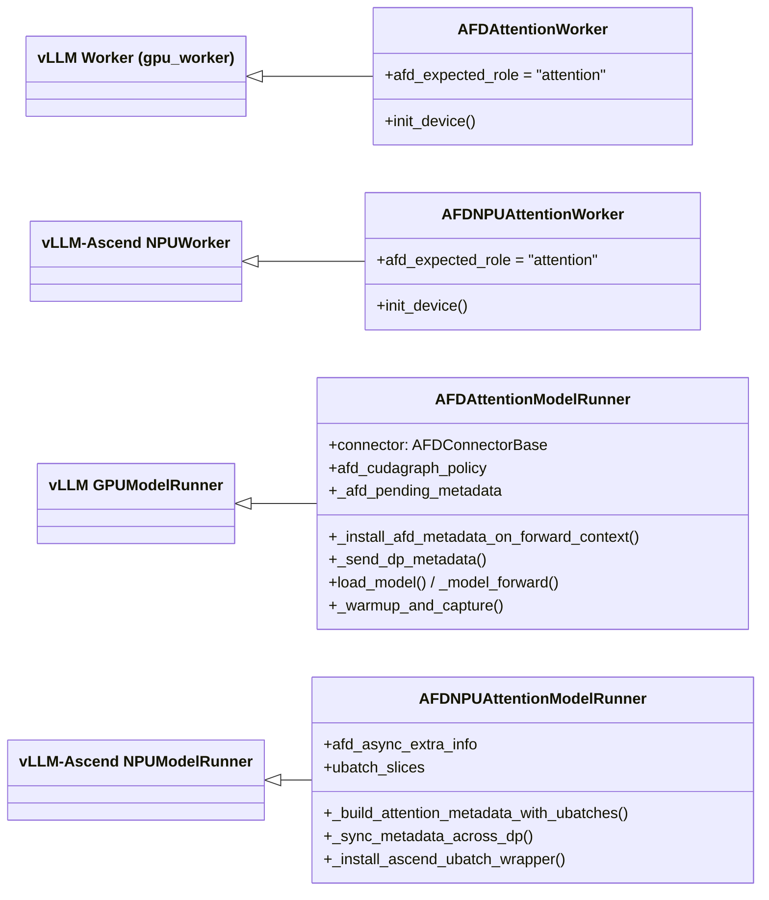

# Attention Runtime

Attention 侧是 AFD 的"请求持有者"：它承接 vLLM scheduler 的请求生命周期、KV cache、采样与输出路径，并在每个 split layer 把 hidden states 经 connector 交给 FFN、收回 FFN 结果后继续。本页覆盖 GPU（`AFDAttentionWorker` / `AFDAttentionModelRunner`）与 NPU（`AFDNPUAttentionWorker` / `AFDNPUAttentionModelRunner`）的实现与差异。connector 线语义见 [06-Connectors](06-Connectors.md)，图/stream/ubatch/DBO 平台机制见 [08-Execution-Platforms](08-Execution-Platforms.md)，模型侧逐层 handoff 见 [07-Model-Integration](07-Model-Integration.md)。FFN 对照页见 [05-FFN-Runtime](05-FFN-Runtime.md)。

## 类继承关系



关键事实：

- `AFDAttentionWorker(Worker)` 见 `afd_plugin/v1/worker/attention_worker.py:20`，`afd_expected_role = "attention"` 在 `attention_worker.py:23`（`Worker` 来自 `vllm.v1.worker.gpu_worker`，`attention_worker.py:10`）。
- `AFDAttentionModelRunner(GPUModelRunner)` 见 `afd_plugin/v1/worker/attention_model_runner.py:46`。
- `AFDNPUAttentionWorker(NPUWorker)` 见 `afd_plugin/v1/worker/npu/attention_worker.py:28`（`NPUWorker` 来自 `vllm_ascend.worker.worker`，`attention_worker.py:10`）。
- `AFDNPUAttentionModelRunner(NPUModelRunner)` 见 `afd_plugin/v1/worker/npu/attention_model_runner.py:104`（`NPUModelRunner` 来自 `vllm_ascend.worker.model_runner_v1`，`attention_model_runner.py:51`）。
- 类路径经懒导出暴露：GPU 见 `afd_plugin/v1/worker/__init__.py:7-13`，NPU 见 `afd_plugin/v1/worker/npu/__init__.py:7-12`。

## 生命周期

### GPU

1. worker 构造：`AFDAttentionWorker.__init__` 仅调 `super().__init__`（`attention_worker.py:25-26`）。
2. `init_device`（`attention_worker.py:28`）：`assert_compatible_afd_stack`（`:31`）→ 拒绝 v2 model runner（`:36-40`）→ `fail_if_unsupported_ubatching`（`:42`）→ `super().init_device()`（`:44`）→ `get_afd_model_config` 改写 model_config（`:45`）→ 构造 `AFDAttentionModelRunner`（`:48`）。
3. runner `__init__`（`attention_model_runner.py:51`）：`parse_config`（`:53`）→ `fail_if_unsupported_ubatching`（`:54`）→ `validate_cuda_graph_mode(role="attention")`（`:55-58`）→ `_with_dp_derived_afd_rank`（`:59`）→ `_resolve_world_ranks`（`:63`）→ `AFDConnectorFactory.create_connector`（`:64`）→ **`connector.init_afd_connector()`（`:70`）** → assert `control_plane is not None`（`:72`）。
4. `load_model`（`attention_model_runner.py:144`）：`super().load_model`，若 `use_ubatching` 则 `_install_afd_ubatch_wrapper`（`:146-149`）把模型包进 `AFDUBatchWrapper`。
5. `execute_model` 主循环（`attention_model_runner.py:344`）：`step_afd_gpu_profiler` 后委托 `super().execute_model`，请求驱动持续到 `shutdown`（停 profiler + `connector.close()`，`:463`）。

### NPU

1. worker `__init__`（`npu/attention_worker.py:33`）先 `apply_afd_ascend_patches_if_needed`（`:34`）再 `super().__init__`。
2. `init_device`（`npu/attention_worker.py:37`）：`assert_compatible_afd_stack`（`:38`，带 `NPU_ATTENTION_WORKER_FQCN`）→ `fail_if_unsupported_npu_afd_features`（`:44`）→ `fix_all2all_backend_for_afd`（`:45`）→ 拒绝 v2（`:46`）→ `self._init_device()`（`:51`）→ `init_workspace_manager`（`:52`）→ `get_afd_model_config`（`:56`）→ 构造 `AFDNPUAttentionModelRunner`（`:59`）。
3. runner `__init__`（`npu/attention_model_runner.py:109`）：`parse_config`→`super().__init__`→`fail_if_unsupported_npu_afd_features`（`:114`）→ `_with_dp_derived_afd_rank`（`:118`）→ `create_connector`（`:120`）→ 处理 `AFDAsyncExtraInfo`（`:126-134`）→ **`connector.init_afd_connector()`（`:135`）**。
4. `load_model`（`npu/attention_model_runner.py:1329`）：`super().load_model`，若 `use_ubatching` 则 `_install_ascend_ubatch_wrapper`（`:1331-1332`）。
5. `execute_model`（`npu/attention_model_runner.py:149`）：`step_afd_npu_profiler` + `super().execute_model`。`shutdown` 见 `:1669`。

### connector 初始化时机（Attention vs FFN 的关键差异）

Attention 在 **runner 构造期**（即 worker `init_device` 阶段、`load_model` 之前）就调 `init_afd_connector`（GPU `attention_model_runner.py:70`；NPU `attention_model_runner.py:135`）。FFN 则把 `init_afd_connector` 推迟到 `initialize_from_config`（`load_model` 之后），见 [05-FFN-Runtime](05-FFN-Runtime.md)。

生命周期顺序：

```text
worker.__init__
  -> init_device(construct runner + init_afd_connector)
  -> load_model(install ubatch wrapper)
  -> initialize_from_config(KV cache)
  -> compile_or_warm_up_model
  -> execute_model 主循环
  -> shutdown
```

## Attention 执行流

逐层 handoff 发生在 **模型**（`afd_plugin/model_executor/models/deepseek_v2.py`），不在 runner。runner 只把 `afd_metadata`（携带 connector 引用，类型 `AFDForwardContextMetadata`，`afd_plugin/connectors/metadata.py:281`）装进 forward context，模型读取后调 connector。

### 装载 AFD metadata

`_model_forward`（GPU `attention_model_runner.py:339`；NPU `attention_model_runner.py:153`）取 `get_forward_context()`，调 `_install_afd_metadata_on_forward_context`（GPU `:215`；NPU `:1236`）把 `_afd_pending_metadata` 写入 `forward_context.additional_kwargs["afd_metadata"]`。当 `connector.control_plane` 非 None 时调 `_send_dp_metadata`（GPU `:115`；NPU `:1272`）把 `AFDControlPayload`（`metadata.py:107`）发给 FFN；NPU async 路径 `control_plane is None` 时直接 return（`npu/attention_model_runner.py:1249-1250`）。`_build_afd_metadata`（GPU `:86`；NPU `:1207`）按 ubatch slices 或单 stage 构造 stage/token 起止与 `transaction_id`。

### 默认路径（gate 在 FFN 侧；GPU P2P / NPU CAMP2P）

`AFDDeepseekV2Model.forward_with_afd`（`deepseek_v2.py:476`）。非 gate 分支（`deepseek_v2.py:505` 起）逐层循环（`:511-545`）：

1. `layer_offset > 0` 时先 `afd_connector.recv_ffn_output(ref_tensor=hidden_states, ubatch_idx=stage_idx)`（`:519`）收上一层的 FFN 结果。
2. 跑 Attention 层 `layer(positions, hidden_states, residual, ...)`（`:524`）。
3. 构造 `AFDTransferMetadata.create_attention_metadata`（`:530`）+ `AFDTransferContext`（`:535`）。
4. `afd_connector.send_attn_output(hidden_states, context)`（`:536`）把 hidden states 发给 FFN。
5. `maybe_apply_dbo_yield(hidden_states, role="attention")`（`:537`，`afd_plugin/v1/worker/dbo.py:12`）在 vLLM DBO 启用时让出给对端 ubatch 线程。
6. 循环结束后再 `recv_ffn_output`（`:542`）收最后一层结果。

即每层 = `recv_ffn_output`（首层除外）→ attention 计算 → `send_attn_output`，FFN 在对端算 MoE/FFN 后回传。MoE gate（router）在 FFN 侧计算。

### compute_gate_on_attention 开启时的差异（仅 NPU async CAM）

`compute_gate_on_attention` 是 NPU 专属（`deepseek_v2.py:103` 显式声明 "supported only on NPU"），且在 NPU 上仅 `CAMAsyncAFDConnector` 可用：CAMP2P 路径会被 `fail_if_unsupported_npu_afd_features` 拒绝（`afd_plugin/compat/npu/feature_validation.py:45-48`），async 路径绕过该检查（`feature_validation.py:37-43`），`async_moe_ubatching` 反过来 **要求** `compute_gate_on_attention=true`（`feature_validation.py:117-120`）。

此时 `forward_with_afd` 走 `forward_with_afd_v2`（`deepseek_v2.py:548,484-503`）→ `run_attention_gate_afd_forward`（`afd_plugin/model_executor/models/npu/deepseek_v2_async_cam_forward.py:31`）。差异：

- Attention 侧由 `layer.compute_attn_output(...)`（`deepseek_v2_async_cam_forward.py:77`）同时产出 `hidden_states`、`topk_weights`、`topk_ids`、`router_logits` —— MoE gate 在 Attention 侧算。
- `send_attn_output` 携带 `topk_weights/topk_ids/router_logits`（`:90-96`），FFN 只跑专家、不再算 gate。`CAMAsyncAFDConnector.send_attn_output`（`afd_plugin/connectors/npu/async_cam.py:472`）内部执行 `async_dispatch_send`（`:537`）。
- `recv_ffn_output` 被 **延迟到下一层**（`pending_ffn_recv`，`:55-60`；循环末尾 `:103-107`），从而允许 CAM dispatch/combine overlap。
- Dense 层不出 connector，本地直接算（`:62-69`）。

### AFDUBatchWrapper 如何介入 ubatch

native ubatching 启用时（当前固定 2 个 ubatch，`fail_if_unsupported_ubatching` 要求 `num_ubatches==2`，`attention_model_runner.py:473-480`），`AFDUBatchWrapper`（`afd_plugin/v1/worker/ubatch_wrapper.py:24`，继承 vLLM `UBatchWrapper`）在每个 ubatch stage 的 child forward context 装入 stage-local AFD metadata：

- `__call__`（`ubatch_wrapper.py:42`）读 `forward_context.ubatch_slices`，若缺 `afd_metadata` 调 `_install_missing_afd_metadata`（`:105`）经 context provider 构造。
- `_make_ubatch_metadata`（`:128`）用 `build_ubatch_afd_metadata`（`:228`）把父 metadata clone 出每个 stage 的子 metadata（`stage_idx/num_stages/tokens_lens` 按 slice 调整），并 `build_ubatch_dp_metadata_list`（`:260`，DP=1 用 `AFDDPMetadata`，DP>1 用 `DPMetadata.make`）。
- AFD 下关闭 vLLM 原生 SM 控制：`_create_sm_control_context` 返回 `nullcontext()`（`:34-40`）。
- 捕获路径 `_capture_ubatches`（`:77`）由 wrapper 负责，确保 per-stage DP metadata 在进入 `torch.cuda.graph` 前发送。

NPU 对应 `AscendUBatchWrapper`（`afd_plugin/v1/worker/npu/npu_ubatch_wrapper.py:53`）：`__call__`（`:99`）把 batch 拆成两线程（`_run_ubatches` `:329`，`_capture_ubatches` `:353`），每线程一个 `AscendUBatchContext`（`afd_plugin/v1/worker/npu/ubatching.py:17`）与 `create_ascend_forward_context`（`afd_plugin/v1/worker/npu/forward_context.py:20`）构造的子 forward context。

ubatch/DBO/stream 细节见 [08-Execution-Platforms](08-Execution-Platforms.md)。

### 控制平面协调

`connector.control_plane` 非 None 时（GPU `P2pNcclAFDConnector` `afd_plugin/connectors/gpu/p2p.py:112/210`；NPU `CAMP2pAFDConnector` `afd_plugin/connectors/npu/camp2p.py:214/285`），`_send_dp_metadata` 先 `update_state_from_dp_metadata` 再 `send_dp_metadata_list`（`attention_model_runner.py:141-142`；NPU `:1298/1307`）。payload 含 per-stage DP metadata map + `is_warmup` + `is_graph_capturing`。`CAMAsyncAFDConnector.control_plane = None`（`async_cam.py:216`），故无 DP metadata 协调，CAM dispatch payload 自带路由与 token 元数据。控制平面契约见 `afd_plugin/connectors/base.py:254`，连接器细节见 [06-Connectors](06-Connectors.md)。

## GPU 与 NPU 差异对比

| 维度 | GPU（CUDA） | NPU（Ascend） |
| --- | --- | --- |
| Worker 基类 | `vllm.v1.worker.gpu_worker.Worker` | `vllm_ascend.worker.worker.NPUWorker` |
| Runner 基类 | `GPUModelRunner` | `NPUModelRunner` |
| Connector | `P2pNcclAFDConnector`（control_plane 非 None） | `CAMP2pAFDConnector`（非 None）/ `CAMAsyncAFDConnector`（None） |
| `control_plane is None` | 不支持，构造期 assert（`attention_model_runner.py:72`） | 支持（async CAM），跳过 `_send_dp_metadata`（`npu/attention_model_runner.py:1249`） |
| `compute_gate_on_attention` | 不支持（`deepseek_v2.py:103` NPU-only） | 仅 async CAM（`feature_validation.py:45-48/117-120`） |
| 图捕获 | CUDA graph，`FULL_DECODE_ONLY` | ACL graph（`ACLGraphWrapper` + `AscendUBatchWrapper`） |
| ubatch wrapper | `AFDUBatchWrapper`（`ubatch_wrapper.py:24`） | `AscendUBatchWrapper`（`npu_ubatch_wrapper.py:53`） |
| forward context | vLLM `ForwardContext` + `additional_kwargs` | 额外 `set_ascend_forward_context` / `create_ascend_forward_context`（`forward_context.py:20`） |
| ubatch 判定 | DP=1 本地复刻：`_should_ubatch_single_rank`（`attention_model_runner.py:293`） | `_sync_metadata_across_dp`（`:1379`）+ `check_enable_ubatch`（`ubatch_utils.py:37`） |
| 设备初始化 | `super().init_device()`（`attention_worker.py:44`） | `apply_afd_ascend_patches_if_needed` + `_init_device` + `init_workspace_manager`（`npu/attention_worker.py:34/51-52`） |
| async MoE ubatching | 无 | async CAM 专属两阶段请求边界流水线（`attention_model_runner.py:234`） |

## 与 CUDA Graph 的关系

`AFDAttentionModelRunner.__init__` 调 `validate_cuda_graph_mode(role="attention")`（`attention_model_runner.py:55-58`；实现 `afd_plugin/v1/worker/cuda_graph.py:42`）。当前唯一支持的 cudagraph_mode 是 `FULL_DECODE_ONLY`（`cuda_graph.py:20-21`），policy 中 `allow_attention_full_decode_only=True`（`cuda_graph.py:82`）—— 即 Attention 侧只对 decode 类 batch 做全图捕获。

`_warmup_and_capture`（`attention_model_runner.py:375`）区分 warmup 与正式 capture，核心约束是 **control-plane 副作用（DP metadata send）必须在进入 `torch.cuda.graph` 前完成**，capture 内只留可重放的数据面工作（`attention_model_runner.py:426-446`）：非 ubatch capture 显式先发一次 capture payload 再 `_afd_suppress_metadata_send=True`；ubatch capture 让 `AFDUBatchWrapper` 发送精确 per-stage 形状。`graph_run_mode`（`cuda_graph.py:136`）给出 EAGER/WARMUP/CAPTURE/REPLAY 四态。

DP=1 时 `_should_ubatch_single_rank`（`attention_model_runner.py:293`）复刻 vLLM 的 DP 协调判定，避免 `split_attn_metadata` 按 padded token 数切分时尾部 ubatch 落在真实请求之外触发 "Token slice start outside of first request" 断言（注释 `attention_model_runner.py:299-310`）。

CUDA graph / ACL graph / stream / pool / wrapper 实现细节归 [08-Execution-Platforms](08-Execution-Platforms.md)。

## 不变量

- **请求只进 Attention**：API 流量只发往 Attention 进程；FFN 不接收外部请求。Attention 持有完整请求生命周期（scheduler `execute_model`、KV cache、采样、输出）。FFN 的 `execute_model` 被 fail-fast 拒绝（见 [05-FFN-Runtime](05-FFN-Runtime.md)）。
- **Attention 始终 request-driven**，即使 connector 让 FFN 变成 connector-driven。空闲 DP rank 走上游 dummy-batch 路径，runner 在该路径惰性安装 AFD metadata，因为原生 dummy 执行绕过 `_model_forward`（`_dummy_run` GPU `attention_model_runner.py:348-373`；NPU `npu/attention_model_runner.py:692`）。
- **Metadata 契约统一**：CUDA 与 NPU 模型路径都从 `forward_context.additional_kwargs["afd_metadata"]` 读取（`metadata.py:281`）。设计文档据此纠正了早期"NPU 单独 metadata 镜像"的描述。
- **控制面先于可重放图工作**：DP metadata send 不进入图捕获体。

## 相关页面

[05-FFN-Runtime](05-FFN-Runtime.md) · [06-Connectors](06-Connectors.md) · [07-Model-Integration](07-Model-Integration.md) · [08-Execution-Platforms](08-Execution-Platforms.md) · [09-Compatibility-Patches](09-Compatibility-Patches.md)
