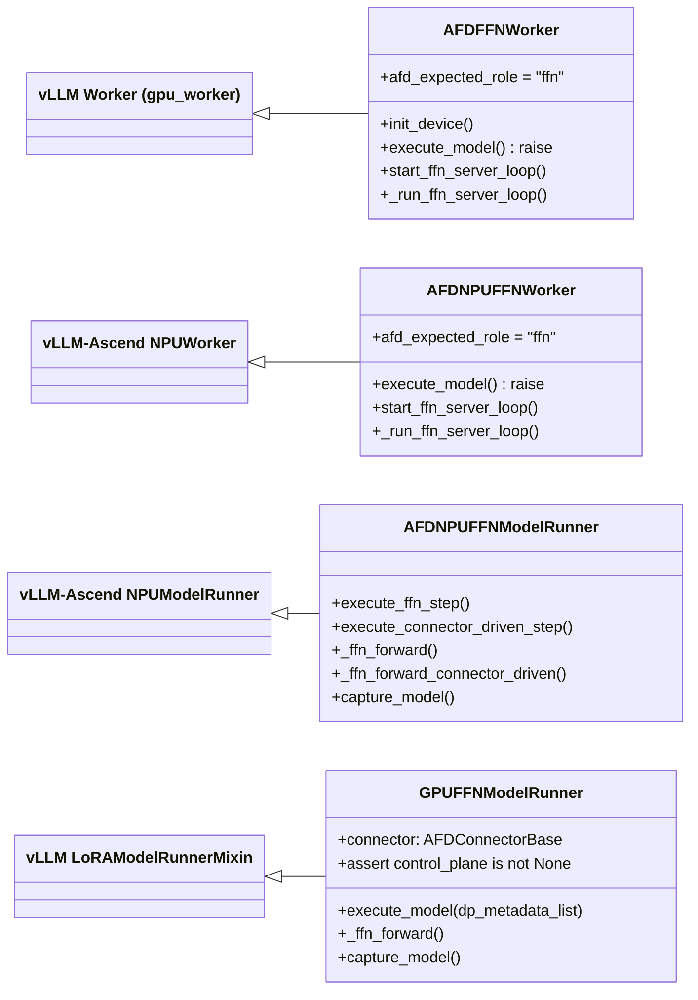

# FFN Runtime

FFN 侧是 AFD 的"计算引擎"：它不接收 scheduler 请求、不持有 KV cache、不采样 token，而是由 connector 驱动一个守护线程，在每个 split layer 从 Attention 接收 hidden states、计算 MoE/FFN、再把结果送回。本页覆盖 GPU（`AFDFFNWorker` / `GPUFFNModelRunner`）与 NPU（`AFDNPUFFNWorker` / `AFDNPUFFNModelRunner`）。Attention 对照页见 [04-Attention-Runtime](04-Attention-Runtime.md)，connector 细节见 [06-Connectors](06-Connectors.md)，模型侧逐层 handoff 见 [07-Model-Integration](07-Model-Integration.md)。

## 类继承关系



关键事实：

- `AFDFFNWorker(Worker)` 见 `afd_plugin/v1/worker/ffn_worker.py:26`，`afd_expected_role = "ffn"` 在 `:34`。
- `GPUFFNModelRunner(LoRAModelRunnerMixin)` 见 `afd_plugin/v1/worker/ffn_model_runner.py:48`，**不继承 `GPUModelRunner`**，是仅混入 `LoRAModelRunnerMixin` 的独立类。
- `AFDNPUFFNWorker(NPUWorker)` 见 `afd_plugin/v1/worker/npu/ffn_worker.py:32`。
- `AFDNPUFFNModelRunner(NPUModelRunner)` 见 `afd_plugin/v1/worker/npu/ffn_model_runner.py:56`。

## FFN 是 connector 驱动

FFN 不走 vLLM scheduler → `execute_model` 路径。`execute_model` 在两平台都 fail-fast：

```python
# ffn_worker.py:86  (GPU)
def execute_model(self, scheduler_output: SchedulerOutput) -> None:
    raise RuntimeError(
        "AFD FFN workers are connector-driven; scheduler-driven "
        "execute_model() is not supported.",
    )
# npu/ffn_worker.py:78  (NPU, 同理)
```

实际驱动来自 `start_ffn_server_loop`（GPU `ffn_worker.py:94`；NPU `npu/ffn_worker.py:84`），在 `initialize_from_config` 中被调用（GPU `:71`；NPU `:69`），启动 daemon 线程跑 `_run_ffn_server_loop`（GPU `:121`；NPU `:111`）。

守护线程的两种模式：

```text
┌─────────────────────────────────────────────────────┐
│            _run_ffn_server_loop                     │
├──────────────────────┬──────────────────────────────┤
│  control_plane ≠ None│  control_plane == None       │
│  (GPU P2P / NPU CAMP)│  (NPU async CAM only)        │
├──────────────────────┼──────────────────────────────┤
│  recv_dp_metadata_list│  execute_connector_driven_  │
│  → execute_model /    │  step()                     │
│    capture_model      │  → _ffn_forward_connector_  │
│  → cuda/npu.sync      │    driven()                 │
└──────────────────────┴──────────────────────────────┘
```

- **control_plane 非 None**（GPU `P2pNcclAFDConnector`；NPU `CAMP2pAFDConnector`）：线程在 `recv_dp_metadata_list()` 阻塞，收到 Attention 发来的 `AFDControlPayload`（`afd_plugin/connectors/metadata.py:107`）后，根据 `is_warmup`/`is_graph_capturing` 走 capture 或 execute（GPU `:130-155`；NPU `:123-132`）。
- **control_plane is None**（仅 NPU `CAMAsyncAFDConnector`，`afd_plugin/connectors/npu/async_cam.py:216`）：线程直接调 `execute_connector_driven_step()`（`npu/ffn_worker.py:118-120`），不经过 DP metadata 协调，由 connector 自身的 work-item 队列驱动。GPU 在此分支 `raise NotImplementedError`（`ffn_worker.py:130-135`）。

## 生命周期

```text
worker.__init__
  -> init_device(assert stack / construct runner)
  -> load_model
  -> initialize_from_config(kv_cache / init_afd_connector / start_ffn_server_loop)
  -> compile_or_warm_up_model  (returns 0.0)
  -> [daemon thread runs _run_ffn_server_loop]
  -> shutdown(stop loop / connector.close)
```

### GPU

1. `__init__`（`ffn_worker.py:36`）：`super().__init__` → 初始化 `_ffn_thread`/`_ffn_shutdown_event`/`_ffn_loop_error`（`:38-40`）。
2. `init_device`（`:42`）：`assert_compatible_afd_stack` → 拒绝 v2（`:50`）→ `fail_if_unsupported_ubatching`（`:56`）→ `super().init_device()`（`:58`）→ `get_afd_model_config`（`:59`）→ 构造 `GPUFFNModelRunner`（`:62`）。
3. `initialize_from_config`（`:71`）：`initialize_kv_cache`（空操作）→ **`initialize_afd_connector()`**（`:76`）→ **`start_ffn_server_loop()`**（`:77`）。
4. `compile_or_warm_up_model`（`:79`）：返回 `0.0`；graph capture 在守护线程内按需触发。
5. `shutdown`（`:180`）：`stop_ffn_server_loop` → `super().shutdown`。

### NPU

1. `__init__`（`npu/ffn_worker.py:37`）：`apply_afd_ascend_patches_if_needed`（`:38`）→ `super().__init__` → 初始化 loop 变量（`:40-42`）。
2. `init_device`（`:44`）：`assert_compatible_afd_stack`（带 `NPU_FFN_WORKER_FQCN`）→ `fail_if_unsupported_npu_afd_features`（`:51`）→ `fix_all2all_backend_for_afd`（`:52`）→ 拒绝 v2 → `_init_device`（`:56`）→ `init_workspace_manager`（`:57`）→ 构造 `AFDNPUFFNModelRunner`（`:64`）。
3. `initialize_from_config`（`:69`）：同 GPU 模式。
4. `compile_or_warm_up_model`（`:75`）：返回 `0.0`。
5. `shutdown`（`:155`）：`stop_ffn_server_loop` → `super().shutdown`。

### connector 初始化时机（Attention vs FFN 差异）

Attention 在 runner **构造期**（`init_device` 阶段）就调 `init_afd_connector`。FFN 推迟到 **`initialize_from_config`**（`load_model` 之后），因为 connector 依赖 KV cache 配置中的 world/topology 信息。`start_ffn_server_loop` 内部还有一道保险：若 `connector.is_initialized` 为 False 再调一次（GPU `:101-102`；NPU `:91-92`）。

## FFN 只加载角色组件

FFN runner 砍掉了所有 Attention / scheduler 专属功能：

| 功能 | GPU | NPU |
| --- | --- | --- |
| `get_kv_cache_spec` | `{}`（`:125`） | `{}`（`npu/ffn_model_runner.py:93`） |
| `initialize_kv_cache` | `return None`（`:128`） | `return None`（`:96`） |
| `profile_run` | `pass`（`:122`） | `return None`（`:99`） |
| `sample_tokens` | `raise RuntimeError`（`:304`） | `raise RuntimeError`（`:420`） |
| `compile_or_warm_up_model` | `0.0`（worker `:79`） | `0.0`（worker `:75`） |
| LoRA | 全 stub（`:307-321`） | N/A（父类） |

`GPUFFNModelRunner` 不继承 `GPUModelRunner`，只混入 `LoRAModelRunnerMixin` 并 stub 掉 LoRA。`AFDNPUFFNModelRunner` 继承 `NPUModelRunner` 但覆写了 KV cache / sample / profile 路径。

## 执行流

### 默认路径（control_plane 非 None：GPU P2P / NPU CAMP2P）

`_ffn_forward` 是核心循环（GPU `ffn_model_runner.py:161`；NPU `npu/ffn_model_runner.py:189`）：

```text
update_state_from_dp_metadata(control_plane)
for layer_idx in range(num_layers):          # GPU: :180  NPU: :244
    for stage_idx in sorted(dp_metadata_list):
        payload = connector.recv_attn_output(ubatch_idx=stage_idx)
        hidden_states = payload.hidden_states
        context = payload.context
        metadata.layer_idx = layer_idx
        metadata.stage_idx = stage_idx
        install afd_metadata on forward_context
        rank_ffn_output = model.compute_ffn_output(hidden_states, layer_idx)
        connector.send_ffn_output(rank_ffn_output, context)
```

- **recv_attn_output** 阻塞直到 Attention 发来该 layer+stage 的 hidden states（GPU `:182`；NPU `:246`，NPU 额外传 `layer_idx` 和 `max_num_tokens`）。
- **compute_ffn_output** 调模型的 `compute_ffn_output`（GPU `:204-206`；NPU `:262-265`），只跑 FFN/MoE 层。
- **send_ffn_output** 把结果送回 Attention（GPU `:195`；NPU 经 `_send_ffn_output` `:432`，支持 `AFDF2ATransferPayload` 的 routed/shared 拆分 `:439-454`）。

GPU 与 NPU 差异：

- GPU 用 `_ffn_forward_context`（`:340`）——简单 `set_forward_context(attn_metadata=None)`。
- NPU 用 `ascend_forward_context`（`npu/ffn_model_runner.py:236`），传 `afd_metadata`/`model_instance`/`num_tokens`/`num_tokens_across_dp`/`aclgraph_runtime_mode`。
- NPU 在循环前计算 `num_tokens_across_dp`（`_ffn_token_counts_across_ranks` `:492`）并做 TP→DP 投影（`_to_dp_level_token_counts` `:553`）；GPU 不需要。
- NPU `compute_ffn_output` 额外接受 `group_list`/`dynamic_scales`/`expand_x_shared`/`dynamic_scales_shared`（`:262-265`）；GPU 只传 `hidden_states` + `layer_idx`。

### control_plane is None 路径（仅 NPU async CAM）

`_ffn_forward_connector_driven`（`npu/ffn_model_runner.py:274`）：

```text
for _ in _ffn_layer_indices(self):
    work_item = connector.recv_ffn_work_item(stage_idx, max_num_tokens)
    hidden_states = work_item.hidden_states
    layer_idx = work_item.layer_idx       # ← 来自 CAM，非本地 range
    build AFDForwardContextMetadata(stage_idx, num_tokens)
    with ascend_forward_context(...):
        forward_context.dp_metadata = None
        forward_context.additional_kwargs[afd_metadata] = metadata
        rank_ffn_output = model.compute_ffn_output(
            hidden_states, layer_idx,
            group_list=states.group_list, dynamic_scales=...,
            expand_x_shared=..., dynamic_scales_shared=...,
        )
        rank_ffn_output = connector.send_ffn_work_item_output(work_item, ...)
```

关键差异：

- **层索引由 CAM 决定**：`work_item.layer_idx` 来自 `async_dispatch_recv` 的 `TokenNums_Rankid_Layeridx`（`async_cam.py:359-360`），FFN 被动接收。
- **只跑 MoE 层**：`_ffn_layer_indices`（`npu/ffn_model_runner.py:457`）在 `compute_gate_on_attention=True` 时只返回 MoE 层索引（`_is_moe_layer` `:470`）；dense 层已在 Attention 侧算完。
- **无 DP metadata**：`forward_context.dp_metadata = None`（`:314`）。
- **send 经 work_item API**：`send_ffn_work_item_output`（`async_cam.py:429`）处理空 routed rank（fake bf16 token workaround，`:448-470`）。

### AFDAsyncFFNWorkItem 简介

`AFDAsyncFFNWorkItem`（`async_cam.py:176`，`@dataclass(slots=True)`）是 async CAM 的标准化工作单元：

| 字段 | 类型 | 说明 |
| --- | --- | --- |
| `hidden_states` | `Tensor` | dispatch-recv buffer 切到实际 token 数（`:384`） |
| `context` | `AFDTransferContext` | metadata + states（group_list, dynamic_scales 等） |
| `recv_output` | `AFDA2FTransferPayload` | 原始 recv payload |
| `layer_idx` | `int` | CAM 元数据层索引 |
| `stage_idx` | `int` | 固定 0（async 无 ubatch 分阶段） |
| `num_tokens` | `int` | routed expert token 数（`:374`） |
| `total_num_tokens` | `int` | 含 shared 总 token 数 |
| `shared_num_tokens` | `int` | shared expert token 数 |

由 `recv_ffn_work_item`（`async_cam.py:328`）构造，由 `send_ffn_work_item_output`（`:429`）消费。CAM dispatch/combine 自带路由元数据，故不需要 DP metadata 控制面。

## control_plane None vs 非 None 对比

| 维度 | control_plane 非 None | control_plane is None |
| --- | --- | --- |
| Connector | `P2pNcclAFDConnector` (GPU) / `CAMP2pAFDConnector` (NPU) | `CAMAsyncAFDConnector` (NPU only) |
| 触发方式 | `recv_dp_metadata_list` 阻塞 | `recv_ffn_work_item` 阻塞 |
| 层迭代 | `range(num_layers)` 本地控制 | `work_item.layer_idx` CAM 决定 |
| DP metadata | `update_state_from_dp_metadata` + forward_context | `dp_metadata = None` |
| Gate 位置 | FFN 侧（默认） | Attention 侧（`compute_gate_on_attention=True`） |
| Dense 层 | FFN 跑全部层 | FFN 只跑 MoE 层 |
| Graph capture | 支持（assert control_plane，`:198/381`） | 不支持 |
| GPU 支持 | 是 | 否（`NotImplementedError` `ffn_worker.py:131`） |

## GPU 与 NPU 差异对比

| 维度 | GPU（CUDA） | NPU（Ascend） |
| --- | --- | --- |
| Worker 基类 | `Worker` | `NPUWorker` |
| Runner 基类 | `LoRAModelRunnerMixin`（独立类） | `NPUModelRunner` |
| Connector | `P2pNcclAFDConnector` | `CAMP2pAFDConnector` / `CAMAsyncAFDConnector` |
| `control_plane is None` | `NotImplementedError`（`:131`） | 支持（`npu/ffn_worker.py:118`） |
| Runner 构造期 assert | `assert control_plane is not None`（`:81`） | 无（允许 async CAM） |
| 图技术 | CUDA graph（`torch.cuda.CUDAGraph`，`:234`） | ACL graph（`torch.npu.NPUGraph`，`:393`） |
| forward context | `_ffn_forward_context`（`set_forward_context(None)`） | `ascend_forward_context`（含 num_tokens / aclgraph mode） |
| 层迭代 | `range(num_layers)`（`:180`） | `_ffn_layer_indices`（`:244`） |
| send_ffn_output | 直接发 tensor（`:195`） | `_send_ffn_output` 处理 `AFDF2ATransferPayload`（`:432`） |
| compute_ffn_output | `(hidden_states, layer_idx)` | `(hidden_states, layer_idx, group_list=..., ...)` |
| 设备 sync | `torch.cuda.synchronize()`（`:158`） | `torch.npu.synchronize()`（`npu/ffn_worker.py:133`） |
| LoRA | stub 方法（`:307-321`） | N/A（父类） |
| workspace | N/A | `init_workspace_manager`（`npu/ffn_worker.py:57`） |

## 与 Graph Capture 的关系

### GPU

`use_cuda_graph` 取决于 `afd_cudagraph_policy.enable_ffn_graph_cache`（`:88-90`）。守护线程在 `is_warmup`/`is_attn_graph_capturing` 时调 `capture_model`（`ffn_worker.py:142-149`），否则走 `execute_model`。

`capture_model`（`:260`）在 `graph_capture(device)` 内：warmup 调 `_ffn_forward(update_connector_state=False)`（`:286-290`）；capture 调 `_dummy_run(FULL)` → 先 `update_state_from_dp_metadata`（控制面副作用在 graph 外），再 `torch.cuda.graph` 内 `_ffn_forward(update_connector_state=False)`（`:230-253`）。

replay：`execute_model` 检查 `graph_run_mode`（`:145`），`REPLAY` 时 `cuda_graph_info["graph"].replay()`（`:151-153`）。

### NPU

`use_aclgraph` 由 `_use_npu_aclgraph`（`npu/ffn_model_runner.py:576`）决定。`execute_ffn_step`（`:102`）在 capturing/warmup 时转 `capture_model`。

`_capture_graphs`（`:374`）先 `assert self.connector.control_plane`（`:381`，async CAM 无法 capture），`update_state_from_dp_metadata` 后 `torch.npu.graph` 内 `_ffn_forward(update_connector_state=False, aclgraph_runtime_mode=...)`（`:402-412`）。

replay 与 GPU 对称：`execute_model` 检查 `graph_run_mode`，`REPLAY` 时 `graph_info["graph"].replay()`（`:160-167`）。

通用框架（`AFDGraphRunMode`/`graph_run_mode`/`make_ffn_graph_key`）在 `afd_plugin/v1/worker/cuda_graph.py`，两平台共用；平台特定语义见 [08-Execution-Platforms](08-Execution-Platforms.md)。

## 不变量

- **FFN 是 connector 驱动**：scheduler `execute_model` 必 fail-fast（GPU `:89`；NPU `npu/ffn_worker.py:79`）。
- **FFN 不持有 KV cache**：`get_kv_cache_spec` 返回 `{}`，`initialize_kv_cache` 返回 `None`。
- **FFN 不采样**：`sample_tokens` 必 raise（GPU `:304`；NPU `:420`）。
- **FFN 不在 worker 层 warmup**：`compile_or_warm_up_model` 返回 `0.0`；graph capture 在守护线程内按需触发。
- **控制面副作用不入图**：`update_state_from_dp_metadata` 在 `torch.cuda.graph`/`torch.npu.graph` 之外（GPU `:235-242`；NPU `:395-401`）。
- **control_plane is None 时不做 graph capture**：NPU `_capture_graphs` assert `control_plane`（`:381`）。
- **FFN 层序与 Attention 对称**：默认跑全部层；`compute_gate_on_attention=True` 时 FFN 只跑 MoE 层，dense 层归 Attention。

## 相关页面

[04-Attention-Runtime](04-Attention-Runtime.md) · [06-Connectors](06-Connectors.md) · [07-Model-Integration](07-Model-Integration.md) · [08-Execution-Platforms](08-Execution-Platforms.md) · [09-Compatibility-Patches](09-Compatibility-Patches.md)
