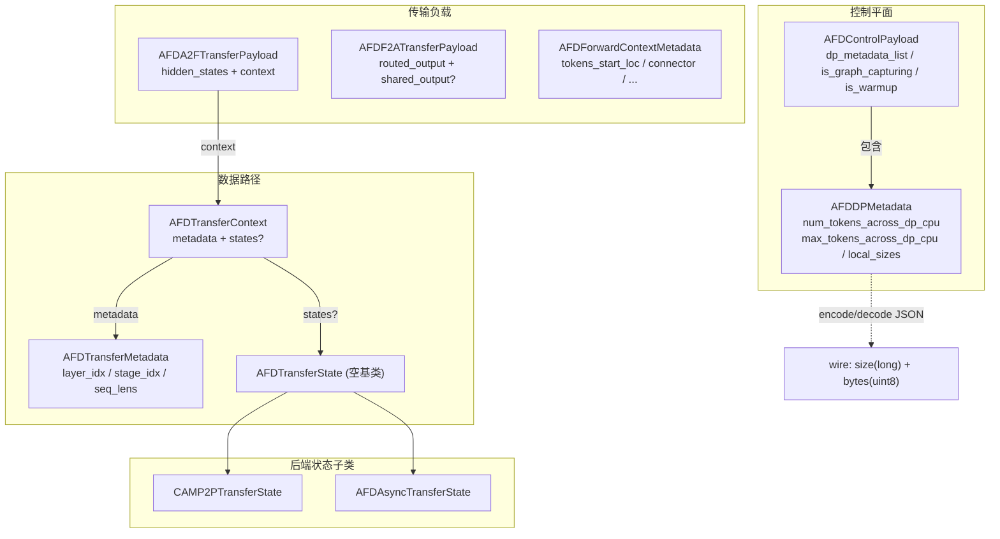

# 连接器

连接器（connector）是 AFD 核心：它拥有 Attention 运行时与 FFN 运行时之间的通信契约与实现。本页逐行对照源码，覆盖基类契约、控制平面、工厂、元数据体系、三种实现、拓扑与进程组。总览与连接器选择矩阵见 [总览](01-Overview.md)，分层定位见 [架构](02-Architecture.md)，Attention/FFN 运行时如何调用连接器分别见 [Attention 运行时](04-Attention-Runtime.md) 与 [FFN 运行时](05-FFN-Runtime.md)。

## 连接器基类契约 AFDConnectorBase

`AFDConnectorBase`（`afd_plugin/connectors/base.py:37`）是所有连接器的抽象基类。它声明连接器承担三类工作：初始化/释放后端通信资源、在 Attention 与 FFN 之间搬运 hidden states、施加 DP 元数据控制平面负载以驱动后续张量传输（`base.py:38-53`）。

### 类属性

```python
control_plane: AFDControlPlane | None = None   # base.py:60
attn_size: int = 0                              # base.py:61
ffn_size: int = 0                               # base.py:62
```

`control_plane` 是运行时选择器：同步连接器在构造时安装一个控制平面对象，异步连接器（CAM async）保持 `None`（`async_cam.py:216`）。运行时据此选择 FFN 步驱模式。

### 生命周期方法

| 方法 | 签名 | 源码位置 | 职责 |
| --- | --- | --- | --- |
| `__init__` | `(rank, local_rank, vllm_config, afd_config) -> None` | `base.py:74-103` | 存储公共上下文；调用 `parse_extra_config(connector_extra_config_from_source(vllm_config))` 得到不可变 `extra_info` |
| `init_afd_connector` | `() -> None` | `base.py:120-129` | 后端就绪后创建进程组、注册自定义算子、初始化通信器与拓扑派生状态；幂等 |
| `is_initialized` | `-> bool`（property） | `base.py:131-135` | 报告后端通信资源是否就绪 |
| `close` | `() -> None` | `base.py:109-118` | 释放连接器拥有的通信资源，安全用于 worker 关闭，清理后 `is_initialized` 应为 false |

`__init__` 在 `base.py:97-103` 存储 `rank`/`local_rank`/`vllm_config`/`afd_config`，并通过 `connector_extra_config_from_source`（`afd_plugin/config.py:261`）提取 `connector_extra_config` 再交给 `parse_extra_config` 解析。

### 数据路径方法

Attention 侧（发送 hidden states、接收 FFN 输出）：

| 方法 | 签名 | 源码位置 | 返回 |
| --- | --- | --- | --- |
| `send_attn_output` | `(hidden_states, context: AFDTransferContext, **kwargs) -> None` | `base.py:141-167` | None |
| `recv_ffn_output` | `(ref_tensor, ubatch_idx=0, **kwargs) -> torch.Tensor` | `base.py:169-196` | FFN 输出张量 |

FFN 侧（接收 Attention hidden states、发送 FFN 输出回 Attention）：

| 方法 | 签名 | 源码位置 | 返回 |
| --- | --- | --- | --- |
| `recv_attn_output` | `(ubatch_idx=0, **kwargs) -> AFDA2FTransferPayload` | `base.py:202-223` | 含 hidden states + transfer context 的负载 |
| `send_ffn_output` | `(ffn_output, context: AFDTransferContext, **kwargs) -> None` | `base.py:225-251` | None |

`recv_attn_output` 返回 `AFDA2FTransferPayload`（`metadata.py:253-269`），FFN runner 将其中 `context` 贯穿 FFN 计算并传回 `send_ffn_output`。`ref_tensor` 在 `recv_ffn_output` 中是必需的：CAMP2P 与 CAM async 无法自行分配输出张量，P2P 则用它作为 CUDA graph 捕获的稳定缓冲与单 rank 子组无传输时的返回值（`base.py:183-187`）。

### ConnectorExtraInfo 与 parse_extra_config

`ConnectorExtraInfo`（`base.py:25-34`）是 frozen dataclass，为连接器自有配置的基类型：

```python
@classmethod
def from_mapping(cls, raw: Mapping[str, Any] | None) -> ConnectorExtraInfo:
    raise NotImplementedError          # base.py:29-31

def to_mapping(self) -> dict[str, Any]:
    return {}                          # base.py:33-34
```

`parse_extra_config`（`base.py:64-72`）是抽象 classmethod，各连接器用它**严格校验** `connector_extra_config`。三者的行为：

- **P2P**：不接受任何字段，非空 mapping 直接 `raise ValueError`（`p2p.py:133-146`）。
- **CAMP2P**：委托 `CAMP2PExtraInfo.from_mapping`，对未知字段 `raise ValueError`（`camp2p.py:99-105`），并用 `coerce_extra_*` 工具强制类型校验（`camp2p.py:108-128`）。
- **CAM async**：委托 `AFDAsyncExtraInfo.from_mapping`，同样拒绝未知字段（`async_cam.py:109-116`）。

构造时基类 `__init__` 自动调用并存储结果为 `self.extra_info`（`base.py:101-103`）。工厂也可不经构造通信资源单独解析配置：`AFDConnectorFactory.parse_connector_extra_info`（`factory.py:68-77`）。

## 控制平面 AFDControlPlane

`AFDControlPlane`（`base.py:254`）是独立抽象接口，通过 `connector.control_plane` 访问。它定义三个方法：

| 方法 | 签名 | 源码位置 | 职责 |
| --- | --- | --- | --- |
| `update_state_from_dp_metadata` | `(payload: AFDControlPayload) -> None` | `base.py:257-273` | 本地状态更新（非网络发送）：存储 DP 元数据与标志，派生张量元数据，预分配后端缓冲 |
| `send_dp_metadata_list` | `(payload: AFDControlPayload) -> None` | `base.py:275-290` | 从 Attention 向 FFN 提交控制平面负载；内部封装拓扑特定的发送 rank 判定，非发送 rank 静默 no-op |
| `recv_dp_metadata_list` | `() -> AFDControlPayload` | `base.py:292-303` | FFN 侧阻塞接收下一个驱动 FFN 步的控制负载 |

### 两种 FFN 步驱模式

`control_plane` 是否为 `None` 决定 FFN 步如何驱动（对应设计文档不变量 `CAP-INV-001`）：

| 模式 | `control_plane` | 对应连接器 | FFN 步驱动方式 |
| --- | --- | --- | --- |
| 控制平面驱动 | 非 `None` | `P2pNcclAFDConnector`（`p2p.py:210`）、`CAMP2pAFDConnector`（`camp2p.py:285`） | FFN 步由 `recv_dp_metadata_list()` 到达的负载驱动；先 `update_state_from_dp_metadata` 派生形状/缓冲，再做数据路径传输 |
| 连接器驱动 | `None` | `CAMAsyncAFDConnector`（`async_cam.py:216` 类级 `control_plane = None`） | 无控制平面；路由/token 元数据随 CAM dispatch 负载内联携带，FFN 步由连接器接收循环直接阻塞驱动 |

控制平面编解码细节见下文 [控制平面编解码](#控制平面编解码)。

## 工厂 AFDConnectorFactory

`AFDConnectorFactory`（`afd_plugin/connectors/factory.py:22`）维护名称到实现的惰性注册表。

### 惰性注册表

```python
_registry: dict[str, Callable[[], type[AFDConnectorBase]]] = {}   # factory.py:23
```

`register_connector(name, module_path, class_name, *, replace=False)`（`factory.py:25-46`）注册一个**惰性 loader**：仅在首次调用时 `importlib.import_module` 导入目标模块并验证其类是 `AFDConnectorBase` 子类。重复注册默认被拒（`factory.py:34-35`），`replace=True` 允许覆盖。导入工厂模块不会触发 CUDA/Ascend 实现的导入。

### 创建与查询

| 方法 | 签名 | 源码位置 | 行为 |
| --- | --- | --- | --- |
| `create_connector` | `(rank, local_rank, vllm_config, afd_config=None) -> AFDConnectorBase` | `factory.py:48-60` | `afd_config` 为 None 时用 `parse_afd_config` 解析；查注册表 -> 调 loader -> 构造实例 |
| `get_connector_class` | `(connector_name) -> type[AFDConnectorBase]` | `factory.py:62-66` | 仅解析类对象，不构造 |
| `parse_connector_extra_info` | `(connector_name, source) -> ConnectorExtraInfo` | `factory.py:68-77` | 不构造通信资源，用连接器自有 schema 解析配置 |

### 已注册名称

模块加载时注册三个内置连接器（`factory.py:80-94`）：

| 名称 | 模块路径 | 类名 |
| --- | --- | --- |
| `P2pNcclAFDConnector` | `afd_plugin.connectors.gpu.p2p` | `P2pNcclAFDConnector` |
| `CAMP2pAFDConnector` | `afd_plugin.connectors.npu.camp2p` | `CAMP2pAFDConnector` |
| `CAMAsyncAFDConnector` | `afd_plugin.connectors.npu.async_cam` | `CAMAsyncAFDConnector` |

> 配置白名单 `SUPPORTED_AFD_CONNECTORS`（`afd_plugin/config.py:23`）是独立硬编码的 allow-list，不从工厂注册表派生。仅注册工厂不足以让外部连接器通过配置校验。

## 元数据体系

全部元数据结构定义于 `afd_plugin/connectors/metadata.py`。

### 逐结构说明

**AFDDPMetadata**（`metadata.py:23-100`）—— 可序列化的 CPU token 计数负载：

| 字段 | 类型 | 说明 |
| --- | --- | --- |
| `num_tokens_across_dp_cpu` | `torch.Tensor` | 各 DP rank 的 token 计数；`__post_init__` 强制 int32/CPU（`metadata.py:31-36`） |
| `max_tokens_across_dp_cpu` | `torch.Tensor | None` | 跨 DP 最大 token 数；为 None 时取 `.max()`（`metadata.py:37-44`） |
| `local_sizes` | `list[int] | None` | SP/chunk 切分后每 rank 的局部尺寸，仅在 contextmanager 内有效 |

辅助方法：`sp_local_sizes(sp)`（`metadata.py:46-59`）、`cu_tokens_across_sp(sp_size)`（`metadata.py:64-70`）、`chunked_sizes(sp, max_chunk, chunk_idx)`（`metadata.py:72-100`）。`AFDSingleDPMetadata` 是其别名（`metadata.py:103`）。

**AFDControlPayload**（`metadata.py:106-141`）—— 控制平面信封：

| 字段 | 类型 | 说明 |
| --- | --- | --- |
| `dp_metadata_list` | `dict[int, AFDDPMetadata]` | stage/ubatch 索引到 DP 元数据的映射；`__post_init__` 将上游 `DPMetadata` 归一化为 `AFDDPMetadata`（`metadata.py:132-141`） |
| `is_graph_capturing` | `bool` | Attention 侧是否正在执行 graph 捕获路径 |
| `is_warmup` | `bool` | 是否属于 warmup 步（与 graph 捕获分离） |

**AFDTransferState**（`metadata.py:144-156`）—— 后端专有传输状态的空基类。后端子类化它以在单次 AFD 交换的 recv 和 send 之间携带路由/共享 MoE 负载、句柄、HCCL 端点名、active-token mask 等。不路由负载的后端（GPU P2P）在 `AFDTransferContext.states` 上保留 `None`（`metadata.py:154-155`）。

**AFDTransferMetadata**（`metadata.py:159-219`）—— 后端中性的单次传输元数据：

| 字段 | 类型 | 说明 |
| --- | --- | --- |
| `layer_idx` | `int` | 模型层索引 |
| `stage_idx` | `int` | stage/ubatch 索引 |
| `seq_lens` | `list[int]` | 每 peer/切分的 token 长度；`__post_init__` 校验非空且全正（`metadata.py:180-184`）；`total_tokens = sum(seq_lens)`（`metadata.py:186-188`） |

工厂方法：`create_attention_metadata`（`metadata.py:190-202`，单元素 `seq_lens`）、`create_ffn_metadata`（`metadata.py:204-216`，多元素）。`validate_tensor_shape`（`metadata.py:218-219`）校验张量首维等于 `total_tokens`。

**AFDTransferContext**（`metadata.py:222-250`）—— 绑定元数据与后端状态：

| 字段 | 类型 | 说明 |
| --- | --- | --- |
| `metadata` | `AFDTransferMetadata` | 层/stage/token 布局 |
| `states` | `AFDTransferState | None` | 后端专有状态；P2P 为 `None`，CAMP2P 挂 `CAMP2PTransferState`，async CAM 挂 `AFDAsyncTransferState`（`metadata.py:233-235`）。默认 `None` 而非 `field(default_factory=...)` 以保持 `torch.compile`/Dynamo 可追踪（`metadata.py:237-241`） |

**AFDA2FTransferPayload**（`metadata.py:253-269`）—— `recv_attn_output()` 的统一返回载体：

| 字段 | 类型 | 说明 |
| --- | --- | --- |
| `hidden_states` | `torch.Tensor` | 从 Attention 接收的 hidden states |
| `context` | `AFDTransferContext` | 描述本次接收的 transfer context（含 metadata + 后端状态） |

**AFDF2ATransferPayload**（`metadata.py:272-277`）—— 分离的 routed/shared FFN 输出：

| 字段 | 类型 | 说明 |
| --- | --- | --- |
| `routed_output` | `torch.Tensor` | 路由专家输出 |
| `shared_output` | `torch.Tensor | None` | 共享专家输出（可选） |

**AFDForwardContextMetadata**（`metadata.py:280-299`）—— 模型包装可见的 forward-context 元数据：

| 字段 | 类型 | 说明 |
| --- | --- | --- |
| `tokens_start_loc` | `list[int]` | token 偏移表 |
| `requests_start_loc` | `list[int]` | request 偏移表 |
| `stage_idx` | `int` | 当前 stage |
| `connector` | `AFDConnectorBase` | 活连接器引用 |
| `tokens_lens` | `list[int]` | token 长度列表 |
| `num_stages` | `int` | 总 stage 数 |
| `transaction_id` | `str | None` | 事务标识 |
| `tokens_unpadded_lens` | `list[int]` | 去 padding 后的 token 长度 |

提供 `clone()`（`metadata.py:293-299`）做浅拷贝。

### 控制平面编解码

`encode_control_payload`（`metadata.py:307-330`）将 `AFDControlPayload` 序列化为紧凑 JSON bytes：仅携带每 stage 的 `num_tokens_across_dp_cpu`/`max_tokens_across_dp_cpu` 及 `is_graph_capturing`/`is_warmup` 标志，不序列化 vLLM `DPMetadata` 对象。`decode_control_payload`（`metadata.py:333-355`）反向重建。

`send_control_payload`（`metadata.py:358-382`）发两条消息——`long` 尺寸张量 + `uint8` 对象张量，二者 stage 到 `device` 故调用方控制 CUDA/NPU/CPU。`recv_control_payload`（`metadata.py:385-402`）接收并解码，校验两条片段来自同一 rank。

### 数据结构关系图



## 三种实现

### P2pNcclAFDConnector + P2pNcclAFDControlPlane

| 维度 | 内容 |
| --- | --- |
| 类名 | `P2pNcclAFDConnector`（`p2p.py:112`）/ `P2pNcclAFDControlPlane`（`p2p.py:583`） |
| 平台 | CUDA（NCCL + vLLM `PyNcclCommunicator`） |
| 同步/异步 | 同步 |
| 控制平面类 | `P2pNcclAFDControlPlane`，构造时安装（`p2p.py:210`） |
| 拓扑类 | `AFDRankMapping`（`afd_plugin/distributed/topology.py:12`），由 `build_rank_mapping` 构建（`topology.py:64`） |
| 关键通信原语 | `torch.ops.vllm.afd_p2p_send`/`afd_p2p_recv`（`p2p.py:529`/`p2p.py:579`），包装 `PyNcclCommunicator.send/recv`，带 fake impl 支持 `torch.compile` 与 CUDA graph 捕获（`p2p.py:794-874`） |
| 图支持 | eager + `FULL_DECODE_ONLY` CUDA graph |
| 关键约束 | `num_attention_ranks >= num_ffn_ranks` 且可整除（`topology.py:49-61`）；FFN-first 排布；不支持 `async`/`async_dp`；GPU DBO + CUDA graph 仅限两个 ubatch（`p2p.py:52-53`）；跨节点未验证（`p2p.py:54-55`） |

**拓扑与进程组**：`build_rank_mapping`（`topology.py:64-127`）计算 P2P rank 映射。FFN rank `i` 的 `world_rank = i`（`topology.py:90`），Attention rank `j` 的 `world_rank = ffn_size + j`（`topology.py:82`）。每个 FFN rank 拥有一个子组：自身在子组 rank 0，其后 `ratio = attention_size // ffn_size` 个连续 Attention rank 占 1..ratio（`topology.py:95-102`）。

**初始化**（`p2p.py:233-296`）：collective 调用，三步——(1) 在 `tcp://host:port` 创建 AFD NCCL world 进程组（FFN 先 Attention 后）；(2) 经 `DefaultProcessGroupSwitcher`（`afd_process_group.py:24`）在 `port + subgroup_index + 1` 创建子组 `StatelessProcessGroup` 及两个 `PyNcclCommunicator`（Attention-to-FFN 与 FFN-to-Attention），注册到模块级 `_AFD_COMMUNICATORS` 字典（`p2p.py:99`）；(3) 参与 DP 元数据的 rank 创建 `p2p` NCCL 进程组（`p2p.py:286-294`）。

**控制平面**：`P2pNcclAFDControlPlane`（`p2p.py:583`）绑定 owning connector。`update_state_from_dp_metadata`（`p2p.py:603-694`）从 DP 元数据派生每 stage 的 wire-tensor 元数据——Attention rank 算自己的收发形状；FFN rank 为每个 Attention peer 算一项，非 eager 时预分配 CUDA graph 接收缓冲（`p2p.py:678-694`）。`send_dp_metadata_list`（`p2p.py:696-726`）经 `p2p` NCCL 组在 CUDA device 上发送；只有前 `min_size` 个 Attention rank 发送。`recv_dp_metadata_list`（`p2p.py:728-751`）在 FFN 侧阻塞接收。

**数据路径**：Attention 侧 `send_attn_output`（`p2p.py:303-337`）经 `afd_p2p_send` 发给自己的 FFN rank；`recv_ffn_output`（`p2p.py:339-373`）经 `afd_p2p_recv` 接收 FFN 切片。FFN 侧 `recv_attn_output`（`p2p.py:375-439`）逐 peer 接收并 `torch.cat` 拼接，记录各 peer `seq_lens`；`send_ffn_output`（`p2p.py:441-505`）按 `seq_lens` 切分回发。`states` 始终为 `None`（P2P 不路由后端专有负载）。

### CAMP2pAFDConnector + _CAMP2PTopology + CAMP2PTransferState

| 维度 | 内容 |
| --- | --- |
| 类名 | `CAMP2pAFDConnector`（`camp2p.py:214`）/ `CAMP2pAFDControlPlane`（`camp2p.py:619`） |
| 平台 | Ascend NPU（HCCL + CAMP2P 自定义算子） |
| 同步/异步 | 同步 |
| 控制平面类 | `CAMP2pAFDControlPlane`，构造时安装（`camp2p.py:285`） |
| 拓扑类 | `_CAMP2PTopology`（`camp2p.py:179`），由 `build_camp2p_topology` 构建（`camp2p.py:672`） |
| 关键通信原语 | `torch.ops.vllm.afd_camp2p_send_attn_output`/`afd_camp2p_recv_ffn_output`（`camp2p.py:438`/`camp2p.py:481`）包装 `torch.ops.afd_ascend.a2e`/`e2a`（`camp2p.py:551`/`camp2p.py:604`）；fake impl 支持编译追踪 |
| 图支持 | eager + `FULL_DECODE_ONLY` ACL graph |
| 关键约束 | `attention_size >= ffn_size`（`camp2p.py:697-701`）；FFN-first 排布；`compute_gate_on_attention=true` 被拒（`camp2p.py:137-141`）；`quant_mode != 0` 被拒（`camp2p.py:142-143`） |

**CAMP2PExtraInfo**（`camp2p.py:72-155`）：frozen dataclass，字段为 `core_num`（默认 8）、可选 `attn_core_num`/`ffn_core_num`、`compute_gate_on_attention`（默认 false）、`quant_mode`（默认 0）。`from_mapping`（`camp2p.py:90-128`）拒绝白名单 `_CAMP2P_EXTRA_CONFIG_FIELDS`（`camp2p.py:61-69`）外的字段并 `coerce_extra_*` 强制类型。`validate_supported`（`camp2p.py:137-143`）在 feature validation 阶段调用（`afd_plugin/compat/npu/feature_validation.py:57`），非构造时调用。

**CAMP2PTransferState**（`camp2p.py:158-176`）：`AFDTransferState` 子类，携带 `aiv_num`/`batch_size`/`h`/`k`（算子尺寸）、`atten_batch_size`（A2E 返回的 Attention token 数）、`x_active_mask`（active-token mask）、`cam_p2p_ep_name`（HCCL 端点名）。`CAMP2PAFDConnectorData` 是其别名（`camp2p.py:1009`）。

**_CAMP2PTopology**（`camp2p.py:179-211`）：frozen slots dataclass，含 `role`/`role_rank`/`world_rank`/`p2p_rank`/`attention_size`/`ffn_size`/`min_size`/`dp_metadata_destinations`。`participates_in_p2p_group`（`camp2p.py:204-206`）判定是否加入 Gloo 元数据组。`build_camp2p_topology`（`camp2p.py:672-742`）：FFN-first 排布——Attention `world_rank = ffn_size + role_rank`（`camp2p.py:711`），FFN `world_rank = role_rank`（`camp2p.py:719`）；要求 `attention_size >= ffn_size`（`camp2p.py:697-701`）。

**初始化**（`camp2p.py:292-364`）：先 `ensure_cam_p2p_ops_available()` 确认算子可用（`camp2p.py:311`），再按 `num_ubatches` 逐个创建 HCCL AFD 进程组（`camp2p.py:318-333`）并记录 `hccl_comm_name` 列表；FFN rank 额外创建 `afd_moe` HCCL 组用于 MoE 通信（`camp2p.py:340-352`）；参与 p2p 的 rank 创建 Gloo `p2p` 组（`camp2p.py:354-362`）。

**控制平面**：`CAMP2pAFDControlPlane`（`camp2p.py:619`）。`update_state_from_dp_metadata`（`camp2p.py:632-639`）存储 DP 元数据与标志。`send_dp_metadata_list`（`camp2p.py:641-658`）经 Gloo `p2p` 组在 **CPU** 上发送（不同于 P2P 的 CUDA device）。`recv_dp_metadata_list`（`camp2p.py:660-669`）在 FFN 侧经 Gloo 组 CPU 接收。

**数据路径**：Attention 侧 `send_attn_output`（`camp2p.py:394-452`）构造 `CAMP2PTransferState`，经 `afd_camp2p_send_attn_output`（内部调 `afd_ascend.a2e`）发送并保存返回值供后续接收；`recv_ffn_output`（`camp2p.py:454-493`）经 `afd_camp2p_recv_ffn_output`（内部调 `afd_ascend.e2a`）接收。FFN 侧 `recv_attn_output`（`camp2p.py:495-571`）直接调 `afd_ascend.a2e` 接收，将返回的 `atten_batch_size`/`x_active_mask` 存入 `CAMP2PTransferState`；`send_ffn_output`（`camp2p.py:573-616`）调 `afd_ascend.e2a` 回发，依赖 `context.states` 中的接收期数据。ubatch 通过 `_get_group_ep`（`camp2p.py:793-807`）选择对应 HCCL 通信组名。

### CAMAsyncAFDConnector + AFDAsyncTopology + AFDAsyncFFNWorkItem

| 维度 | 内容 |
| --- | --- |
| 类名 | `CAMAsyncAFDConnector`（`async_cam.py:206`） |
| 平台 | Ascend NPU（CAM async-DP 自定义算子） |
| 同步/异步 | 异步 |
| 控制平面类 | 无（`control_plane = None`，`async_cam.py:216`） |
| 拓扑类 | `AFDAsyncTopology`（`async_cam.py:189`），由 `build_async_topology` 构建（`async_cam.py:848`） |
| 关键通信原语 | `torch.ops.umdk_cam_op_lib.async_dispatch_send`（`async_cam.py:537`）/ `async_dispatch_recv`（`async_cam.py:705`）/ `async_combine_send`（`async_cam.py:795`）/ `async_combine_recv`（`async_cam.py:637`） |
| 图支持 | 不支持（eager-only） |
| 关键约束 | 需 `async=true`（即 `async_dp`，`afd_plugin/config.py:34`，校验见 `config.py:310-313`）；Attention-first 排布 `[A0, A1, ..., F0, F1, ...]`；不支持 vLLM native DBO、ACL graph 与 decode；专家数应能被 FFN rank 数整除（`async_cam.py:859-860`） |

**AFDAsyncExtraInfo**（`async_cam.py:82-148`）：frozen dataclass，字段为 `dynamicQuant`（默认 0）、`attn_ranks_per_dp`（默认 1，作为 CAM Attention TP 宽度）、`async_moe_ubatching`（默认 false）、`async_moe_num_ubatches`（默认 2）、`async_moe_split`（默认 `"request"`）。`from_mapping`（`async_cam.py:100-139`）拒绝白名单 `_AFD_ASYNC_EXTRA_CONFIG_FIELDS`（`async_cam.py:69-77`）外的字段。

**AFDAsyncTransferState**（`async_cam.py:151-172`）：`AFDTransferState` 子类，从 dispatch-recv 携带到 combine-send 的状态：`batch_size`/`hidden_size`/`topk`/`layer_idx`（算子尺寸）、`token_nums_rankid_layeridx`/`expert_token_nums_shared`（dispatch-recv 输出）、`group_list`/`dynamic_scales`/`expand_x_shared`/`dynamic_scales_shared`（routed/shared MoE 计算负载）。

**AFDAsyncFFNWorkItem**（`async_cam.py:175-187`）：FFN 侧归一化工作项，由 `recv_ffn_work_item`（`async_cam.py:328-403`）产生，含 `hidden_states`/`context`/`recv_output`/`layer_idx`/`stage_idx`/`num_tokens`/`total_num_tokens`/`shared_num_tokens`。`send_ffn_work_item_output`（`async_cam.py:429-470`）处理无 routed token 时的占位回发（CAM combine-send 不接受 int8 dispatch buffer 作空结果，故发一个 fake bf16 token）。`recv_ffn_work_item` 与 `send_ffn_work_item_output` 不在 `AFDConnectorBase` 抽象基类上，属连接器专有方法。

**AFDAsyncTopology**（`async_cam.py:189-203`）：frozen slots dataclass，含 `role`/`role_rank`/`world_rank`/`attn_size`/`ffn_size`/`expert_per_rank`。`build_async_topology`（`async_cam.py:848-896`）：**Attention-first** 排布——Attention `world_rank = role_rank`（`async_cam.py:876`），FFN `world_rank = attn_size + role_rank`（`async_cam.py:883`），与两种同步连接器相反。`expert_per_rank` 用向上取整分配（`async_cam.py:888`）。

**初始化**（`async_cam.py:273-301`）：`ensure_cam_async_ops_available()` 确认算子可用（`async_cam.py:283`），创建单一 HCCL `afd_async_cam` 进程组（`async_cam.py:284-291`），获取 HCCL 通信组名，在 NPU device 上创建 `comm_args` 与 `_placeholder` 缓冲。

**数据路径**：Attention 侧运行 MoE routing（`select_experts`，`async_cam.py:315-326`）后 `send_attn_output`（`async_cam.py:472-556`）调 `async_dispatch_send` 发送激活与路由，并按 stage 缓存 context/topk 待后续 `recv_ffn_output` 弹出（`async_cam.py:510-514`）；`recv_ffn_output`（`async_cam.py:558-654`）调 `async_combine_recv` 合并专家输出。FFN 侧 `recv_attn_output`（`async_cam.py:656-750`）调 `async_dispatch_recv` 接收 routed/shared 激活与路由元数据，存入 `AFDAsyncTransferState`；`send_ffn_output`（`async_cam.py:752-811`）调 `async_combine_send` 回发，依赖 `states.token_nums_rankid_layeridx`（`async_cam.py:768-775`）。`send_attn_output` 额外要求 `topk_ids`/`topk_weights` kwargs（`async_cam.py:498-503`），经 `_validate_topk_payload`（`async_cam.py:899-920`）校验形状。

## 拓扑与进程组

### rank 排布规则

三种连接器使用两种世界排布：

**FFN-first**（P2P + CAMP2P）：世界为 `[F0, F1, ..., A0, A1, ...]`，即 FFN ranks 排在 Attention ranks 之前。

- P2P（`topology.py:82`/`topology.py:90`）：Attention `world_rank = ffn_size + role_rank`，FFN `world_rank = role_rank`。每个 FFN rank 拥有一个子组含自身（rank 0）与 `ratio = attention_size // ffn_size` 个连续 Attention rank（`topology.py:95-102`）。
- CAMP2P（`camp2p.py:711`/`camp2p.py:719`）：同样的 FFN-first 公式。`build_camp2p_topology`（`camp2p.py:672-742`）独立实现但不依赖 `topology.py`。

README "FFN ranks are ordered before Attention ranks" 表述（`README.md:46`）的实现位置即上述两处。P2P 还要求 `num_attention_ranks >= num_ffn_ranks` 且可整除（`topology.py:49-61`），CAMP2P 要求 `attention_size >= ffn_size`（`camp2p.py:697-701`）。

**Attention-first**（CAM async）：世界为 `[A0, A1, ..., F0, F1, ...]`，Attention ranks 排在前。Attention `world_rank = role_rank`（`async_cam.py:876`），FFN `world_rank = attn_size + role_rank`（`async_cam.py:883`）。

### AFD 专用进程组

`afd_plugin/distributed/afd_process_group.py` 提供两个辅助设施：

- `init_afd_process_group`（`afd_process_group.py:42-97`）：插件自有进程组创建函数，不经补丁即可在插件内隔离 PG setup。它调用 PyTorch 私有 API（`rendezvous`/`_new_process_group_helper`/`_update_default_pg`/`_world`）并临时更新 vLLM `parallel_state` world group 的 `pg_group_ranks`，是升级敏感的兼容边界。
- `DefaultProcessGroupSwitcher`（`afd_process_group.py:24-39`）：context manager，临时切换 PyTorch 默认进程组，使 vLLM parallel-state helper 在 AFD PG 上下文初始化。P2P 用它在子组 `StatelessProcessGroup`/`PyNcclCommunicator` 创建时切换默认组（`p2p.py:266`）。

`distributed/__init__.py` 导出 `AFDRankMapping`/`build_rank_mapping`/`topology_from_config`/`validate_p2p_topology`，并惰性加载 `DefaultProcessGroupSwitcher`/`init_afd_process_group`（`distributed/__init__.py:13-20`），避免无分布式后端环境过早导入。

三种连接器的进程组使用：

| 连接器 | AFD world PG | 数据通信 | DP 元数据组 | FFN-only 组 |
| --- | --- | --- | --- | --- |
| P2P | NCCL `afd` 组（`p2p.py:257`） | 每 sub-group 2 个 `PyNcclCommunicator`（`p2p.py:275-284`） | NCCL `p2p` 组，CUDA device（`p2p.py:287-294`） | 无 |
| CAMP2P | 每 ubatch 一个 HCCL `afd` 组（`camp2p.py:318-333`） | HCCL comm name 选择（`camp2p.py:793-807`） | Gloo `p2p` 组，CPU device（`camp2p.py:355-362`） | HCCL `afd_moe` 组（`camp2p.py:341-348`） |
| CAM async | 单一 HCCL `afd_async_cam` 组（`async_cam.py:284-291`） | CAM 算子内联 | 无 | 无 |

## 连接器选择矩阵

| 连接器 | 平台 | 推荐阶段 | 同步/异步 | 图支持 | 关键约束 |
| --- | --- | --- | --- | --- | --- |
| `P2pNcclAFDConnector` | CUDA | Decode | 同步 | `FULL_DECODE_ONLY` CUDA graph | `A >= F` 且 `A % F == 0`；FFN-first；不支持 async；DBO+graph 仅限 2 ubatch |
| `CAMP2pAFDConnector` | Ascend NPU | Decode | 同步 | `FULL_DECODE_ONLY` ACL graph | `A >= F`；FFN-first；HCCL/CAMP2P 算子；拒 gate-on-attn 与非零 quant |
| `CAMAsyncAFDConnector` | Ascend NPU | Prefill | 异步 | 不支持 | 需 `async=true`；Attention-first；eager-only；不支持 DBO/decode |

异步约束由配置校验强制：`async_dp=true` 且 connector 非 `CAMAsyncAFDConnector` 会被拒（`afd_plugin/config.py:310-313`）。详见 [总览](01-Overview.md)。

## 源码与设计文档差异

以 `docs/design/module/connector_contracts.md` 为参考文档，以下为与当前 main 分支源码的实际差异（以源码为准）：

1. **基类方法签名参数名**：设计文档 "Current base surface" 表（`connector_contracts.md:132`/`135`）将 `send_attn_output` 与 `send_ffn_output` 的第二参数写作 `metadata`，源码实际为 `context: AFDTransferContext`（`base.py:145`/`base.py:229`）。设计文档的 `metadata` 是泛指，源码使用更具体的 `context`。

2. **recv_attn_output 默认值**：设计文档（`connector_contracts.md:134`）写作 `recv_attn_output(ubatch_idx=None, **kwargs)`，源码为 `recv_attn_output(ubatch_idx: int = 0, **kwargs)`（`base.py:204`），默认值是 `0` 而非 `None`。

3. **AFDA2FTransferPayload 状态拆分**：设计文档（`connector_contracts.md:162`）标注 `AFDA2FTransferPayload` 为 "Draft and scheduled for state splitting in #105"。当前源码中后端状态已拆分到 `AFDTransferContext.states`，`AFDA2FTransferPayload` 只保留 `hidden_states` 与 `context` 两字段（`metadata.py:268-269`），状态拆分似已部分完成。

4. **连接器驱动工作项方法**：设计文档（`connector_contracts.md:146-150`）提到 CAM async 有 "connector-driven work-item methods" 仍为 draft 且不在抽象基类上。源码确认 `recv_ffn_work_item`（`async_cam.py:328`）与 `send_ffn_work_item_output`（`async_cam.py:429`）是 `CAMAsyncAFDConnector` 的具体方法，不在 `AFDConnectorBase` 上，状态与文档描述一致。

5. **CAMP2PAFDConnectorData 别名**：源码 `camp2p.py:1009` 定义 `CAMP2PAFDConnectorData = CAMP2PTransferState` 别名并导出，设计文档未提及此别名。
