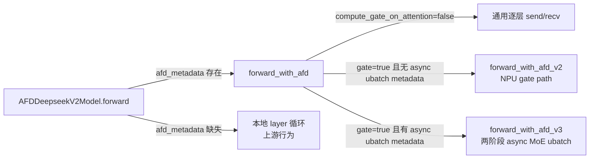

# Model Integration

本页描述 AFD 插件如何把上游 DeepSeek 家族与 GLM MoE DSA 架构注册为 AFD 包装类、如何按 Attention/FFN 角色拆分构造与加载、以及模型侧 forward 如何通过 connector 在两个角色间传递 hidden states。运行时生命周期（runner、worker、connector 传输）分别见 [04-Attention-Runtime.md](04-Attention-Runtime.md)、[05-FFN-Runtime.md](05-FFN-Runtime.md)、[06-Connectors.md](06-Connectors.md)；兼容补丁见 [09-Compatibility-Patches.md](09-Compatibility-Patches.md)。

## 模块布局

```
afd_plugin/model_executor/
  __init__.py                              # 仅包文档
  models/
    __init__.py                            # 导出 forward_context 辅助
    deepseek_v2.py                         # AFD 包装类与角色分流（核心）
    forward_context.py                     # ForwardContext 元数据读写
    model_utils.py                         # arch -> AFD arch 配置解析
    npu/
      __init__.py                          # 仅包文档
      deepseek_v2_async_cam_forward.py     # NPU async CAM forward 编排
      deepseek_v2_attention_gate.py        # NPU Attention-side gate/topk 与 FFN 计算
```

## 模型注册

### 注册表

`afd_plugin/__init__.py:47` 定义 `_DEEPSEEK_MODEL_REGISTRATIONS`，把上游 checkpoint 架构名映射到 AFD 包装类的导入路径：

| 上游架构名 | 注册别名 | 实际包装类 | 源码位置 |
| --- | --- | --- | --- |
| `DeepseekForCausalLM` | `AFDDeepseekForCausalLM` | `AFDDeepseekForCausalLM` | `__init__.py:48-50` |
| `DeepseekV2ForCausalLM` | `AFDDeepseekV2ForCausalLM` | `AFDDeepseekV2ForCausalLM` | `__init__.py:51-53` |
| `DeepseekV3ForCausalLM` | `AFDDeepseekV3ForCausalLM` | `AFDDeepseekV3ForCausalLM` | `__init__.py:54-56` |
| `DeepseekV32ForCausalLM` | `AFDDeepseekV32ForCausalLM` | `AFDDeepseekV3ForCausalLM` | `__init__.py:57-59` |
| `GlmMoeDsaForCausalLM` | `AFDGlmMoeDsaForCausalLM` | `AFDGlmMoeDsaForCausalLM` | `__init__.py:60-62` |

注意 `DeepseekV32ForCausalLM`（V3.2）复用 `AFDDeepseekV3ForCausalLM` 类：V3 与 V3.2 共用同一包装实现，只是注册了不同别名以便 vLLM `ModelRegistry` 能按各自架构名查到。

### 注册时机

`register_afd()`（`__init__.py:66`）是 `vllm.general_plugins` 入口。它在 `__init__.py:130-131` 遍历上表，对每个 `model_arch` 调用：

```python
ModelRegistry.register_model(f"AFD{model_arch}", model_cls)
```

即注册名是 `AFD` 前缀 + 上游架构名。vLLM 原生架构查询保持不变；AFD worker 在构造 model runner 前把本地 `ModelConfig.hf_config.architectures` 改成 `[f"AFD{model_arch}"]`，从而解析到 AFD 包装类。非 AFD worker 保留原架构名，仍解析到 vLLM 原生模型类。

### 架构名解析工具

`model_utils.py:16` 的 `get_afd_model_config(model_config)` 实现这一改写：遍历 `model_config.hf_config.architectures`，若命中 `_DEEPSEEK_MODEL_REGISTRATIONS`，返回一份 `hf_config` 副本，其 `architectures` 设为 `[f"AFD{model_arch}"]`；否则原样返回。这保证只有 DeepSeek 家族/GLM MoE DSA 会被改写，其它模型不受影响。

（`models/__init__.py:5-10` 还把 `forward_context.py` 的几个辅助函数重导出，供 `deepseek_v2.py` 等模块统一导入。）

## 包装类设计

所有 AFD 包装类都在 `afd_plugin/model_executor/models/deepseek_v2.py`，且共享 DeepSeek V2 派生实现。

### 类继承关系

```
native.DeepseekV2ForCausalLM          # vLLM 上游
  └─ AFDDeepseekV2ForCausalLM         # deepseek_v2.py:630  (核心包装)
       ├─ AFDDeepseekForCausalLM      # deepseek_v2.py:911  (pass)
       ├─ AFDDeepseekV3ForCausalLM    # deepseek_v2.py:915  (pass)
       │    └─ V3.2 复用此类，靠注册别名区分
       └─ AFDGlmMoeDsaForCausalLM     # deepseek_v2.py:919  (pass)
```

`AFDDeepseekForCausalLM`、`AFDDeepseekV3ForCausalLM`、`AFDGlmMoeDsaForCausalLM` 都是空 `pass` 子类（`deepseek_v2.py:911-920`），仅用于在 `ModelRegistry` 中提供独立别名；实际逻辑全部在 `AFDDeepseekV2ForCausalLM` 及其 `model_cls`。

### CausalLM 包装层

`AFDDeepseekV2ForCausalLM`（`deepseek_v2.py:630`）：

- `model_cls = AFDDeepseekV2Model`（`deepseek_v2.py:633`），覆盖上游的 `model_cls`，使父类 `__init__` 构造 AFD 模型体。
- `__init__`（`deepseek_v2.py:635-638`）先解析 `afd_config.role` 存到 `self.afd_role`，再调用 `super().__init__`，使下游模型体/层构造能读到角色。
- `set_moe_parameters`（`deepseek_v2.py:640-660`）：遍历 layer 收集 MoE 专家参数；`attention` 角色在第 658 行直接 `return`，不提取专家参数（因为 Attention 不执行 MoE FFN）。
- `compute_ffn_output`（`deepseek_v2.py:662-668`）：委托给 `self.model.compute_ffn_output`，供 FFN runner 调用。
- `load_weights`（`deepseek_v2.py:670-866`）：角色感知的权重加载，详见下文 [角色感知权重加载](#角色感知权重加载)。

### Model 体

`AFDDeepseekV2Model`（`deepseek_v2.py:347`，带 `@native.support_torch_compile`）：

- 构造 `embed_tokens`（仅 first pp rank，`deepseek_v2.py:377-385`）、`layers`（`make_layers` 工厂传入 `AFDDeepseekV2DecoderLayer`，`deepseek_v2.py:387-395`）、`norm`（仅 last pp rank，`deepseek_v2.py:397-400`）。共享 embedding/norm/output 按上游 pipeline-rank 规则构造，在生命周期需要处仍可用；非首/末 rank 用 `PPMissingLayer` 占位。
- V3.2 检测：`is_v32 = hasattr(config, "index_topk")`（`deepseek_v2.py:365`），并为 V3.2 预分配 `topk_indices_buffer`（`deepseek_v2.py:366-373`）传给每个 decoder layer。
- `aux_hidden_state_layers` 初始化为空元组（`deepseek_v2.py:407`）；AFD 路径下若非空会显式报错（`deepseek_v2.py:440-444`），即 E2E AFD 包装暂不支持 aux hidden state 捕获。
- `forward`（`deepseek_v2.py:412-474`）：若 forward context 中存在 `afd_metadata`，走 `forward_with_afd`（`deepseek_v2.py:445-451`）；否则走本地 layer 循环（`deepseek_v2.py:453-464`，等价上游行为）。这是“无 metadata 即退化为本地 forward”的分流点。

### Decoder Layer 角色构造

`AFDDeepseekV2DecoderLayer`（`deepseek_v2.py:65`）继承 `native.DeepseekV2DecoderLayer`。构造时按角色只建所需模块：

| 组件 | `attention` 角色 | `ffn` 角色 | 源码 |
| --- | --- | --- | --- |
| `self_attn`（MLA/MHA/DeepseekV2Attention） | 构造 | 不构造 | `deepseek_v2.py:119-144` |
| `gate`（`ReplicatedLinear`，仅 `compute_gate_on_attention` + MoE 层） | 构造 | 不构造 | `deepseek_v2.py:147-160` |
| dense MLP（仅 `compute_gate_on_attention` + dense 层） | 构造并本地执行 | 不构造 | `deepseek_v2.py:162-169` |
| MoE `mlp`（`DeepseekV2MoE`） | 不构造 | 构造（MoE 层） | `deepseek_v2.py:174-180` |
| dense `mlp`（`DeepseekV2MLP`，非 gate-on-attn 模式） | 不构造 | 构造（dense 层） | `deepseek_v2.py:181-188` |
| `input_layernorm` / `post_attention_layernorm` | 构造 | 构造 | `deepseek_v2.py:190-195` |

注意 `afd_role is None` 时（非 AFD worker）直接调用上游 `super().__init__`（`deepseek_v2.py:73-76`），保持原生行为。

Attention 类的选择（`deepseek_v2.py:120-128`）：`use_mha`（`model_type == "deepseek"` 或 nope/rope head_dim 全 0）用 `DeepseekAttention`；否则 `use_mla` 用 `DeepseekV2MLAAttention`，再否则用 `DeepseekV2Attention`。这决定 GLM MoE DSA 等架构走哪条 attention 实现。

`compute_gate_on_attention` 仅 NPU 可用：`deepseek_v2.py:98-104` 在非 NPU 平台直接 `raise RuntimeError`。

## 角色分流实现

### Attention 侧：算完注意力后 send

通用 AFD forward（非 gate-on-attention）在 `AFDDeepseekV2Model.forward_with_afd`（`deepseek_v2.py:476-546`）：

```
for each layer in [start_layer, end_layer):
    if not first layer:
        hidden_states = connector.recv_ffn_output(ref_tensor, ubatch_idx)   # 519
    hidden_states, residual = layer(positions, hidden_states, residual)    # 524  (attention-only, 提前返回)
    metadata = AFDTransferMetadata.create_attention_metadata(layer_idx, stage_idx, seq_len)  # 530
    connector.send_attn_output(hidden_states, AFDTransferContext(metadata)) # 536
    hidden_states = maybe_apply_dbo_yield(hidden_states, role="attention")  # 537
hidden_states = connector.recv_ffn_output(...)   # 542  (最后一层 FFN 结果)
```

层内 `AFDDeepseekV2DecoderLayer.forward`（`deepseek_v2.py:197-241`）的处理：

1. `input_layernorm`（`deepseek_v2.py:204-208`）
2. `self_attn`（`deepseek_v2.py:216`）
3. fp16 下 `routed_scaling_factor` 修正（`deepseek_v2.py:218-224`）
4. `post_attention_layernorm`（`deepseek_v2.py:226-229`）
5. **Attention 角色提前返回**（`deepseek_v2.py:230-233`）：若 `afd_role == "attention"` 且不是“gate-on-attention 的 dense 层”，直接 `return hidden_states, residual`，**不执行 MLP**。这层归一化后的 hidden states 就是要发给 FFN 的 payload。

所以 Attention 侧在每层 `post_attention_layernorm` 之后、MLP 之前切出，通过 connector `send_attn_output`（`deepseek_v2.py:536`）发出。`stage_idx` 取自 `forward_context.ubatch_idx`，回退到 `afd_metadata.stage_idx`（`deepseek_v2.py:507-509`、`514-517`）。

### FFN 侧：从 connector 接收后算 MoE

FFN runner 不走 `AFDDeepseekV2Model.forward`，而是调用 `AFDDeepseekV2ForCausalLM.compute_ffn_output`（`deepseek_v2.py:662-668`）→ `AFDDeepseekV2Model.compute_ffn_output`（`deepseek_v2.py:603-612`）→ 对应 `AFDDeepseekV2DecoderLayer.compute_ffn_output`（`deepseek_v2.py:299-343`）。

`compute_ffn_output`（layer 级）的逻辑：

- 非 gate-on-attention：直接 `self.mlp(hidden_states)`（`deepseek_v2.py:337`），dense 层做 fp16 修正（`deepseek_v2.py:338-342`）。FFN 侧从 connector 交付的 hidden states 开始算 MoE/MLP，无需重算 attention 或 gate。
- gate-on-attention 的 dense 层：直接报错（`deepseek_v2.py:311-315`），因为 dense 层已在 Attention 侧算完。
- gate-on-attention 的 MoE 层：要求 `group_list` 等参数，委托给 `deepseek_v2_attention_gate.compute_attention_gate_moe_ffn`（`deepseek_v2.py:316-336`），返回 `AFDF2ATransferPayload`（可能含分离的 routed/shared 输出）。

### 分流汇总



`forward_with_afd` 的分发逻辑见 `deepseek_v2.py:484-503`：先看 `compute_gate_on_attention`，再看 `get_async_moe_ubatch_metadata_from_forward_context()` 是否返回非空，分别进入 v3 或 v2。

## compute_gate_on_attention 开关

`afd_config.compute_gate_on_attention` 把 MoE 路由 gate 从 FFN 侧移到 Attention 侧计算。仅 NPU 支持（`deepseek_v2.py:98-104`）。

### 数据路径

开启后，Attention 侧的 MoE 层不再只发 hidden states，而是额外算出 `topk_weights`/`topk_ids`/`router_logits` 一并发给 FFN 侧；FFN 侧据此直接执行专家计算，跳过 gate。

门控计算入口在 `AFDDeepseekV2DecoderLayer.compute_attn_output`（`deepseek_v2.py:243-297`）：算完 attention + `post_attention_layernorm` 后，若 `compute_gate_on_attention and is_moe_layer`，调用 `npu/deepseek_v2_attention_gate.py:24` 的 `compute_attention_gate_topk`，返回 `(topk_weights, topk_ids, router_logits)`（`deepseek_v2.py:286-296`）。

### gate 模块

Attention 侧 MoE 层额外构造 `self.gate = ReplicatedLinear(hidden_size, n_routed_experts, bias=False)`（`deepseek_v2.py:148-154`）；若 `topk_method == "noaux_tc"`，再挂 `gate.e_score_correction_bias` 参数（`deepseek_v2.py:155-160`）。这个 gate 与上游 `DeepseekV2MoE.gate` 同源权重，只是搬到了 Attention 侧。

### topk 计算（NPU）

`compute_attention_gate_topk`（`npu/deepseek_v2_attention_gate.py:24-78`）：

1. `layer.gate(hidden_states)` 得到 `router_logits`（`deepseek_v2_attention_gate.py:30`）。
2. 从 forward context 取 `afd_metadata`，拿到 `afd_connector`（`deepseek_v2_attention_gate.py:31-37`）；缺失即报错。
3. 调用 `afd_connector.select_experts(...)`（`deepseek_v2_attention_gate.py:56-71`），传入 grouped top-k、`e_score_correction_bias`、`mix_placement`、shared/redundant expert 计数等，得到 `topk_weights`/`topk_ids`。即路由选择由 connector 实现（链 [06-Connectors.md](06-Connectors.md)）。
4. 若 `force_balanced_topk_ids_enabled()`，用 `_force_balanced_topk_ids` 把 topk_ids 改成均匀分布（`deepseek_v2_attention_gate.py:72-76`、`251-265`），用于负载均衡测试/调试。
5. `topk_weights` 转 `float32` 返回（`deepseek_v2_attention_gate.py:77-78`）。

### FFN 侧 MoE 计算（NPU）

`compute_attention_gate_moe_ffn`（`npu/deepseek_v2_attention_gate.py:81-179`）消费 Attention 侧产出的 topk payload 与 connector 产出的 `group_list`/`dynamic_scales` 等：

- 仅支持 `QuantType.NONE` 与 `QuantType.W8A8`（`deepseek_v2_attention_gate.py:104-130`），其它量化显式报错。
- 用 vLLM-Ascend 的 `unified_apply_mlp` + `MoEMlpComputeInput` 执行 routed experts（`deepseek_v2_attention_gate.py:155-169`）。
- shared experts 单独计算（`deepseek_v2_attention_gate.py:136-153`）：INT8 输入走 `_compute_w8a8_shared_experts_from_int8` 的 `npu_quant_matmul` 快路径（`deepseek_v2_attention_gate.py:199-240`），否则反量化后调用 `_shared_experts`。
- fp16 修正 `routed_scaling_factor`（`deepseek_v2_attention_gate.py:171-174`）。
- 返回 `AFDF2ATransferPayload(routed_output, shared_output)`（`deepseek_v2_attention_gate.py:176-179`），允许 routed/shared 分离回传。

## forward_context.py

AFD 不扩展 vLLM `ForwardContext` 的 schema，而是把元数据塞进 `ForwardContext.additional_kwargs`。模型代码只读这一个字典键，保证 `torch.compile` 不触碰 provider 查找。

### 主元数据

`get_afd_metadata_from_forward_context`（`forward_context.py:26-42`）从 `additional_kwargs["afd_metadata"]` 读出 `AFDForwardContextMetadata`（`forward_context.py:41`）。该 metadata 由 runner 在 `set_forward_context` 时安装，包含 stage/request/token 切片、stage 数、可选事务 ID，以及一个**活的 connector 引用**（链 [06-Connectors.md](06-Connectors.md)）。模型代码只读取元数据并用 connector 做 send/recv，不初始化或关闭 connector。

### async MoE ubatch sidecar

`ASYNC_MOE_UBATCH_METADATA_KEY = "afd_async_moe_ubatch_metadata"`（`forward_context.py:18`）。`get_async_moe_ubatch_metadata_from_forward_context`（`forward_context.py:45-59`）读这个 sidecar，返回 `AsyncMoeUbatchMetadata`（TypedDict，含 `attn_metadata` 与 `ubatch_slices`，`forward_context.py:21-23`）。仅 async CAM 两阶段路径使用（见下文）。

### dummy run 适配

原生 vLLM dummy run 会直接调用模型、绕过 AFD runner 的 `_model_forward()`，从而不会安装 `afd_metadata`。`use_afd_metadata_provider`（`forward_context.py:62-88`）是一个 contextmanager：临时包装 `vllm.forward_context.create_forward_context`，在 vLLM 创建 context 后立即调用 `provider._install_afd_metadata_on_forward_context` 注入相同的 `additional_kwargs`，`finally` 中还原原函数。这是 scoped 兼容适配，不是常驻全局 provider。

## NPU 专用 forward 变体

`forward_with_afd_v2`（`deepseek_v2.py:548-567`）与 `forward_with_afd_v3`（`deepseek_v2.py:569-601`）都委托给 `npu/deepseek_v2_async_cam_forward.py`。两者都只在 `compute_gate_on_attention=true` 时进入，覆盖上游 DeepSeek forward 中“逐层 attention+MLP”这段，改为跨 Attention/FFN 的分离执行。

### run_attention_gate_afd_forward（标准 gate 路径）

`npu/deepseek_v2_async_cam_forward.py:31-108`，对应 `forward_with_afd_v2`：

- dense 层（`not layer.is_moe_layer`）在 Attention 侧本地完整执行（`async_cam:62-69`），不发送。
- MoE 层调用 `layer.compute_attn_output`（`async_cam:71-82`），拿到 hidden states + topk payload。
- `send_attn_output` 携带 `topk_weights`/`topk_ids`/`router_logits`（`async_cam:90-96`）。
- **延迟 recv**：用 `pending_ffn_recv` 标志（`async_cam:46`、`55-60`），只在下一层 MoE 开始前才 `recv_ffn_output`，最后一层之后再收尾（`async_cam:103-107`）。这样 dense 层不需等待 FFN，MoE 层间形成流水。

### run_async_moe_ubatch_afd_forward（两阶段 async MoE ubatch）

`npu/deepseek_v2_async_cam_forward.py:111-289`，对应 `forward_with_afd_v3`。这是实验性的请求边界两阶段流水：

1. dense 区段一次性本地执行（`async_cam:127-133`）；若全是 dense 直接返回（`async_cam:134-135`）。
2. 把 MoE 区段按 `ubatch_slices` 切成两个 stage，分别切片 hidden states/residual/positions/llama_4_scaling（`async_cam:137-155`）。
3. `compute_stage_attention`（`async_cam:160-194`）：在 stage 专属 forward context（`_use_async_moe_ubatch_forward_context`，`async_cam:295-345`）中调用 `layer.compute_attn_output`，临时改写 `attn_metadata`/`additional_kwargs`/`ubatch_idx`/`num_ubatches`/`num_tokens`，`finally` 还原。强制要求 topk payload 非空（`async_cam:183-186`）。
4. `send_stage_attention`（`async_cam:196-216`）与 `recv_stage_ffn`（`async_cam:218-222`）按 stage 索引收发。
5. 主循环（`async_cam:224-281`）在相邻两 MoE 层间交错：对当前层算 stage1、收 stage0、发 stage1，再对下一层算 stage0、收 stage1、发 stage0，形成跨层跨 stage 的双缓冲流水。最后 `torch.cat` 拼回（`async_cam:282`）。

`_build_async_moe_stage_afd_metadata`（`async_cam:348-365`）从父 metadata clone 出 stage 级 metadata，改写 `stage_idx`/`num_stages`/切片范围。

## model_utils.py 工具函数

仅一个函数 `get_afd_model_config`（`model_utils.py:16-25`）：见上文 [架构名解析工具](#架构名解析工具)。它做浅拷贝 `model_config` 与 `hf_config`，把命中的架构名改写为 `AFD` 前缀别名，供 worker 在构造 runner 前切换模型实现。非 DeepSeek 家族/GLM MoE DSA 原样返回。

## 角色感知权重加载

`AFDDeepseekV2ForCausalLM.load_weights`（`deepseek_v2.py:670-866`）沿用上游的 stacked mapping、expert mapping、spec-layer 跳过、PP 缺失检查、KV scale 重命名、shared-expert mix placement、redundant expert 等逻辑，AFD 仅在过滤层叠加角色规则：

- **Attention 跳过 FFN 专家权重**：`attention` 角色且 `is_moe_weight(name)` 时跳过（`deepseek_v2.py:726-734`）；expert mapping 循环里 `attention` 角色 `continue`（`deepseek_v2.py:814-815`）。
- **gate 权重重映射**：`attention` + `compute_gate_on_attention` 下，把 checkpoint 的 `mlp.gate.weight`/`mlp.gate.e_score_correction_bias` 重映射到 Attention 侧的 `gate` 模块（`deepseek_v2.py:707-724`）。
- **dense MLP 权重**：`attention` + gate-on-attn 下仍加载 dense MLP（因 dense 层在 Attention 侧执行）；`ffn` + gate-on-attn 下跳过 dense MLP（`deepseek_v2.py:736-741`）。
- **FFN 跳过无关权重**：`ffn` 角色且非 MoE/非 common 权重时 `continue`（`deepseek_v2.py:841-846`）。
- **common 权重**定义在 `is_common_weight`（`deepseek_v2.py:901-908`）：`lm_head`/`model.norm.weight`/`embed_tokens`/`input_layernorm`/`post_attention_layernorm`。
- `is_moe_layer_weight`/`is_dense_mlp_weight`（`deepseek_v2.py:877-887`）通过 `weight_layer_idx`（`deepseek_v2.py:889-899`）解析层号，结合 `_is_moe_layer`（`deepseek_v2.py:56-62`）判断。

`num_redundant_experts` 在 `attention` 角色取自 `vllm_config.parallel_config.eplb_config`（`deepseek_v2.py:683-687`），`ffn` 角色取自 `self.num_redundant_experts`（`deepseek_v2.py:688-689`）。

## 为何只支持 DeepSeek 家族 + GLM MoE DSA

⚠️ 源码未明说选型动机，以下为结合结构的推断：

- 所有注册类共享 `AFDDeepseekV2ForCausalLM` 实现（`deepseek_v2.py:911-920`），说明 AFD 目前只针对与 DeepSeek V2 结构兼容的模型。
- DeepSeek V2/V3 家族采用 MLA（Multi-head Latent Attention）+ 细粒度 MoE + shared experts，attention 与 MoE-FFN 在 decoder layer 内有天然清晰的切分点（`post_attention_layernorm` 之后、MLP 之前），适合 AFD 的 Attention/FFN 分离。
- MLA 的低秩 KV 压缩使 Attention 侧 KV cache 与计算可独立于 FFN 放大，分离后两侧负载更均衡。
- GLM MoE DSA 复用同一包装（`AFDGlmMoeDsaForCausalLM` 仅 `pass`），说明其 layer 结构（attention + MoE/MLP + norm）与 DeepSeek V2 decoder layer 足够兼容，能直接走 `_is_moe_layer`/`use_mha`/`use_mla` 等既有分支。
- 非 MoE 模型或 attention/FFN 耦合更紧的结构（如 attention 内含 MoE）不适用当前切分方案，故未纳入。

设计文档 `docs/design/module/model_integration.md` 亦标注“current implementation is DeepSeek-oriented”且整体为 draft 状态，未给出正式选型规范。

## 与设计文档的对照

逐行核对 `docs/design/module/model_integration.md` 与当前 main 源码，二者基本一致，未发现实质性冲突。需注意的差异/状态：

- 设计文档标注 `status: draft`，并明确 `AFDForwardContextMetadata` 形状、connector 引用、async MoE sidecar、架构别名均为 draft，挂 issue #88/#105 待定。源码现状与该 draft 描述一致，但这些 API 不构成稳定扩展承诺。
- 设计文档的注册表与本页表格一致，包括 V3.2 复用 `AFDDeepseekV3ForCausalLM` 的事实。
- 设计文档称 gate helper 支持 unquantized 与 W8A8，源码 `deepseek_v2_attention_gate.py:104-130` 一致，且额外支持 `MXFP8` 的 fusion 开关判断（`deepseek_v2_attention_gate.py:131-134`，实际仅影响 fusion 标志，量化类型仍只接受 NONE/W8A8）。
