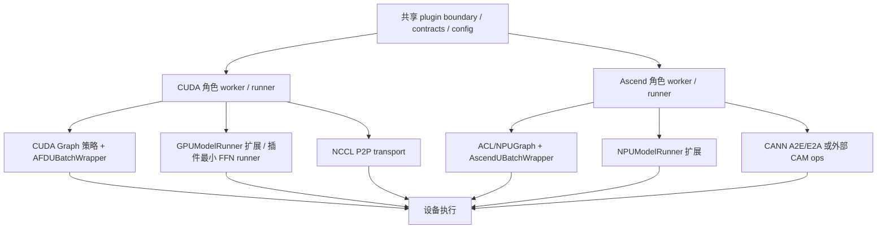

# Execution Platforms

本页以当前 main 分支源码为准，记录 AFD plugin 在 GPU（CUDA）与 NPU（Ascend）两大执行平台上的运行时机制：CUDA graph 策略、Dual-Batch Overlap（DBO）、ubatch 包装、NPU 运行时兼容层、profiler、原生算子构建，以及两平台的系统对比。概念定义见 [12-Glossary](12-Glossary.md)，整体架构见 [02-Architecture](02-Architecture.md)。

## 平台机制总览



CUDA 与 Ascend 使用各自独立的类路径，分别继承对应的上游运行时类，不跨平台继承。共享行为通过配置、connector payload、forward-context metadata、graph-policy helper 等机制传递。

## CUDA Graph 策略

### AFDGraphRunMode 枚举

`afd_plugin/v1/worker/cuda_graph.py:24-28` 定义了四种运行时模式：

| 枚举值 | 含义 |
| --- | --- |
| `EAGER` | 纯 eager 执行，无 graph |
| `WARMUP` | graph 预热阶段 |
| `CAPTURE` | 正式捕获 CUDA graph |
| `REPLAY` | 重放已捕获的 graph |

`graph_run_mode()`（`cuda_graph.py:136-149`）根据 `is_warmup`、`is_graph_capturing`、`graph_enabled`、`graph_exists` 四个输入决定当前模式，优先级为 WARMUP > CAPTURE > REPLAY > EAGER。

### FULL_DECODE_ONLY 模式

`FULL_DECODE_ONLY = "FULL_DECODE_ONLY"`（`cuda_graph.py:20`）是 AFD 当前唯一支持的 vLLM CUDA graph 模式。`_SUPPORTED_GRAPH_MODES`（`cuda_graph.py:21`）仅包含此值。

### AFDCUDAGraphPolicy 解析

`AFDCUDAGraphPolicy`（`cuda_graph.py:31-39`）是一个 frozen dataclass，字段含义：

| 字段 | 含义 |
| --- | --- |
| `enabled` | graph 执行是否启用 |
| `mode_name` | vLLM `cudagraph_mode` 名称 |
| `allow_attention_full_decode_only` | Attention 角色是否允许 full-decode graph |
| `enable_ffn_graph_cache` | FFN 角色是否启用 graph 缓存 |
| `allow_cuda_graph_with_ubatching` | 是否允许 ubatching + graph 共存 |

`validate_cuda_graph_mode()`（`cuda_graph.py:42-85`）的决策逻辑：

1. 若 `enforce_eager=True`，返回 `enabled=False` 的策略（`cuda_graph.py:49-59`）。
2. 若 `mode_name` 不在 `_SUPPORTED_GRAPH_MODES` 中，抛 `RuntimeError`（`cuda_graph.py:61-66`）。
3. 读取 `parallel_config.use_ubatching` 和 `num_ubatches`，仅当 `use_ubatching=True` 且 `num_ubatches==2` 时允许 ubatching 与 graph 共存（`cuda_graph.py:68-77`）。
4. 根据 `role` 设置 `allow_attention_full_decode_only`（role 为 `None` 或 `"attention"`）和 `enable_ffn_graph_cache`（role 为 `None` 或 `"ffn"`）（`cuda_graph.py:79-85`）。

### "恰好两个 ubatch" 约束

GPU 侧约束位于 `cuda_graph.py:71-77`：

```python
allow_ubatching = use_ubatching and int(num_ubatches or 0) == 2
if use_ubatching and not allow_ubatching:
    raise RuntimeError(
        "AFD CUDA graph support currently supports ubatching only for "
        f"{FULL_DECODE_ONLY} with exactly two ubatches; "
        f"got num_ubatches={num_ubatches!r}.",
    )
```

NPU 侧的等价约束位于 `afd_plugin/compat/npu/feature_validation.py:59-64`，在 `fail_if_unsupported_npu_afd_features()` 中检查 `use_ubatching` 且 `num_ubatches != 2` 时报错。NPU async MoE ubatching 路径同样要求恰好两个 stage（`feature_validation.py:121-125`）。

### FFN graph key

`make_ffn_graph_key()`（`cuda_graph.py:104-133`）从 DP metadata 提取可哈希的 graph key，按 stage 索引排序，每 stage 取 `num_tokens_across_dp_cpu` 的值元组。当 TP > 1 时通过 `_aggregate_ffn_values_tuple()`（`cuda_graph.py:176-198`）将 DP 级值扩展到 attention 级再聚合为 FFN 级。

## DBO（Dual-Batch Overlap）

### yield custom op 机制

`afd_plugin/v1/worker/dbo.py` 实现了 AFD 的 DBO yield 机制。核心是注册一个自定义 op `torch.ops.vllm.manual_dbo_yield`，在模型前向过程中主动让出 CPU 控制权，使两个 ubatch 线程可以交替执行。

`register_dbo_yield_custom_op()`（`dbo.py:26-49`）：

- 使用 `direct_register_custom_op` 注册名为 `manual_dbo_yield` 的 op（`dbo.py:40-45`）。
- 真实实现 `afd_manual_dbo_yield_op` 调用 `_yield_if_dbo_enabled()`（`dbo.py:32-34`）。
- fake 实现 `afd_manual_dbo_yield_fake` 直接返回输入（`dbo.py:36-37`），用于 torch.compile 的 tracing。
- 使用模块级 `_AFD_DBO_YIELD_OP_REGISTERED` flag 保证只注册一次（`dbo.py:9, 29-30, 49`）。

`maybe_apply_dbo_yield()`（`dbo.py:12-23`）是模型侧入口：先尝试注册 op（`ImportError` 时静默返回原 tensor），然后调用 `torch.ops.vllm.manual_dbo_yield(tensor)`。

### 平台分发

`_yield_if_dbo_enabled()`（`dbo.py:52-74`）实现了平台分发：

1. 优先尝试导入 `afd_plugin.v1.worker.npu.ubatching` 的 `dbo_enabled` / `dbo_yield`（`dbo.py:54-59`）。
2. 若 Ascend DBO 已启用，调用 `ascend_dbo_yield()` 并返回（`dbo.py:64-70`）。
3. 否则回退到 vLLM 原生的 `dbo_enabled()` / `dbo_yield()`（从 `vllm.v1.worker.ubatching` 导入，`dbo.py:7`）（`dbo.py:72-73`）。

### 双微批如何重叠

NPU 侧的重叠实现在 `afd_plugin/v1/worker/npu/ubatching.py`。`AscendUBatchContext`（`ubatching.py:17-76`）是每个 ubatch 线程的执行上下文：

- 两个 ubatch 共享一个 `threading.Barrier(3)`（两个线程 + 主线程）。
- 使用配对的 `threading.Event` 实现交替：ubatch 0 的 `cpu_signal_event` 指向 ubatch 1 的 `cpu_wait_event`，反之亦然（`ubatching.py:126-136`）。
- `__enter__` 等待 barrier 和 `cpu_wait_event`，恢复 forward context 和 stream（`ubatching.py:37-45`）。
- `yield_()` 保存当前 stream，调用 `_cpu_yield()` 设置 signal event 并等待对方（`ubatching.py:73-75, 62-71`）。

`make_ubatch_contexts()`（`ubatching.py:114-137`）强制断言 `num_micro_batches == 2`（`ubatching.py:120-122`）。

GPU 侧的 DBO 由 vLLM 原生 ubatching 栈提供，`AFDUBatchWrapper` 通过 `make_ubatch_contexts`（从 `vllm.v1.worker.ubatching` 导入，`ubatch_wrapper.py:18`）创建上下文。

### DBO 与 ubatch 的关系

DBO 是 ubatching 的执行时重叠策略：ubatch 将一个 batch 切分为两个微批，DBO 使两个微批在前向计算中交替重叠执行，以隐藏通信延迟。`dbo_enabled()` 在 NPU 侧通过检查 `_THREAD_ID_TO_CONTEXT` 是否非空判断（`ubatching.py:89-90`）。

## ubatch 包装

### ubatch 概念

ubatch（micro-batch）是 vLLM 将一个调度 batch 沿 token 维切分为多个微批的机制。AFD 当前在 GPU 和 NPU 上均仅支持恰好两个 ubatch。详见 [12-Glossary](12-Glossary.md)。

### GPU 侧：AFDUBatchWrapper

`afd_plugin/v1/worker/ubatch_wrapper.py` 中的 `AFDUBatchWrapper`（`ubatch_wrapper.py:24`）是 vLLM `UBatchWrapper` 的薄子类。

核心职责：

- **AFD context provider 注入**：`configure_afd_context_provider()`（`ubatch_wrapper.py:31-32`）安装 AFD metadata 提供者。
- **SM control 旁路**：AFD 激活时 `_create_sm_control_context()` 返回 `nullcontext()`，跳过 vLLM 的 SM control（`ubatch_wrapper.py:34-40`）。
- **AFD metadata 安装**：`_install_missing_afd_metadata()`（`ubatch_wrapper.py:105-126`）在 forward context 缺少 `afd_metadata` 时，通过 provider 构建 stage-local metadata 并发送 DP metadata。
- **ubatch metadata 构建**：`_make_ubatch_metadata()`（`ubatch_wrapper.py:128-225`）为每个 ubatch slice 创建独立的 forward context，包含切分后的 AFD metadata、DP metadata、additional_kwargs。
- **CUDA graph 捕获/重放**：`__call__`（`ubatch_wrapper.py:42-103`）在 `CUDAGraphMode.FULL` 下处理 graph 捕获（`ubatch_wrapper.py:60-78`）和重放（`ubatch_wrapper.py:80-87`）。

辅助函数：

| 函数 | 位置 | 职责 |
| --- | --- | --- |
| `build_ubatch_afd_metadata` | `ubatch_wrapper.py:228-248` | 克隆父级 AFD metadata 为单个 ubatch，设置 stage_idx/num_stages/token 切片 |
| `build_ubatch_additional_kwargs` | `ubatch_wrapper.py:251-257` | 将 AFD metadata 注入子 kwargs |
| `build_ubatch_dp_metadata_list` | `ubatch_wrapper.py:260-303` | DP=1 用 `AFDDPMetadata`，DP>1 用 vLLM `DPMetadata.make` |

### NPU 侧 ubatch 包装

NPU 侧由多个模块协作：

**`afd_plugin/v1/worker/npu/npu_ubatch_wrapper.py`** — `AscendUBatchWrapper`（`npu_ubatch_wrapper.py:53`）：

- 独立实现，不继承 `AFDUBatchWrapper`。
- 使用 `ACLGraphWrapper`（`npu_ubatch_wrapper.py:70-75`）管理 ACL graph。
- `__call__`（`npu_ubatch_wrapper.py:99-180`）处理无 ubatch 的 graph 路径和有 ubatch 的 capture/replay/run 路径。
- `_run_ubatches`（`npu_ubatch_wrapper.py:329-351`）启动两个线程执行，通过 `ready_barrier` 和 `cpu_wait_event` 协调。
- `_capture_ubatches`（`npu_ubatch_wrapper.py:353-392`）在 `torch.npu.graph(...)` 中捕获两个线程的执行。
- `_merge_outputs`（`npu_ubatch_wrapper.py:301-316`）按 stage 顺序合并输出，FlashComm 路径做 TP all-gather 并去 padding。
- `_slice_model_inputs`（`npu_ubatch_wrapper.py:247-286`）在 SP 启用时对 intermediate tensors 做 TP 对齐切片。

**`afd_plugin/v1/worker/npu/ubatching.py`** — DBO 上下文与线程协调（见上文 DBO 小节）。

**`afd_plugin/v1/worker/npu/ubatch_utils.py`** — ubatch 切片工具：

- `check_enable_ubatch`（`ubatch_utils.py:37-68`）：判断是否启用 ubatching，要求 `num_ubatches==2`、`enable_dbo=True`、非 CP、通过 threshold 检查、末尾 ubatch 非空。
- `create_ubatch_slices`（`ubatch_utils.py:84-99`）：按 token split point 创建 `UBatchSlices`。
- `create_request_boundary_ubatch_slices`（`ubatch_utils.py:102-141`）：按 request 边界切分（async MoE 用），选择两 stage token 数最接近的边界。
- `pad_out_ubatch_slices`（`ubatch_utils.py:71-81`）：padding 最后一个 slice。
- `split_attn_metadata`（`ubatch_utils.py:303-311`）：将 `AscendCommonAttentionMetadata` 按 slice 切分，处理首尾 request 被切割的情况（`_make_metadata_with_slice`，`ubatch_utils.py:184-300`）。

**`afd_plugin/v1/worker/npu/forward_context.py`** — `create_ascend_forward_context`（`forward_context.py:20-133`）：为每个 ubatch 创建独立的 `ForwardContext`，复制 MoE comm type/method、FlashComm、pad_size、padded_length、mc2_mask 等字段，设置 `dbo_enabled=True`。

**`afd_plugin/v1/worker/npu/pcp_debug.py`** — PCP（Prefill Context Parallel）调试工具：通过 `AFD_DEBUG_PCP_METADATA` 环境变量启用，提供 metadata 快照/恢复/克隆等调试辅助，不影响正常执行路径。

## NPU 运行时兼容层（compat/npu/）

`afd_plugin/compat/npu/__init__.py` 是公共 facade，聚合了以下子模块的导出。

### runtime.py — 兼容 facade

`afd_plugin/compat/npu/runtime.py` 是 Ascend 运行时兼容的入口 facade：

- `apply_afd_ascend_patches_if_needed()`（`runtime.py:21-33`）：幂等应用 AFD Ascend patch，通过 `_PATCHES_APPLIED` flag 防重复。当前调用 `apply_afd_ascend_dbo_config_patch()`（从 `afd_plugin.compat.patches.npu.ascend_platform` 延迟导入）。
- 转发 `ascend_forward_context`、`fail_if_unsupported_npu_afd_features`、`fix_all2all_backend_for_afd`、`npu_afd_num_ubatches`。

### runtime_config.py — 配置修正

`afd_plugin/compat/npu/runtime_config.py`：

- `npu_afd_num_ubatches`（`runtime_config.py:15-19`）：返回 ubatch 数量，未启用 ubatching 时返回 1。
- `fix_all2all_backend_for_afd`（`runtime_config.py:22-42`）：当 SP 未启用且 `all2all_backend` 非 `flashinfer_all2allv` 时，强制改写为 `flashinfer_all2allv`。此项修正镜像 vLLM-Ascend 对默认 worker 的改写，覆盖显式指定 AFD worker 的 legacy 启动路径，避免 MoE 路径误认为 SP MoE 已启用。

### forward_context.py — connector-driven forward context

`afd_plugin/compat/npu/forward_context.py`：

- `ascend_forward_context()`（`forward_context.py:19-51`）：上下文管理器，为 connector-driven FFN 步骤创建最小 forward context。调用 vLLM-Ascend 的 `set_ascend_forward_context()`，设置 `aclgraph_runtime_mode`（默认 `CUDAGraphMode.NONE`）、`num_tokens`、`num_tokens_across_dp`，并将 `afd_metadata` 注入 `additional_kwargs`。

### profiler.py — NPU profiler

见下文 [profiler](#profiler) 小节。

### feature_validation.py — 特性校验

`afd_plugin/compat/npu/feature_validation.py`：

- `fail_if_unsupported_npu_afd_features()`（`feature_validation.py:22-64`）：fail-fast 校验。对非 async 路径：拒绝 `compute_gate_on_attention=True`（`feature_validation.py:45-48`）；校验 `CAMP2pAFDConnector` 的 `CAMP2PExtraInfo`（`feature_validation.py:49-57`）；要求 ubatching 时恰好两个 ubatch（`feature_validation.py:59-64`）。
- `_fail_if_unsupported_npu_afd_async_features()`（`feature_validation.py:67-104`）：对 `CAMAsyncAFDConnector` 路径：要求 async DP 配置（`feature_validation.py:80-85`）、仅 eager（`feature_validation.py:86-89`）、拒绝原生 ubatching/DBO（`feature_validation.py:90-93`）、`dynamicQuant` 仅 0 或 1（`feature_validation.py:101-104`）。
- `_fail_if_unsupported_npu_async_moe_ubatching_features()`（`feature_validation.py:107-134`）：async MoE ubatching 路径要求 `compute_gate_on_attention=True`、恰好两个 stage、request-boundary split、DCP size <= 1。

### ops.py — 原生算子加载器

`afd_plugin/compat/npu/ops.py` 负责将 plugin 原生算子绑定到 Python：

- 常量定义（`ops.py:11-18`）：`AFD_ASCEND_OPS_NAMESPACE = "afd_ascend"`、`AFD_ASCEND_VENDOR_NAME = "afd-plugin"`、`AFD_CUST_OPAPI_ENV = "AFD_CUST_OPAPI_LIB_PATH"`、CAM op 名称常量。
- `get_afd_cann_vendor_path()`（`ops.py:21-27`）：返回包内 `_cann_ops_custom/vendors/afd-plugin` 路径。
- `_ensure_afd_custom_opp_env()`（`ops.py:43-54`）：将 vendor 目录 prepend 到 `ASCEND_CUSTOM_OPP_PATH`、`LD_LIBRARY_PATH`，并设置 `AFD_CUST_OPAPI_LIB_PATH`。
- `ensure_cam_p2p_ops_available()`（`ops.py:71-89`）：`@lru_cache` 幂等加载器。设置 custom OPP 环境 -> 导入 `afd_plugin._C_ascend` -> 断言 `torch.ops.afd_ascend.a2e` 和 `torch.ops.afd_ascend.e2a` 已注册（`ops.py:57-59`）。
- `ensure_afd_ascend_ops_loaded()`（`ops.py:92-95`）：`ensure_cam_p2p_ops_available` 的向后兼容别名。
- `has_afd_ascend_ops()`（`ops.py:98-103`）：探测加载是否可用，失败返回 `False`。
- `ensure_cam_async_ops_available()`（`ops.py:106-127`）：加载外部 CAM async ops，要求 `torch_npu` 和 `umdk_cam_op_lib`，断言 `torch.ops.umdk_cam_op_lib` 下的四个 async op 已注册。

## profiler

### GPU profiler

`afd_plugin/compat/profiler.py`：

- 两个角色 `attention` / `ffn`，环境变量前缀分别为 `AFD_GPU_ATTENTION_PROFILER` / `AFD_GPU_FFN_PROFILER`（`profiler.py:19-22`）。
- `AFDGPUProfilerConfig`（`profiler.py:35-43`）：enabled/wait/warmup/active/repeat/skip_first/trace_dir。
- `create_afd_gpu_profiler`（`profiler.py:64-96`）：启用时创建 `torch.profiler.profile`，活动为 CPU + CUDA，schedule 按 wait/warmup/active/repeat/skip_first，trace handler 为 TensorBoard。`with_stack=False` 硬编码（`profiler.py:93`），`profile_memory=False`（`profiler.py:92`）。
- 默认值：wait=2500, warmup=1, active=10, repeat=1, skip_first=0（`profiler.py:27-31`）。
- trace_dir 回退链：`AFD_GPU_{ROLE}_PROFILER_DIR` -> `VLLM_TORCH_PROFILER_DIR` -> 默认目录（`profiler.py:131-132`）。

### NPU profiler

`afd_plugin/compat/npu/profiler.py`：

- 两个角色，前缀 `AFD_NPU_ATTENTION_PROFILER` / `AFD_NPU_FFN_PROFILER`（`profiler.py:16-19`）。
- `AFDNPUProfilerConfig`（`profiler.py:35-44`）：比 GPU 多一个 `with_stack` 字段。
- `create_afd_npu_profiler`（`profiler.py:72-113`）：创建 `torch_npu.profiler.profile`，活动为 CPU + NPU，配置 `_ExperimentalConfig`（Level2、Text 导出、AiCoreNone）（`profiler.py:81-85`）。
- 角色差异化默认 active：attention=10, ffn=20（`profiler.py:24-27`）；默认 skip_first=1500（`profiler.py:31`）。

### stack toggle 机制

| 平台 | with_stack | toggle 方式 |
| --- | --- | --- |
| GPU | 硬编码 `False`（`profiler.py:93`） | 无 toggle |
| NPU | 可配置（`profiler.py:104-105`） | `AFD_NPU_{ROLE}_WITH_STACK` 环境变量，同时控制 `with_stack` 和 `with_modules` |

NPU profiler 的 stack toggle 通过 `AFD_NPU_{ROLE}_WITH_STACK` 布尔环境变量控制（`profiler.py:68`），启用后 `with_stack` 和 `with_modules` 同时为 `True`（`profiler.py:104-105`），用于在 trace 中记录 Python 调用栈和模块信息。GPU profiler 无此 toggle，`with_stack` 始终为 `False`。

## 原生算子（csrc/npu）

### 目录结构

```text
csrc/
  README.md               # 总览：npu/ 为 Ascend 算子，gpu/ 为预留
  gpu/
    README.md             # 仅 "reserved for GPU native source files"
  npu/
    CMakeLists.txt        # CANN vendor 包构建（opapi/opsproto/optiling/ops_aclnn）
    build.sh              # CANN 构建脚本（cmake config + build package）
    build_aclnn.sh        # ACLNN vendor 包构建入口（调用 build.sh -n "a2e;e2a"）
    a2e/op_host/          # a2e 算子 host 代码（aclnn_a2e.h）
    e2a/op_host/          # e2a 算子 host 代码（aclnn_e2a.h）
    aclnn_torch_adapter/  # ACLNN <-> torch 桥接
    torch_extension/      # PyTorch C++ extension binding
    cmake/                # CANN cmake 配置
```

`csrc/gpu/` 为预留位，仅含一个 README.md（`csrc/gpu/README.md`），无任何源码。

### a2e / e2a 算子

a2e（Attention-to-Expert）和 e2a（Expert-to-Attention）是 AFD CAMP2P connector 的核心 CANN 自定义算子。

**ACLNN host 接口**（`csrc/npu/a2e/op_host/aclnn_a2e.h`、`csrc/npu/e2a/op_host/aclnn_e2a.h`）：

- `aclnnA2e` / `aclnnE2a`：标准 ACLNN 两段式接口（`GetWorkspaceSize` + 执行）。
- a2e 输入：x、expert_ids、scales、batch_size、hidden_size、topk、expert_rank_size、attention_rank_size、rank、group_ep、aiv_num、compute_gate；输出：expand_x_out、simulate_expert_ids、simulate_expert_scales、atten_batch_size、x_active_mask_out。
- e2a 输入：expand_x、atten_batch_size 及拓扑参数；输出：x_out。

**torch binding**（`csrc/npu/torch_extension/torch_binding.cpp`）：

- `a2e()`（`torch_binding.cpp:19-90`）：C++ 实现，根据 rank 与 expert_rank_size/attention_rank_size 的关系分配输出 tensor，通过 `EXEC_NPU_CMD(aclnnA2e, ...)` 分发到 ACLNN。
- `e2a()`（`torch_binding.cpp:92-131`）：同理，通过 `EXEC_NPU_CMD(aclnnE2a, ...)` 分发。
- `TORCH_LIBRARY(afd_ascend, ops)`（`torch_binding.cpp:135-147`）：注册 `a2e` 和 `e2a` 的 schema 与 `torch::kPrivateUse1` 实现。

**Meta 实现**（`csrc/npu/torch_extension/torch_binding_meta.cpp`）：

- `a2e_meta` / `e2a_meta`（`torch_binding_meta.cpp:10-92`）：在 `at::kMeta` 设备上创建同形状的空 tensor，用于 torch.compile tracing。
- `TORCH_LIBRARY_IMPL(afd_ascend, Meta, ops)`（`torch_binding_meta.cpp:96-98`）注册 Meta dispatch。

### aclnn_torch_adapter

`csrc/npu/aclnn_torch_adapter/` 提供 ACLNN 与 torch 的桥接层：

- **`op_api_common.h`**（604 行）：核心适配头文件。定义 `EXEC_NPU_CMD` 宏（`op_api_common.h:535-602`）、ACL 数据类型转换表（`op_api_common.h:81-108`）、`GetOpApiFuncAddr` 动态加载机制。`EXEC_NPU_CMD` 的工作流程：通过 `GetOpApiFuncAddr` 从 `libcust_opapi.so` 动态查找 `aclnn{Op}GetWorkspaceSize` 和 `aclnn{Op}` 符号 -> 调用 `GetWorkspaceSize` 获取 `aclOpExecutor` 和 workspace 大小 -> 分配 workspace -> 通过 `OpCommand` 在当前 NPU stream 上执行。错误信息引用 `AFD_CUST_OPAPI_LIB_PATH`（`op_api_common.h:548`）。
- **`NPUStorageImpl.h`/`.cpp`**：`NPUStorageImpl` 继承 `c10::StorageImpl`，附加 `NPUStorageDesc`（含 `base_sizes_`、`base_strides_`、`origin_format_`、`npu_format_` 等 CANN 格式信息）（`NPUStorageImpl.h:22-58`）。`make_npu_storage_impl` 工厂函数创建 NPU storage（`NPUStorageImpl.cpp:30-50`）。
- **`NPUBridge.h`/`.cpp`**：`NPUBridge` 提供静态方法从 `at::Tensor`/`c10::StorageImpl`/`c10::Storage` 获取 `NPUStorageImpl` 及其 `NPUStorageDesc`（`NPUBridge.cpp:11-29`）。`op_api_common.h` 通过 `NPUBridge` 访问 tensor 底层 NPU storage 描述，以构造 ACLNN 所需的 `aclTensor`。

这些文件源自华为 torch_npu/vLLM-Ascend heritage（头部 copyright 标注 Huawei Technologies），由 plugin 内嵌以保持构建自包含。

### torch_extension CMake 构建

`csrc/npu/torch_extension/CMakeLists.txt`（82 行）：

- 构建目标 `afd_plugin_ascend_C`，输出名 `_C_ascend`（`CMakeLists.txt:46-52`），即 Python 侧的 `afd_plugin._C_ascend`。
- 源文件：`torch_binding.cpp`、`torch_binding_meta.cpp`、`NPUBridge.cpp`、`NPUStorageImpl.cpp`（`CMakeLists.txt:46-50`）。
- 链接 `torch_npu`、`ascendcl`、`opapi`（`CMakeLists.txt:72-77`），以及包内 `_cann_ops_custom/vendors/afd-plugin/op_api/lib`（`CMakeLists.txt:66-70`）。
- rpath 设置 `$ORIGIN:$ORIGIN/_cann_ops_custom/vendors/afd-plugin/op_api/lib`（`CMakeLists.txt:79-80`），确保运行时找到 `libcust_opapi.so`。

### setup.py 自动检测与构建

`setup.py` 的 Ascend 算子构建逻辑分为自动检测和构建两个阶段。

**自动检测** — `_should_build_ascend_ops()`（`setup.py:40-50`）：

1. 若环境变量 `AFD_BUILD_ASCEND_OPS` 已设置：值为真（`1/true/yes/on`）则构建，值为假（`0/false/no/off`）则跳过，其他值报错（`setup.py:41-49`）。
2. 若未设置：调用 `_running_on_ascend_platform()`（`setup.py:32-37`）自动检测——`torch_npu` 可导入、任一 Ascend 环境变量（`ASCEND_HOME_PATH`/`ASCEND_OPP_PATH`/`ASCEND_TOOLKIT_HOME`/`TORCH_NPU_PATH`）已设置、或默认路径 `/usr/local/Ascend/ascend-toolkit/latest` 存在，三者满足其一即视为 Ascend 环境。

**构建流程** — `BuildAscendOps`（`setup.py:59-109`）：

1. `run()` 除非 `AFD_SKIP_ACLNN_BUILD=1`，否则先调用 `csrc/npu/build_aclnn.sh`（`setup.py:63-68`），按 `SOC_VERSION`（默认 `910c`）构建 ACLNN vendor 包。
2. `build_extension()` 对 `CMakeExtension` 执行 cmake configure + build + install（`setup.py:71-102`），通过 pybind11 cmake dir、`ASCEND_HOME_PATH`、`TORCH_NPU_PATH` 传递路径。
3. 将 `afd_plugin/_cann_ops_custom` 拷贝到构建目录（`setup.py:104-109`）。

**`build_aclnn.sh`**（`csrc/npu/build_aclnn.sh`）：仅接受 `910c`、`ascend910_93*`、`ascend910_9392` 三类 SOC（`build_aclnn.sh:10-18`），调用 `build.sh -n "a2e;e2a" -c <soc>` 构建 CANN vendor 包，安装到 `afd_plugin/_cann_ops_custom`（`build_aclnn.sh:25-28`）。

**构建产物**：

| 产物 | 路径 | 说明 |
| --- | --- | --- |
| Python 扩展 | `afd_plugin/_C_ascend*.so` | torch C++ extension，注册 `torch.ops.afd_ascend` |
| CANN vendor 包 | `afd_plugin/_cann_ops_custom/vendors/afd-plugin/...` | `libcust_opapi.so`、opsproto、optiling 等 |

运行时加载通过 `ensure_cam_p2p_ops_available()` 延迟触发（见 [ops.py](#opspy-原生算子加载器) 小节），package 无此扩展仍可导入，但 CAMP2P 数据路径无法运行。

### vLLM-Ascend 共存

AFD 自定义算子与 vLLM-Ascend 在同一进程共存（`csrc/npu/README.md:62-74`）：

- Python 扩展归 plugin 所有（`afd_plugin._C_ascend`），不与 vLLM-Ascend 的 `torch.ops._C_ascend` 命名空间冲突。
- A2E/E2A 注册在 `torch.ops.afd_ascend` 下。
- CANN vendor 包安装在 AFD vendor 路径 `afd-plugin` 下。
- loader 通过 `AFD_CUST_OPAPI_LIB_PATH` 使用包内 `libcust_opapi.so` 路径，不依赖 bare `dlopen("libcust_opapi.so")`。

## GPU vs NPU 平台机制对比

| 机制 | GPU（CUDA） | NPU（Ascend） |
| --- | --- | --- |
| 图支持 | CUDA Graph，仅 `FULL_DECODE_ONLY` | ACL Graph / NPUGraph，通过 `ACLGraphWrapper` |
| 图策略 | `AFDCUDAGraphPolicy`（`cuda_graph.py`） | 共享策略 + ACL/NPUGraph 集成 |
| DBO | vLLM 原生 `dbo_yield`（`dbo.py:7`） | plugin-owned `AscendUBatchContext`（`ubatching.py`） |
| DBO yield 分发 | `_yield_if_dbo_enabled` 回退路径 | `_yield_if_dbo_enabled` 优先路径 |
| ubatch wrapper | `AFDUBatchWrapper`（`ubatch_wrapper.py`） | `AscendUBatchWrapper`（`npu_ubatch_wrapper.py`） |
| ubatch 切片 | vLLM 原生 `UBatchSlices` | `ubatch_utils.py` plugin-owned 工具 |
| forward context | `AFDUBatchWrapper._make_ubatch_metadata` + `create_forward_context` | `create_ascend_forward_context`（`npu/forward_context.py`） |
| profiler | `compat/profiler.py`，`torch.profiler`，CPU+CUDA | `compat/npu/profiler.py`，`torch_npu.profiler`，CPU+NPU |
| profiler stack toggle | 无，`with_stack=False` 硬编码 | `AFD_NPU_{ROLE}_WITH_STACK` 可配置 |
| profiler level | 无 experimental config | Level2 + Text 导出 |
| 原生算子 | 无 plugin CUDA 扩展，依赖 vLLM/NCCL | plugin CANN A2E/E2A + 外部 CAM async ops |
| 构建 | 无 | `setup.py` + `csrc/npu/**`，`AFD_BUILD_ASCEND_OPS` 自动检测 |
| 特性校验 | `validate_cuda_graph_mode` | `fail_if_unsupported_npu_afd_features` + async sub-checks |
| all2all 修正 | 无 | `fix_all2all_backend_for_afd` -> `flashinfer_all2allv` |

## 待确认与注意事项

- a2e/e2a 算子的 op_kernel 实现（`csrc/npu/a2e/op_kernel/`、`csrc/npu/e2a/op_kernel/`）未在本页覆盖，其内部 tiling/计算细节以 CANN 源码为准。
- `apply_afd_ascend_dbo_config_patch`（`runtime.py:28-32` 引用）的完整实现位于 `afd_plugin/compat/patches/npu/ascend_platform.py`，本页未展开，详见 [09-Compatibility-Patches](09-Compatibility-Patches.md)。
- `csrc/npu/CMakeLists.txt` 的 CANN vendor 构建系统（634 行）复用自 CANN Open Software 模板，本页仅记录输入（`VENDOR_NAME=afd-plugin`、`ASCEND_OP_NAME`、`ASCEND_COMPUTE_UNIT`）和输出（`libcust_opapi.so` 等），cmake 内部宏（`op_add_subdirectory`、`add_ops_compile_options` 等）以 CANN 文档为准。
- 设计文档 `docs/design/module/execution_platforms.md` 与源码基本一致，未发现实质性冲突。该文档使用 front matter 记录了 `primary_code_paths`、`validation_paths` 等元信息，本页以源码行号为准做了细化展开。
