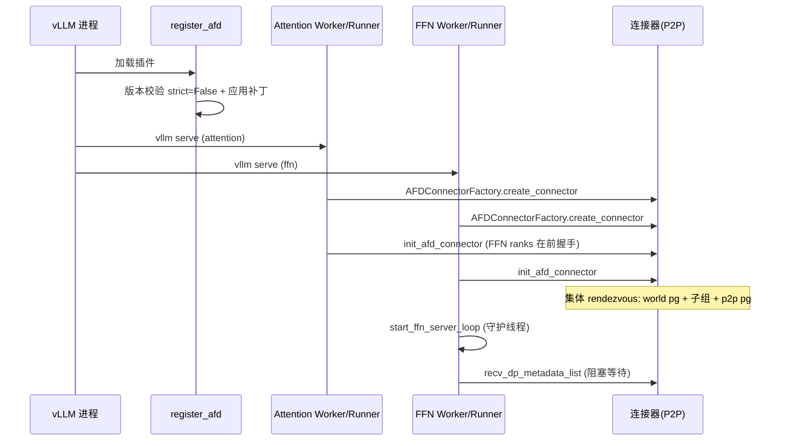
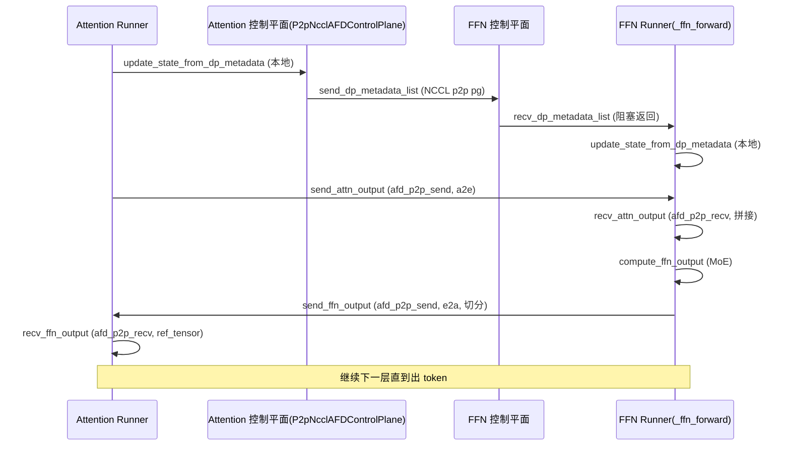
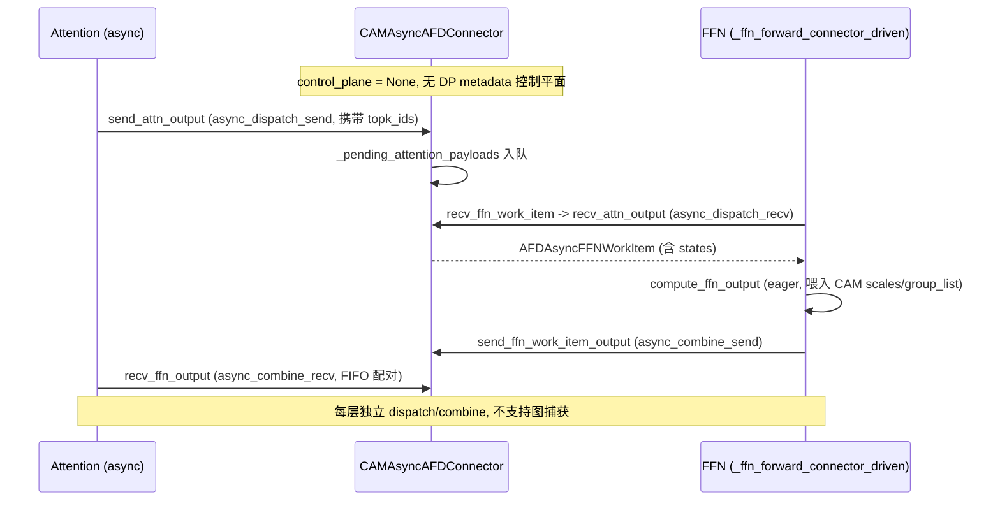

# 数据流

本页以当前 main 分支源码为准，以 GPU `P2pNcclAFDConnector` 同步路径为骨架，逐阶段画出 Attention 与 FFN 之间的控制平面与数据平面交互，并对比 NPU `CAMP2pAFDConnector` 同步与 `CAMAsyncAFDConnector` 异步的差异。连接器契约见 [连接器](06-Connectors.md)，Attention/FFN 运行时见 [04-Attention-Runtime](04-Attention-Runtime.md) 与 [05-FFN-Runtime](05-FFN-Runtime.md)，兼容补丁见 [09-Compatibility-Patches](09-Compatibility-Patches.md)。标注 待确认 处为从契约推断但未逐行核对细节的点。

## 拓扑与角色总览

三连接器的 HCCL/NCCL 世界 rank 排布不同，直接影响握手顺序：

| 连接器 | 平台 | 世界 rank 排布 | 控制平面 | 图支持 |
| --- | --- | --- | --- | --- |
| `P2pNcclAFDConnector` | CUDA | FFN 在前 `[F0,F1,...,A0,A1,...]`（`distributed/topology.py:82-91`） | 有（`P2pNcclAFDControlPlane`） | `FULL_DECODE_ONLY` |
| `CAMP2pAFDConnector` | Ascend | FFN 在前（同步，待确认细节） | 有 | `FULL_DECODE_ONLY` ACL graph |
| `CAMAsyncAFDConnector` | Ascend | Attention 在前 `[A0,A1,...,F0,F1,...]`（`connectors/npu/async_cam.py:848-896`） | 无（`control_plane = None`，`async_cam.py:216`） | 不支持，eager only |

P2P 拓扑约束：`num_attention_ranks >= num_ffn_ranks` 且可整除，每个 FFN rank 拥有一个含自身 + 若干连续 Attention rank 的子组（`distributed/topology.py:49-61, 95-103`）。Async 拓扑相反，Attention 世界 rank 即角色 rank，FFN 世界 rank 从 `num_attention_ranks` 起（`async_cam.py:870-883`）。

## 1. 启动期

### 1.1 插件加载与补丁应用

vLLM 进程启动时加载插件，触发 `register_afd()`（`afd_plugin/__init__.py:66`），按 [09-Compatibility-Patches](09-Compatibility-Patches.md) 的时序应用版本门禁、4 个 vLLM 补丁、DBO op、Ascend 补丁，并注册 `AFD*` DeepSeek 模型架构（`afd_plugin/__init__.py:128-131`）。省略 `--worker-cls` 时，`config_validation.py` 的 auto worker 重映射会按平台 + 角色选 `AFDAttentionWorker` / `AFDFFNWorker`（见 [09-Compatibility-Patches](09-Compatibility-Patches.md) config_validation 节）。

### 1.2 分别拉起 Attention 与 FFN

用户用 `vllm serve ... --additional-config '{"afd":{...}}'` 分别拉起 Attention 与 FFN 两个 `vllm serve` 进程，各自仅含自己角色的 ranks。两进程通过 AFD 配置中的 `host`/`port`/`num_attention_ranks`/`num_ffn_ranks`/`role`/`connector` 协调。

### 1.3 构造连接器与握手

各 worker 的 model runner 构造期完成连接器创建与初始化：

- Attention 侧：`AFDAttentionModelRunner.__init__`（`v1/worker/attention_model_runner.py:51`）经 `AFDConnectorFactory.create_connector`（`attention_model_runner.py:64`，工厂见 `connectors/factory.py:48-60`）创建连接器，随即 `connector.init_afd_connector()`（`attention_model_runner.py:70`）。
- FFN 侧：`AFDFFNWorker.init_device` 构造 `GPUFFNModelRunner`（`v1/worker/ffn_worker.py:62`），后者在 `__init__` 创建连接器（`v1/worker/ffn_model_runner.py:74`）；`init_afd_connector` 在 `AFDFFNWorker.initialize_from_config` 调用（`v1/worker/ffn_worker.py:76`）。

`init_afd_connector` 是集体调用，所有 rank 必须以匹配的 `host`/`port`/rank 计数参与，否则 rendezvous 失败或超时（`connectors/gpu/p2p.py:233-296`）。P2P 连接器三步（`p2p.py:236-249`）：

1. 加入 AFD world 进程组（FFN ranks 在前、Attention ranks 在后，`tcp://host:port`，`p2p.py:257-264`）。
2. 在 `port + subgroup_index + 1` 上创建子组 `StatelessProcessGroup` 与两个 `PyNcclCommunicator`（a2e/e2a），注册到 P2P 自定义 op（`p2p.py:266-284`）。
3. 参与 DP metadata 的 rank 加入 `p2p` 进程组（`p2p.py:286-294`）。

> FFN ranks 在前、Attention ranks 在后的握手影响：FFN rank `i` 的世界 rank 即 `i`，Attention rank `j` 的世界 rank 为 `ffn_size + j`（`topology.py:82-91`）。子组内 FFN 在 rank 0、Attention 在 1..ratio。DP metadata 发送方为 Attention 前 `min_size` 个 rank，目标为对应 FFN rank（`topology.py:106-112`）。

### 1.4 FFN daemon loop 启动

FFN 侧连接器初始化后，`AFDFFNWorker.initialize_from_config` 调用 `start_ffn_server_loop`（`v1/worker/ffn_worker.py:77,94-119`），起守护线程跑 `_run_ffn_server_loop`（`ffn_worker.py:121-158`）。该循环阻塞于控制平面 `recv_dp_metadata_list`，收到负载后驱动 `execute_model` 或 `capture_model`。EngineCore 层面，`engine_core.py` 补丁让 FFN 的 `EngineCoreProc.run_busy_loop` 走 `_run_ffn_busy_loop`（`compat/patches/engine_core.py:488-509`），通过 `collective_rpc("start_ffn_server_loop")` 触发 worker 端循环并轮询错误。

启动期时序（GPU P2P 同步）：

## 2. 请求进入

请求只进入 Attention 侧 API server。Attention 持有完整请求生命周期：调度、KV cache 管理、采样、输出。FFN 侧不接收外部请求，其 `AFDFFNWorker.execute_model` 若被默认 scheduler 直接调用会 **fail-fast**（`v1/worker/ffn_worker.py:86-92` 抛 `RuntimeError("AFD FFN workers are connector-driven; scheduler-driven execute_model() is not supported.")`）。

## 3. 推理期每层/每 stage

以 GPU P2P 同步路径为主线。一次 Attention forward 的控制平面先于数据平面触发，FFN 步由控制平面负载到达驱动。

### 3.1 控制平面：DP metadata 下发

Attention model runner 在 model forward 进入时安装 AFD metadata 并发送 DP metadata。`AFDAttentionModelRunner._model_forward`（`attention_model_runner.py:339-342`）取当前 forward context，调用 `_install_afd_metadata_on_forward_context`（`attention_model_runner.py:215-246`）。后者构建 `AFDForwardContextMetadata` 并调用 `_send_dp_metadata`（`attention_model_runner.py:115-142`）：

1. `control_plane.update_state_from_dp_metadata(payload)`（`attention_model_runner.py:141`）——本地状态更新，FFN/Attention 各自预算 wire tensor 形状（P2P 实现见 `p2p.py:603-694`）。
2. `control_plane.send_dp_metadata_list(payload)`（`attention_model_runner.py:142`）——Attention 发送方经 `p2p` 进程组用 NCCL 把 `AFDControlPayload`（JSON 编码 + size/object tensor 两段，`connectors/metadata.py:307-402`）发到对应 FFN rank（`p2p.py:696-726`）。

FFN 侧 `_run_ffn_server_loop` 阻塞于 `recv_dp_metadata_list`（`v1/worker/ffn_worker.py:137`，P2P 实现见 `p2p.py:728-751`），收到后进入 `execute_model` 或 `capture_model`。`GPUFFNModelRunner.execute_model`（`v1/worker/ffn_model_runner.py:131-159`）再调 `_ffn_forward`，其中再次 `update_state_from_dp_metadata`（`v1/worker/ffn_model_runner.py:168-174`）准备缓冲。

### 3.2 数据平面：hidden states 往返

`_ffn_forward`（`v1/worker/ffn_model_runner.py:161-196`）按层 × stage 嵌套循环驱动数据平面。一次 Attention→FFN→Attention 往返：

1. **Attention `send_attn_output`**：Attention 模型 forward 中（由 `AFDDeepseekForCausalLM` 包装类在算完注意力后调用，具体调用点见 [07-Model-Integration](07-Model-Integration.md)，待确认逐层调用细节），将 hidden states 经 `a2e_pynccl` 发到映射的 FFN rank（`p2p.py:303-337`，底层 `torch.ops.vllm.afd_p2p_send`，`p2p.py:529-533`）。
2. **FFN `recv_attn_output`**：FFN 端 `_ffn_forward` 调 `connector.recv_attn_output(ubatch_idx=stage_idx)`（`v1/worker/ffn_model_runner.py:182`），P2P 实现从子组内每个 Attention peer 收一个 tensor 并按 token 维拼接，记录各 peer 序列长度到 `AFDTransferMetadata.seq_lens`（`p2p.py:375-439`），返回 `AFDA2FTransferPayload`（hidden_states + context）。
3. **FFN compute MoE**：`_execute_eager_mode`（`v1/worker/ffn_model_runner.py:198-207`）调 `model.compute_ffn_output(hidden_states, layer_idx)`。图模式时走 CUDA graph replay（`v1/worker/ffn_model_runner.py:151-153`）。
4. **FFN `send_ffn_output`**：`_ffn_forward` 调 `connector.send_ffn_output(rank_ffn_output, context)`（`v1/worker/ffn_model_runner.py:195`），P2P 按 `context.metadata.seq_lens` 切分输出，每个切片发回原 Attention peer（`p2p.py:441-505`，`ratio==1` 时整张发）。
5. **Attention `recv_ffn_output`**：Attention 模型 forward 调 `connector.recv_ffn_output(ref_tensor, ubatch_idx)`（`p2p.py:339-373`），经 `e2a_pynccl` 收回本 rank 切片，`ref_tensor` 用作 CUDA graph 捕获的稳定缓冲与单 rank 子组无传输时的返回值。

随后 Attention 继续后续层，重复 1–5，直到所有层完成、出 token。

推理期时序（GPU P2P 同步，单层）：

### 3.3 图模式与预热

Attention 侧 `_warmup_and_capture`（`attention_model_runner.py:375-461`）在正式捕获前以 `_is_warmup=True` 跑 dummy（FFN 据此区分 warmup 与 capture metadata），并在捕获前发送一次 DP metadata 使捕获只含可重放的数据平面工作（`attention_model_runner.py:426-446`）。FFN 侧 `capture_model`（`v1/worker/ffn_model_runner.py:260-302`）在 `graph_capture` 下做 warmup + 正式捕获，DP metadata 接收/更新在 `torch.cuda.graph(...)` 之前完成（`v1/worker/ffn_model_runner.py:236-248`）。图策略仅 `FULL_DECODE_ONLY`（见 [08-Execution-Platforms](08-Execution-Platforms.md)）。

## 4. FFN connector 驱动不变量

FFN work 必须由连接器驱动，禁止 scheduler 直驱：

- `AFDFFNWorker.execute_model` 直接抛 `RuntimeError`（`v1/worker/ffn_worker.py:86-92`）。
- `_run_ffn_server_loop` 对 GPU 断言 `control_plane is not None`（`v1/worker/ffn_worker.py:130-135`），否则抛 `NotImplementedError`。
- `GPUFFNModelRunner.execute_model` 缺 `dp_metadata_list` 抛 `RuntimeError`（`v1/worker/ffn_model_runner.py:141-142`）。
- `GPUFFNModelRunner.sample_tokens` 抛 `RuntimeError("FFN runners do not sample tokens")`（`v1/worker/ffn_model_runner.py:304-305`）。
- FFN worker `get_kv_cache_spec` 返回空 dict（`v1/worker/ffn_worker.py:66-69`），`compile_or_warm_up_model` 返回 0.0（`v1/worker/ffn_worker.py:79-84`），不分配 KV cache。

## 5. NPU CAMP2p 同步路径差异

NPU 同步 `CAMP2pAFDConnector` 与 GPU P2P 同为控制平面驱动（`control_plane is not None`），但传输用 HCCL + CAMP2P 自定义 op（a2e/e2a ACLNN 算子，见 [08-Execution-Platforms](08-Execution-Platforms.md)），并在 FFN compute 时进入 `ascend_forward_context`（`compat/npu/forward_context.py`，经 `compat/npu/__init__.py:23` 导出）。FFN NPU runner 的 control-plane-driven 路径与 GPU 结构对应：`recv_dp_metadata_list` → `update_state_from_dp_metadata` → 按层 stage `recv_attn_output` → `compute_ffn_output` → `send_ffn_output`。

> 待确认：`CAMP2pAFDConnector` 的世界 rank 排布、子组拓扑与 control plane 实现细节（未逐行核对 `connectors/npu/camp2p.py`）。NPU FFN worker 的 server loop 入口与 GPU `AFDFFNWorker` 的对应关系亦待确认（NPU FFN runner 在 `v1/worker/npu/ffn_model_runner.py`，control-plane-driven 分支结构与 GPU 一致）。

## 6. CAMAsync 异步路径差异

`CAMAsyncAFDConnector`（`connectors/npu/async_cam.py:206`）是 eager-only 的 Ascend prefill 数据路径，与同步路径在驱动模式、拓扑、控制平面、图支持上均不同。

### 6.1 选择与 async_dp 补丁介入

异步模式由 `additional_config["afd"]["async_dp"] = true` + `connector = "CAMAsyncAFDConnector"` 选择。`is_afd_async_dp`（`afd_plugin/config.py:274-287`）据此判定。两个 async_dp 补丁据此介入（见 [09-Compatibility-Patches](09-Compatibility-Patches.md)）：

- `async_dp_engine.py`：AFD async Attention 用普通 `EngineCoreProc` 替代 `DPEngineCoreProc`、`DPCoordinator` 禁用 wave 协调、`DPAsyncMPClient.add_request_async` 跳过 `FIRST_REQ`。
- `async_dp_forward_context.py`：AFD async 配置跳过上游 `DPMetadata` 构造与跨 DP rank token 计数协调。

### 6.2 无控制平面，连接器接收循环直驱

`CAMAsyncAFDConnector.control_plane = None`（`async_cam.py:216`）。CAM dispatch/combine 算子同时承担集体数据搬运与路由元数据，因此无需独立 DP metadata 控制平面，FFN 工作由连接器接收循环直接触发。NPU FFN runner 走 `_ffn_forward_connector_driven`（`v1/worker/npu/ffn_model_runner.py:274-327`），按层调用连接器的 `recv_ffn_work_item`（`async_cam.py:328-403`）与 `send_ffn_work_item_output`（`async_cam.py:429-470`）。

### 6.3 AFDAsyncFFNWorkItem 工作队列

异步路径用 `AFDAsyncFFNWorkItem`（`async_cam.py:176-186`）规范化每个 FFN dispatch 项，含 `hidden_states`、`context`、`recv_output`、`layer_idx`、`stage_idx`、`num_tokens`、`total_num_tokens`、`shared_num_tokens`。`recv_ffn_work_item` 从 `async_dispatch_recv` 输出切片到实际 token 数（`async_cam.py:328-403`）。Attention 侧 `send_attn_output`（`async_cam.py:472-556`）调 `async_dispatch_send`，`recv_ffn_output`（`async_cam.py:558-654`）调 `async_combine_recv`，路由张量经 `_pending_attention_payloads`（`async_cam.py:263-266, 510-514`）按 stage FIFO 配对。

### 6.4 不支持图捕获

异步路径要求 eager 执行，不支持 vLLM 原生 DBO、ACL graph、decode（`async_cam.py:18-21`）。因此 FFN runner 的 `capture_model` 路径不适用于 async，`_ffn_forward_connector_driven` 直接 eager 调 `model.compute_ffn_output(...)` 并把 `states.group_list`/`dynamic_scales`/`expand_x_shared`/`dynamic_scales_shared` 等 CAM 产物喂入（`v1/worker/npu/ffn_model_runner.py:318-326`）。

异步路径时序：

## 7. 关闭期

关闭路径从 worker/engine shutdown 触发，逐层释放连接器资源：

- Attention GPU：`AFDAttentionModelRunner.shutdown`（`attention_model_runner.py:463-465`）→ `stop_afd_gpu_profiler` + `connector.close()`。P2P `close`（`p2p.py:212-231`）注销 communicator id、`shutdown()` 各 `PyNcclCommunicator`、置 `_initialized=False`。
- FFN GPU：`AFDFFNWorker.shutdown`（`v1/worker/ffn_worker.py:180-182`）→ `stop_ffn_server_loop`（`ffn_worker.py:166-178`：set event、`model_runner.shutdown()`→`connector.close()`、join 线程 5s、清错误）+ `super().shutdown()`。
- EngineCore 层：`engine_core.py` 补丁的 `shutdown`（`compat/patches/engine_core.py:196-208`）对 FFN 引擎先 `_stop_ffn_worker_loop`（`collective_rpc("stop_ffn_server_loop")`）再 `model_executor.shutdown()`。
- Async NPU：`CAMAsyncAFDConnector.close`（`async_cam.py:303-313`）销毁 HCCL 进程组、清 `_pending_attention_payloads`、置 `_initialized=False`。

> 待确认：NPU CAMP2p 的 `close` 与 NPU worker shutdown 的完整逐行细节未核对（结构与 GPU 对应）。多 rank 关闭时各 `close` 的集体语义（如 `destroy_process_group` 是否需所有 rank 同步）亦待确认。

## 8. 待确认汇总

| 点 | 说明 |
| --- | --- |
| Attention 模型层逐层 `send_attn_output`/`recv_ffn_output` 调用点 | 由 `AFDDeepseekForCausalLM` 包装类驱动，本页从 runner hook 与连接器契约推断，未逐行核对 `model_executor/models/deepseek_v2.py`。详见 [07-Model-Integration](07-Model-Integration.md)。 |
| CAMP2p 拓扑/control plane/server loop 细节 | 未逐行核对 `connectors/npu/camp2p.py` 与 NPU FFN worker；结构与 GPU P2P 对应。 |
| async FFN server loop 入口 | `control_plane is None` 使 GPU `AFDFFNWorker` 的 control-plane loop 不适用；NPU worker 的线程/循环入口待确认。 |
| 关闭期集体语义 | 各 `close`/`destroy_process_group` 的跨 rank 同步要求待确认。 |
| `compute_gate_on_attention` | gate 放 Attention 侧计算对数据路径的影响（CODE_READING_MAP 待确认项之一）未展开。 |
