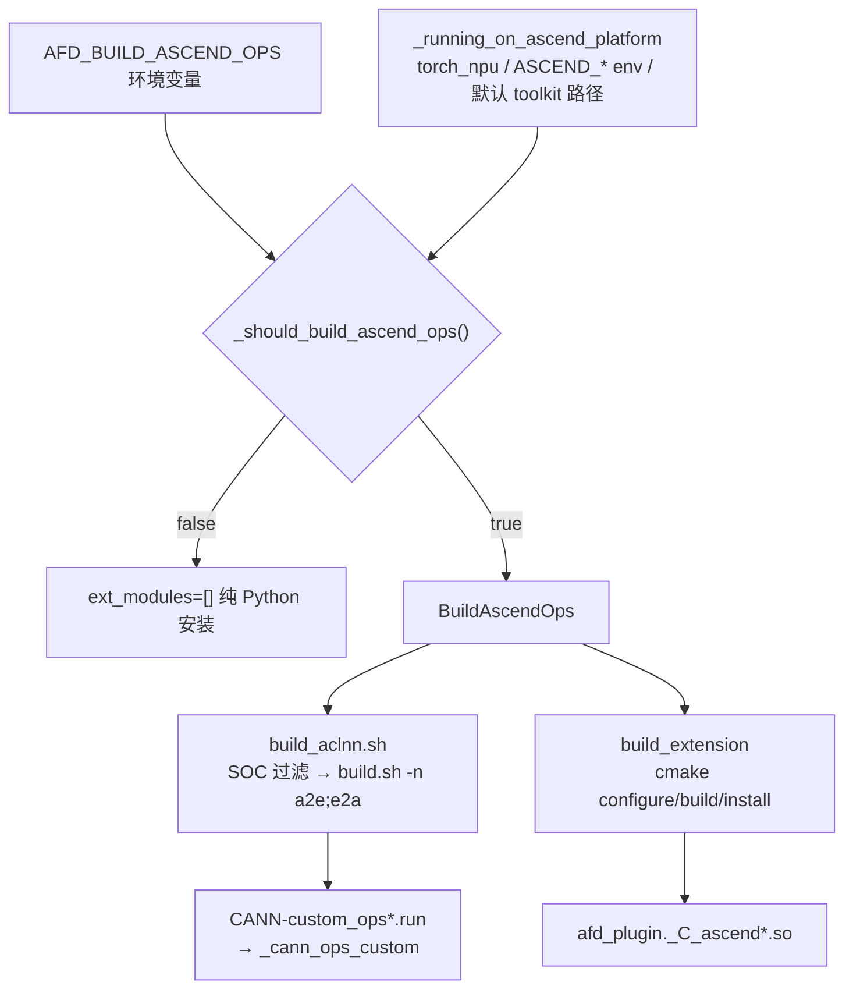

# Build, Packaging & Tests

本页以当前 main 分支源码为准，记录 afd-plugin 的打包元数据、Ascend 算子构建流程、单元与 E2E 测试体系、CI 与 pre-commit、配方目录，并附开发常用命令速查。概念定义见 [12-Glossary](12-Glossary.md)，平台运行时见 [08-Execution-Platforms](08-Execution-Platforms.md)，补丁策略见 [09-Compatibility-Patches](09-Compatibility-Patches.md)。

## 打包元数据

### pyproject.toml

| 关注点 | 配置 | 行号 |
| --- | --- | --- |
| 构建后端 | `setuptools.build_meta`，requires `setuptools>=61`/`wheel`/`setuptools-scm[toml]>=8`/`pybind11>=2.12`/`cmake>=3.16` | `pyproject.toml:1-9` |
| 项目名 | `vllm-afd-plugin` | `pyproject.toml:12` |
| 动态版本 | `dynamic = ["version"]`，由 `[tool.setuptools_scm]` 从 git tag 派生 | `pyproject.toml:13,56` |
| Python 范围 | `>=3.10,<3.14` | `pyproject.toml:16` |
| runtime 依赖 | `dependencies = []`（不 pin 任何运行时） | `pyproject.toml:32` |
| vLLM 可选 extra | `vllm = ["vllm==0.19.1"]`，便于无 CUDA 机器跑 import/config 测试 | `pyproject.toml:36-37` |
| entry point | `vllm.general_plugins` 组 `afd = "afd_plugin:register_afd"` | `pyproject.toml:45-46` |
| dev 依赖组 | `pre-commit>=4`/`pytest>=7.0`/`ruff>=0.15.7,<0.16`/`setuptools-scm>=8` | `pyproject.toml:48-54` |

运行时版本读取链在 `afd_plugin/__init__.py:33-41`：`importlib.metadata.version("vllm-afd-plugin")` → 失败回退 `setuptools_scm.get_version` → 再失败 `0.0.0+unknown`。

**包发现与 package-data**：`[tool.setuptools.packages.find]`（`pyproject.toml:58-62`）`include = ["afd_plugin*"]`、`exclude = ["afd_plugin._cann_ops_custom*"]`、`namespaces = false`。`_cann_ops_custom` 不作为 importable 包，但其内容随包分发：`[tool.setuptools.package-data]`（`pyproject.toml:64-65`）`afd_plugin = ["py.typed", "_cann_ops_custom/**/*"]`。`py.typed` 标记 PEP 561 typed。

**entry point 不变量**：`tests/unit/package/test_package.py:65-69` 的 `test_entry_point_is_registered` 断言入口点存在且值为 `afd_plugin:register_afd`；`test_package_import_is_cpu_safe`（`:13-15`）断言无 vLLM 也能 import 并构造默认 `AFDConfig()`。

**ruff 配置**（`pyproject.toml:80-110`）：`line-length = 88`、`target-version = "py310"`、`extend-exclude = [".venv","venv","build","dist"]`；lint 选 `E/F/I/N/UP/W/B/G/ISC/SIM`（`:86-97`）；per-file-ignores 对 `afd_plugin/compat/patches/**/*.py` 放宽 `E501/N806/N807`（`:99-105`），因补丁须保留上游命名；format 双引号、空格缩进、docstring 代码格式化（`:107-110`）。

**ty 配置**（`pyproject.toml:112-115`）：`allowed-unresolved-imports = ["torch.**","vllm.**"]`，允许 ty 对 torch/vLLM 导入不报未解析。

### MANIFEST.in

`MANIFEST.in:1-2` 共两行，控制 sdist 额外纳入文件：

```
recursive-include csrc *
recursive-include afd_plugin/_cann_ops_custom *
```

即 sdist 含全部 `csrc/` 原生源（Ascend C++/CMake/脚本）与已构建的 `_cann_ops_custom/` vendor 包。`LICENSE`（`pyproject.toml:18`）与 `README.md`（`pyproject.toml:15`）由 setuptools 自动纳入。

## Ascend 算子构建

### 自动检测：AFD_BUILD_ASCEND_OPS

`setup.py:40-50` 的 `_should_build_ascend_ops()` 决定是否构建 Ascend 自定义算子：

1. `AFD_BUILD_ASCEND_OPS` 已设置且非空（`setup.py:41-49`）：真值 `{1,true,yes,on}`（`:24-25`）构建；假值 `{0,false,no,off}`（`:28-29`）跳过；其他值抛 `RuntimeError`。
2. 未设置或空白（空白视为未设置，见 `test_ascend_build_files.py:143-151`）：调 `_running_on_ascend_platform()`（`setup.py:32-37`）自动检测。

`_running_on_ascend_platform()` 三条件满足其一即视为 Ascend：`torch_npu` 可导入；任一 `_ASCEND_ENV_VARS`（`setup.py:15-20`：`ASCEND_HOME_PATH`/`ASCEND_OPP_PATH`/`ASCEND_TOOLKIT_HOME`/`TORCH_NPU_PATH`）已设置；默认路径 `/usr/local/Ascend/ascend-toolkit/latest`（`setup.py:21`）存在。

覆盖语义由 `tests/unit/package/test_ascend_build_files.py` 用 monkeypatch 锁定：`test_ascend_ops_build_is_disabled_by_default_on_gpu`（`:84-87`）、`test_ascend_ops_build_is_enabled_by_default_on_npu`（`:90-103`，参数化 torch_npu/toolkit 路径/`ASCEND_HOME_PATH`）、`test_ascend_ops_build_env_overrides_platform_default`（`:106-133`，全真/假值）、`test_ascend_ops_build_env_rejects_invalid_value`（`:136-140`）、`test_ascend_ops_use_isolated_namespace_and_vendor_path`（`:154-173`，断言 `TORCH_LIBRARY(afd_ascend`、vendor=`afd-plugin`、`AFD_CUST_OPAPI_LIB_PATH`）。

### setup.py 构建流程

`setup.py:112-122`：`_should_build_ascend_ops()` 为真时 `ext_modules` 追加 `CMakeExtension("afd_plugin._C_ascend","csrc/npu/torch_extension")`（`setup.py:114-116`），`cmdclass={"build_ext": BuildAscendOps}`；否则 `ext_modules=[]`，纯 Python 安装。`CMakeExtension`（`setup.py:53-56`）是 `Extension` 子类，`sources=[]`，`source_dir` 指向 `csrc/npu/torch_extension`。

`BuildAscendOps(build_ext)`（`setup.py:59-109`）：

- `run()`（`:60-69`）：有扩展时，除非 `AFD_SKIP_ACLNN_BUILD=1`，按 `SOC_VERSION`（默认 `910c`）调 `bash csrc/npu/build_aclnn.sh <ROOT> <soc>`（`:65-68`），再 `super().run()`。
- `build_extension()`（`:71-102`）：对 `CMakeExtension` 执行 cmake configure（`:99`，传 `CMAKE_BUILD_TYPE` 默认 `Release`、`CMAKE_INSTALL_PREFIX`、`PYTHON_EXECUTABLE`、pybind11 cmake dir（`:87-93`，`python -m pybind11 --cmakedir` 获取，失败抛 "pybind11 is required"）、`ASCEND_HOME_PATH`、`TORCH_NPU_PATH`）→ `cmake --build -j=<MAX_JOBS 或 cpu_count>`（`:100-101`）→ `cmake --install`（`:102`）。
- 拷贝 `afd_plugin/_cann_ops_custom` 到构建产物（`:104-109`）。

### build_aclnn.sh 与 build.sh

`csrc/npu/build_aclnn.sh`（28 行）ACLNN vendor 包入口：`SOC_VERSION` 过滤（`:10-18`）仅 `910c`/`ascend910_93*`/`ascend910_9392` 映射 `ascend910_93`，其他 SOC 打印仅支持 910C 并 `exit 0`（跳过非错误）；调 `bash build.sh -n "a2e;e2a" -c "${SOC_ARG}"`（`:23`）；产物 `output/CANN-custom_ops*.run` 安装到 `afd_plugin/_cann_ops_custom`（`:25-28`）。

`csrc/npu/build.sh`（189 行，CANN Open Software 模板，copyright 标注 Huawei）：toolkit 路径检测（`:158-169`）优先 `ASCEND_HOME_PATH` → `ASCEND_OPP_PATH` 父目录 → 默认路径（root `/usr/local/Ascend/...`，非 root `${HOME}/Ascend/...`，`:23-29`）；选项 `-n` 算子名、`-c` 芯片（默认 `ascend910b`）；`set_env()`（`:56-66`）source `setenv.bash` 并校验 `bisheng`；ccache 自动包装 bisheng（`:92-115`）；流程 `clean` → `cmake_config`（`:76-81`，`-DBUILD_OPEN_PROJECT=ON`）→ `build package`（`:117-119`）。

### CMakeLists.txt 与 config.cmake

`csrc/npu/CMakeLists.txt`（634 行）CANN vendor 包构建，复用 CANN 模板：`VENDOR_NAME="afd-plugin"`（`:18`）决定 vendor 安装前缀 `packages/vendors/afd-plugin/...`；`ASCEND_COMPUTE_UNIT` 默认 `ascend910b`（`:16`）、`ASCEND_OP_NAME` 默认 `ALL`（`:17`）；include `cmake/{config,func,intf}.cmake`（`:20-22`）；构建目标 `op_host_aclnn(_Inner/_Exc)`、`opapi`（输出 `cust_opapi`，`:108-110`）、`opsproto`、`optiling`，安装到 `packages/vendors/${VENDOR_NAME}/...`；CPack 生成 `CANN-custom_ops-*.run` 自解压包（`:621-633`，`CPACK_GENERATOR External`+makeself）。内部 CANN 宏（`op_add_subdirectory` 等）以 CANN 文档为准。

`csrc/npu/cmake/config.cmake`（234 行）：Python3 探测（`:15-19`）；`ASCEND_CANN_PACKAGE_PATH` 解析（`:22-30`）优先 `CUSTOM_ASCEND_CANN_PACKAGE_PATH`（build.sh 传入）→ `ASCEND_HOME_PATH` → `ASCEND_OPP_PATH` 父目录 → `/usr/local/Ascend/latest`；路径开关 `ASCEND_IMPL_OUT_DIR`/`ASCEND_BINARY_OUT_DIR`/`ASCEND_AUTOGEN_DIR`（`:53-55`）、`OP_BUILD_TOOL`（`:59`）、`ENABLE_OPS_KERNEL`（`:40`，`ON` 编译 kernel 二进制）；prepare 阶段调 `cmake/scripts/prepare.sh`（`:195-213`）。

### torch_extension binding 与 vLLM-Ascend 共存

`csrc/npu/torch_extension/` 构建出 Python 侧 `afd_plugin._C_ascend`，将 `a2e`/`e2a` 注册到 `torch.ops.afd_ascend` 命名空间（与 vLLM-Ascend 的 `torch.ops._C_ascend` 隔离）。CMake 细节见 [08-Execution-Platforms](08-Execution-Platforms.md#torch_extension-cmake-构建)。vLLM-Ascend 共存规则（`csrc/npu/README.md:62-74`）：扩展归 plugin 所有；vendor 包安装于 AFD vendor 路径 `afd-plugin`；loader 通过 `AFD_CUST_OPAPI_LIB_PATH` 用包内 `libcust_opapi.so`，不依赖 bare `dlopen`。运行时延迟加载 `ensure_afd_ascend_ops_loaded()`（`afd_plugin/compat/npu/ops.py`）。常用构建环境变量见 `csrc/npu/README.md:37-48`：`ASCEND_HOME_PATH`/`TORCH_NPU_PATH`/`SOC_VERSION`/`MAX_JOBS`/`AFD_SKIP_ACLNN_BUILD`。

构建产物：

| 产物 | 路径 | 说明 |
| --- | --- | --- |
| Python 扩展 | `afd_plugin/_C_ascend*.so` | torch C++ extension，注册 `torch.ops.afd_ascend` |
| CANN vendor 包 | `afd_plugin/_cann_ops_custom/vendors/afd-plugin/...` | `libcust_opapi.so`、opsproto、optiling |

### csrc/gpu 预留

`csrc/README.md:1-8`：原生源按设备分组，`csrc/npu/` 为 Ascend 算子与 NPU torch extension，`csrc/gpu/` 仅预留位（无源码）。当前 GPU 路径无 plugin 自有 CUDA 扩展，依赖 vLLM/NCCL。

## Ascend 构建流程图



## 单元测试

### 目录结构

`tests/unit/` 下按模块划分（`__init__.py` 标记普通包）：

| 子目录 | 覆盖内容 | 代表文件 |
| --- | --- | --- |
| `config/` | `AFDConfig` 解析、公共校验、worker stack 校验 | `test_config.py`、`test_validation.py` |
| `connectors/` | 连接器工厂、P2P/CAMP2P/async CAM 解析 | `test_base_factory.py`、`test_p2p_connector.py`、`test_camp2p_connector.py`、`test_async_cam_connector.py` |
| `compat/` | 版本门禁、async-DP、profiler、Ascend ops 加载 | `test_runtime.py`、`test_async_dp.py`、`test_profiler.py`、`test_ascend_ops.py` |
| `compat/patches/` | 兼容补丁行为 | `test_config_validation.py`、`test_async_dp_engine.py`、`test_async_dp_forward_context.py`、`test_engine_core.py`、`test_force_load_balance.py` |
| `compat/npu/` | NPU profiler | `test_profiler.py` |
| `v1/worker/` | model runner、runtime classpath、cuda graph、dbo、NPU runtime | `test_attention_model_runner.py`、`test_ffn_model_runner.py`、`test_cuda_graph.py`、`test_dbo.py`、`test_runtime_classpaths.py`、`test_npu_runtime.py` |
| `model_executor/models/` | forward context metadata | `test_forward_context.py` |
| `package/` | 打包与构建文件不变量 | `test_package.py`、`test_ascend_build_files.py` |
| （根） | 环境变量 | `test_envs.py` |

### CPU 安全与 markers

单元测试默认 CPU 安全。`tests/conftest.py:1-13` 注释说明自定义 marker 在 `pyproject.toml` 注册、不在 conftest 重复注册；其 session fixture（`tests/conftest.py:21-79`）读取模型路径并 `pytest.skip`，确保无硬件/权重时单元测试不连带跳过失败。

pytest markers 在 `pyproject.toml:67-78`（`testpaths=["tests"]`、`pythonpath=["."]`、`addopts="-q"`）注册 6 个：

| marker | 含义 | 行号 |
| --- | --- | --- |
| `vllm_runtime` | 需可导入 vLLM 运行时依赖 | `pyproject.toml:72` |
| `gpu` | GPU 硬件门控的 AFD 集成测试 | `pyproject.toml:73` |
| `npu` | NPU 硬件门控的 AFD 集成测试 | `pyproject.toml:74` |
| `e2e` | 需模型权重与硬件的端到端测试 | `pyproject.toml:75` |
| `eval` | 需数据集的精度/评测测试 | `pyproject.toml:76` |
| `slow` | 耗时超过 120 秒 | `pyproject.toml:77` |

`uv run pytest`（无 marker 过滤）在 CPU 机器跑 `tests/unit` 全集；需 vLLM 的测试标 `vllm_runtime`，CI 显式排除（见下）。

## E2E 测试

### 目录结构

`tests/e2e/` 按类别分目录（`tests/e2e/__init__.py` 标记普通包）：

```
tests/e2e/
  conftest.py            # AFDServer、_launch_afd_server、_make_args 共享基建
  runner.py              # 本地手动冒烟入口（非 pytest 收集）
  test_runner.py         # runner.py 的单元测试（未标 marker，CPU 安全）
  helpers_gsm8k.py       # gsm8k 评测辅助
  accuracy/
    test_gsm8k_gpu.py    # @pytest.mark.gpu + e2e + eval + slow
    test_gsm8k_npu.py    # @pytest.mark.npu + e2e + eval + slow
  features/
    conftest.py          # module-scoped afd_server_1a1f / npu_server_1a1f
    test_serving_{gpu,npu}.py
    test_graph_{gpu,npu}.py
    test_tp_{gpu,npu}.py
    test_profiler_{gpu,npu}.py
    test_ops_npu.py      # run-e2e skill 明确排除此文件
  models/deepseek_v2_lite/
    test_e2e_gpu.py      # @pytest.mark.gpu（部分 slow）
    test_e2e_npu.py      # @pytest.mark.npu（部分 slow）
    test_async_cam_npu.py# @pytest.mark.npu + e2e (+ slow)
```

E2E 测试需真实硬件 + 模型权重，opt-in。marker 实测：`accuracy/` 全部叠加 `gpu/npu`+`e2e`+`eval`+`slow`（如 `test_gsm8k_gpu.py:96-99`、`test_gsm8k_npu.py:120-123`）；`features/` 多叠加 `e2e`，耗时项再加 `slow`（如 `test_profiler_npu.py:112-114`）；`models/` 以 `gpu/npu` 为主，heavy 项加 `slow`（如 `test_e2e_gpu.py:169-170`）。`tests/e2e/test_runner.py` 不标 marker，被 `-m "gpu or npu"` 自然排除。

### conftest 共享基建

`tests/conftest.py`（根，`:21-79`）定义 session fixture：GPU 侧 `afd_e2e_model`（读 `AFD_GPU_E2E_MODEL`，未设 skip，`:24-27`）、`afd_gpu_list`（`AFD_GPU_E2E_GPUS` 默认 `0,1,2,3`，`:31-34`）、`afd_vllm_bin`（`AFD_GPU_E2E_VLLM_BIN` 默认 `vllm`，`:38-40`）；NPU 侧 `npu_available`（`torch_npu` 不可导入 skip，`:49-55`）、`npu_e2e_model`（`AFD_NPU_E2E_MODEL`，`:59-64`）、`npu_attn_device`/`npu_ffn_device`（默认 `0`/`1`，`:68-74`）、`npu_vllm_bin`（`:78-79`）。

`tests/e2e/conftest.py`：`AFDServer`（`:108-164`，封装 attention+ffn 进程对与 `/v1/completions` 请求）与 `_launch_afd_server()`（`:183-314`，按 backend 启 FFN→Attention、等 API ready）。`_make_args()`（`:29-93`）构造模拟 runner argparse Namespace 的字典。`_patch_connector()`（`:317-326`）在 NPU 时把 `--additional-config` 的 connector 替换为 `CAMP2pAFDConnector`。`_launch_afd_server` 中 GPU 用 `P2pNcclAFDConnector`、NPU 用 `CAMP2pAFDConnector`（`conftest.py:204,234` 注释）。

`tests/e2e/features/conftest.py`（`:14-63`）定义 module-scoped `afd_server_1a1f`（GPU 1A1F，需 ≥2 GPU，用 `AFD_E2E_API_PORT`/`AFD_E2E_AFD_PORT`）与 `npu_server_1a1f`（NPU 1A1F，用 `AFD_NPU_API_PORT`/`AFD_NPU_AFD_PORT`）。

### runner.py 本地冒烟入口

`tests/e2e/runner.py`（657 行，docstring `:4-12`）是**手动**冒烟脚本，**不被 pytest 收集**（无 marker、`if __name__ == "__main__"`，`:656-657`）。它启动一对 FFN+Attention `vllm serve` 进程，XAYF 拓扑用原生 vLLM DP 表达（Attention `DP=X,TP=1`、FFN `DP=Y,TP=1`）。`parse_args()`（`:99-282`）主要参数：

| 参数 | 默认 | 含义 |
| --- | --- | --- |
| `--model` | 必填 | 模型路径或 HF id |
| `--vllm-bin` | `vllm` | vLLM 可执行 |
| `--num-attention-ranks` / `--num-ffn-ranks` | `1`/`1` | 各角色 rank 数 |
| `--attention-gpus` / `--ffn-gpus` | `0` / `1` | 各角色设备（NPU 映射 `ASCEND_RT_VISIBLE_DEVICES`，`build_env` `:474-477`） |
| `--api-host` / `--api-port-base` / `--afd-host` / `--afd-port` | `127.0.0.1`/`8000`/`127.0.0.1`/`1239` | control plane 地址 |
| `--tp-size` / `--attention-tp-size` / `--ffn-tp-size` | `1`/None/None | TP，后两者缺省回退 `--tp-size`（`role_tp_size` `:418-423`） |
| `--cuda-graph-full-decode-only` | off | 设 `cudagraph_mode=FULL_DECODE_ONLY`（`build_vllm_command` `:364-382`） |
| `--enable-dbo` + `--dbo-decode-token-threshold` / `--dbo-prefill-token-threshold` | 1 / capture_size | 启用 DBO/ubatching |
| `--afd-connector` | None | 缺省 GPU=`P2pNcclAFDConnector`、NPU=`CAMP2pAFDConnector`（`:327-329`） |
| `--afd-async` / `--compute-gate-on-attention` | off | 写 `additional_config['afd']['async']/['compute_gate_on_attention']` |
| `--afd-connector-extra-config` | [] | JSON 合并进 `connector_extra_config`（`parse_afd_connector_extra_config` `:426-433`） |
| `--use-decode-bench-connector` | off | Attention 侧传 `AFDDecodeBenchConnector` kv-transfer-config |
| `--device-backend` | `gpu` | `gpu`/`npu`，影响可见设备 env 与 `VLLM_PLUGINS`（`:478`） |
| `--expect-text` | None | 断言每个响应含该文本 |

`uses_async_connector()`（`:436-437`）：connector 为 `CAMAsyncAFDConnector`（常量 `ASYNC_AFD_CONNECTOR`，`:32`）时反转启动顺序（attention 先于 ffn，`:49-54`）。`build_env()`（`:467-493`）按 backend 设 `CUDA_VISIBLE_DEVICES`/`ASCEND_RT_VISIBLE_DEVICES` 与 `VLLM_PLUGINS`，NPU 角色 TP≤1 时移除 `VLLM_ASCEND_ENABLE_FLASHCOMM1`（`:480-485`，测试见 `test_runner.py:147-155`）。`test_runner.py` 是 runner 的 CPU 安全单元测试，覆盖 DP/TP 拓扑、connector 选择、启动顺序等。

### run-e2e skill 简述

`.agents/skills/run-e2e/SKILL.md` 是 opencode 的测试运行 skill，按 marker 跑 E2E 套件：GPU 用 `uv run pytest -m gpu tests/e2e/<category>`，NPU 用 `python -m pytest -m npu tests/e2e/<category>`。它自动探测后端（`nvidia-smi`/`npu-smi`）、做 pre-flight 校验（vLLM 可用、插件可加载、模型路径、`torch_npu`/CANN、`lm_eval` 仅 accuracy 类需 standalone 安装）、按硬件 tier 预测跳过数（2 设备跑 1A1F，4 设备跑全集含 TP/2A2F）。category 路径映射：`all`→`tests/e2e`、`accuracy`→`tests/e2e/accuracy`、`features`→`tests/e2e/features`、`models`→`tests/e2e/models`。skill 自述套件为 40 测试（20 GPU + 20 NPU），`features/test_ops_npu.py` 明确排除。

E2E 环境变量速查（对应 `tests/conftest.py` fixture 与 SKILL.md）：

| 变量 | 后端 | 默认 | 必需 |
| --- | --- | --- | --- |
| `AFD_GPU_E2E_MODEL` | gpu | — | 是（否则全 gpu skip） |
| `AFD_GPU_E2E_GPUS` | gpu | `0,1,2,3` | 否 |
| `AFD_GPU_E2E_VLLM_BIN` | gpu | `vllm` | 否 |
| `AFD_NPU_E2E_MODEL` | npu | — | 是（否则全 npu skip） |
| `AFD_NPU_ATTN_DEVICES` / `AFD_NPU_FFN_DEVICES` | npu | `0` / `1` | 否 |
| `AFD_NPU_VLLM_BIN` | npu | `vllm` | 否 |
| `AFD_GSM8K_LIMIT` | accuracy | 未设=全 1319 | 否 |
| `AFD_NPU_GSM8K_TASK_DIR` | npu accuracy | — | 是（npu gsm8k） |

## CI 与 pre-commit

### .github/workflows/cpu-only-ci.yml

CPU-only CI（`on: push/pull_request` 到 `main/master`，`cancel-in-progress`）。两 job 均设 `AFD_BUILD_ASCEND_OPS: "0"`（`:21,54`），用 `uv` + `uv sync --locked --group dev`（不装 `vllm` extra）。

| job | matrix | 步骤 | 行号 |
| --- | --- | --- | --- |
| `lint` | Python 3.10 | `uv run ruff check .`、`uv run ruff format --check .`、ruby 校验 `.github/ISSUE_TEMPLATE/*.yml` | `:18-49` |
| `cpu-tests` | Python 3.10/3.11/3.12/3.13（`fail-fast: false`） | `uv run pytest -q tests/unit -m "not gpu and not vllm_runtime"` | `:51-79` |

关键点：CI 只跑 CPU 安全子集，排除 `gpu` 与 `vllm_runtime` marker（`:79`）；NPU 测试本就不在有 `npu` marker 的单元层，`AFD_BUILD_ASCEND_OPS=0` 确保不触发 Ascend 构建；`fetch-depth: 0`（`:26,63`）满足 setuptools-scm 动态版本对全历史的需要。

### pre-commit

`.pre-commit-config.yaml` 两个 repo：

- `ruff-pre-commit` rev `v0.15.13`（注释要求与 `uv.lock` 内 ruff 版本同步，`:4`）：`ruff-check --fix`、`ruff-format`。
- `pre-commit-hooks` rev `v5.0.0`：`check-yaml --allow-multiple-documents`、`end-of-file-fixer`、`trailing-whitespace`、`check-merge-conflict`。

注：`pyproject.toml:52` 的 ruff 范围是 `>=0.15.7,<0.16`，pre-commit pin 的 `0.15.13` 落在范围内。

## 配方 recipe/

`recipe/README.md` 说明配方按"硬件后端 / 连接器 / 模型"组织，目录名规范：硬件 `gpu`/`npu`；连接器用类名如 `P2pNcclAFDConnector`/`CAMP2pAFDConnector`/`CAMAsyncAFDConnector`；模型用 lowercase snake 如 `deepseek_v2_lite`/`deepseek_v3_2`。每个模型目录含 `README.md`（前置条件、拓扑、环境变量、启动顺序、限制）。

可用配方索引（`recipe/README.md:32-36`）：

| 硬件 | 连接器 | 模型 | 推荐阶段 | 链接 |
| --- | --- | --- | --- | --- |
| GPU | `P2pNcclAFDConnector` | DeepSeek-V2-Lite | Decode | `recipe/gpu/P2pNcclAFDConnector/deepseek_v2_lite/` |
| Ascend NPU | `CAMP2pAFDConnector` | DeepSeek-V3.2 | Decode | `recipe/npu/CAMP2pAFDConnector/deepseek_v3_2/` |
| Ascend NPU | `CAMAsyncAFDConnector` | DeepSeek-V3.2 | Prefill | `recipe/npu/CAMAsyncAFDConnector/deepseek_v3_2/` |

除非配方另有说明，命令均在仓库根目录执行。

## 开发常用命令速查

```bash
# 初始化 dev 环境（uv）
uv sync --group dev

# GPU 开发（含 vLLM extra，pin vllm==0.19.1）
uv sync --group dev --extra vllm

# CPU 安全单元测试（默认 testpaths=tests，CI 用 -m 子集）
uv run pytest
uv run pytest tests/unit -m "not gpu and not vllm_runtime"

# lint / format 检查
uv run ruff check .
uv run ruff format --check .

# pre-commit
pre-commit run --all-files

# 本地 AFD 冒烟（需真实硬件 + 模型）
uv run python tests/e2e/runner.py \
  --model /path/to/DeepSeek-V2-Lite \
  --device-backend gpu \
  --num-attention-ranks 1 --num-ffn-ranks 1 \
  --attention-gpus 0 --ffn-gpus 1 \
  --common-vllm-arg=--trust-remote-code

# Ascend NPU 安装（容器内仓库根目录，--no-deps 保留匹配运行时）
AFD_BUILD_ASCEND_OPS=1 \
SOC_VERSION=ascend910_9391 \
python -m pip install -v --no-build-isolation --no-deps -e .

# 验证 NPU 算子加载
python -c "from afd_plugin.compat.npu import ensure_afd_ascend_ops_loaded; ensure_afd_ascend_ops_loaded(); print('AFD_OPS_OK')"
```

NPU 安装的 `--no-build-isolation` 使用容器 CANN/torch-npu 工具链；`AFD_BUILD_ASCEND_OPS=1` 强制构建（不设则自动探测）；`SOC_VERSION` 取值见 `csrc/npu/README.md:42-43`（`910c`/`ascend910_93*`/`ascend910_9392` 构建 `a2e;e2a`）。验证脚本见 `README.md:134-145`。

## 待确认与差异

- README "Model support" 表（`README.md:36`）未列 `GlmMoeDsaForCausalLM`，但源码 `afd_plugin/__init__.py:60-62` 注册了 `AFDGlmMoeDsaForCausalLM`。以源码为准（[01-Overview](01-Overview.md) 已标注此差异）。打包测试 `test_deepseek_afd_model_registration_paths_are_lazy_strings`（`tests/unit/package/test_package.py:23-34`）仅校验 DeepseekV2/V3/V32，未覆盖 GlmMoe 项。
- run-e2e skill 自述套件为 "40 测试（20 GPU + 20 NPU）"——此为 skill 文档声明，本页未逐项复核计数。待确认。
- `csrc/npu/CMakeLists.txt`（634 行）与 `csrc/npu/build.sh`（189 行）复用自 CANN Open Software 模板，本页仅记录输入（`VENDOR_NAME=afd-plugin`、`ASCEND_OP_NAME`、`ASCEND_COMPUTE_UNIT`、SOC 过滤）与输出（`libcust_opapi.so` 等 vendor 包 + `_C_ascend.so`），cmake 内部宏以 CANN 文档为准。
- `a2e`/`e2a` 算子的 op_kernel 实现及 aclnn host 接口细节未在本页展开，见 [08-Execution-Platforms](08-Execution-Platforms.md#a2e--e2a-算子)。

