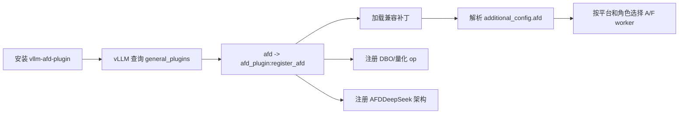
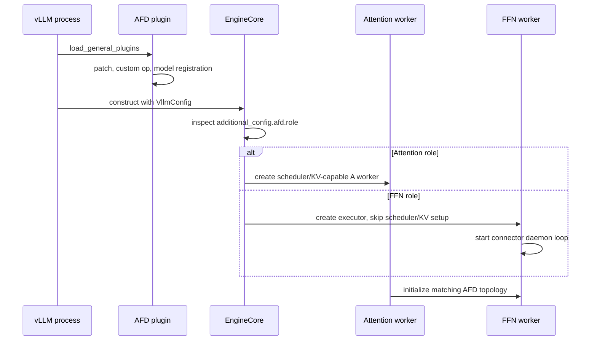
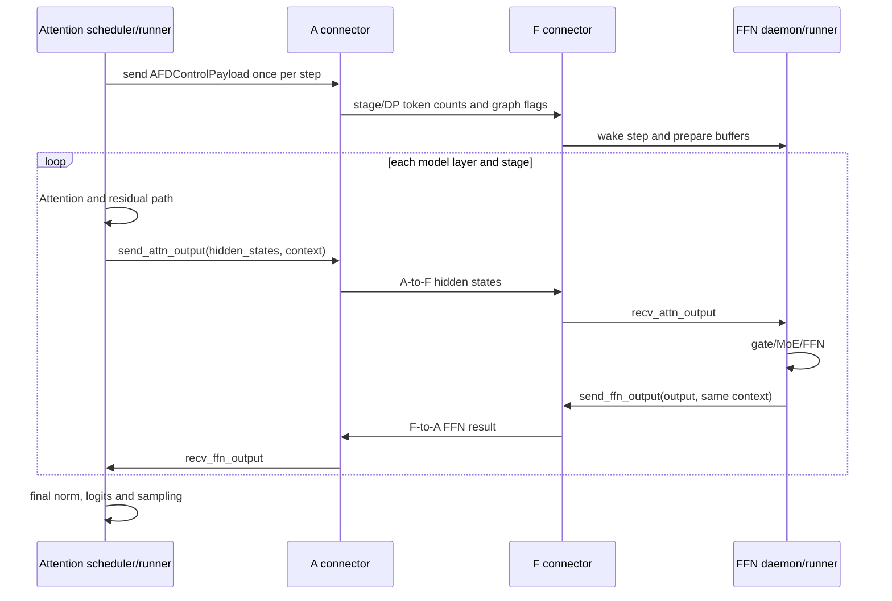

# AFD 架构讨论与实现发现

## 1. 文档范围

本文汇总一次围绕 `afd-plugin` 和配套 vLLM 源码的代码阅读讨论，目标是把零散问题
整理成可以长期复查的实现结论。覆盖范围包括：

- AI 时代理解 AFD 代码应达到的深度；
- vLLM plugin 的发现、加载和 AFD 注入方式；
- AFD patch 与 vLLM 原生代码的边界；
- A→F→A 启动和逐层执行流；
- 仓库目录、新硬件厂商适配和 NPU native ops；
- TP/EP、MoE dispatch/combine 的位置；
- 通信前按 expert 拆 token 的定性与定量分析；
- A/F 之间的 tensor、metadata、控制面和数据面；
- P2P、Async Copy 和完整 GPU Async 的区别；
- NV GPU DBO 当前没有收益的代码级原因。

本文的“代码事实”来自当前仓库和 `<local-vllm-checkout>` 的静态核对；性能判断是
需要目标机器 trace/benchmark 验证的假设。DBO 的完整分析另见
[NV GPU DBO execution and overlap analysis](gpu/NV_GPU_DBO_EXECUTION_ANALYSIS.md)。

---

## 2. 负责 AFD 应理解到什么程度

不要求逐行记住仓库，但应能独立解释下面的因果链：

```text
Python entry point
-> register_afd 和 compatibility patches
-> additional_config["afd"]
-> platform/role worker selection
-> A/F role-aware model construction与权重 ownership
-> scheduler step 控制面
-> 每层 A->F->A 数据面
-> connector stream/process group/native op
-> MoE dispatch/expert compute/combine
-> graph/DBO/async buffer 生命周期
```

建议掌握到四层：

1. **意图层**：能说清各目录、角色和 connector 的职责；
2. **关键路径层**：能从 plugin 入口追到每层 send/recv 和底层通信 op；
3. **正确性与性能层**：能指出 shape、rank mapping、matching order、buffer ownership、
   stream/event、控制/数据面和 graph capture 的不变量；
4. **修改预测层**：增加厂商、移动 gate、改变 ubatch、启用 EP 或 Async 前，能列出
   受影响的配置、通信量、同步点、测试和回退路径。

实用达标标准：

- 能画出启动期和一层 A→F→A 时序；
- 能区分 vLLM 原生逻辑、继承/组合扩展和 monkey patch；
- 能列出 A/F 之间传输以及不传输的状态；
- 能说明同步 P2P 与 CAM async 的 dispatch/combine 差异；
- 能对 `B×H×D`、`B×K×H×D` 和两阶段流水做数量级估算；
- 故障或无收益时知道应检查哪个进程、stream、trace 和 metadata；
- AI 总结与代码冲突时，能用入口、调用链和实际 trace 推翻总结。

一句话原则：**不必读懂 100% 的样板代码，但要读懂 100% 的关键不变量。**

---

## 3. vLLM plugin 机制

### 3.1 `vllm.general_plugins` 的设计初衷

`vllm.general_plugins` 是基于 Python package entry point 的通用启动钩子。第三方包
安装后，vLLM 通过：

```python
importlib.metadata.entry_points(group="vllm.general_plugins")
```

发现回调、导入并执行，无需把第三方实现合入 vLLM 源码。

它解决的是：

> 让 out-of-tree 包在 vLLM 各进程初始化早期注册模型、算子、量化方法、resolver、
> connector backend 或窄范围兼容行为。

配套 vLLM 会在 CLI/EngineArgs 配置构建、EngineCore、WorkerBase，以及模型注册查询的
子进程中调用 `load_general_plugins()`。`plugins_loaded` 只保证**单个进程**加载一次；
分布式部署中的多个进程都会执行，因此回调必须幂等、可重入。`VLLM_PLUGINS` 可以按
entry-point name 过滤插件。

vLLM 的入口组分工如下：

| 入口组 | 主要用途 | 典型加载范围 |
| --- | --- | --- |
| `vllm.general_plugins` | 模型、op、量化、resolver、backend 和通用注册逻辑 | CLI、engine、worker 等多进程 |
| `vllm.platform_plugins` | out-of-tree 硬件平台及默认 worker/backend | current platform 初始化 |
| `vllm.io_processor_plugins` | pooling 模型输入/输出处理 | process 0 |
| `vllm.stat_logger_plugins` | 自定义统计 logger | serve process 0 |

当前 vLLM 自身已经通过 general plugin 注册 filesystem/Hugging Face Hub LoRA resolver；
测试还覆盖 out-of-tree model、自定义 op、KV connector override。可见 general plugin
不只用于模型，但它只是“执行回调”的宽入口，具体能力仍应落在 ModelRegistry、platform、
connector factory 等更窄接口上。

### 3.2 AFD 如何接入

[`pyproject.toml`](../pyproject.toml) 声明：

```toml
[project.entry-points."vllm.general_plugins"]
afd = "afd_plugin:register_afd"
```



[`register_afd()`](../afd_plugin/__init__.py) 的主要动作：

1. 尝试校验目标 vLLM 版本；
2. 导入 EngineCore、配置和 async-DP compatibility patches；
3. 注册 DBO yield custom op；
4. 检测到 vLLM-Ascend 时应用 NPU patch；
5. 注册 W4AFP8 量化；
6. 用 `AFDDeepseek*` 名称注册角色化模型类，不覆盖原生 DeepSeek registration。

`_registered` 保证同一进程重复调用安全；惰性 class path 和模块 `__getattr__` 避免
CPU/macOS import 阶段加载 CUDA/NPU worker。

---

## 4. AFD patch 与 vLLM 原生代码的边界

讨论过的代码：

```python
if _is_afd_ffn_config(vllm_config):
    _initialize_ffn_engine_core(...)
    return
```

**不是 vLLM 原生代码**，来自
[`compat/patches/engine_core.py`](../afd_plugin/compat/patches/engine_core.py)。该 patch
复制目标 vLLM tag 的 `EngineCore.__init__` 主体，在顶部用
`# ### PATCH START/END` 标出 AFD 分支，最后执行：

```python
core_module.EngineCore.__init__ = __init__
```

FFN 进程是 connector daemon，不接普通请求、不需要 request scheduler 和 KV cache；
所以它构造 executor 后提前返回。非 AFD/非 FFN 配置继续执行复制的上游逻辑。该文件
还 patch 了 KV cache 初始化、shutdown 和 busy loop，使“空 KV + 后台 connector loop”
在通用 EngineCore 生命周期中可运行。

判断一段逻辑来源的三步法：

1. 在配套 vLLM 搜索同一符号；
2. 在 `compat/patches/` 检查复制函数和 PATCH marker；
3. 在 patch 文件底部检查 class method reassignment。

插件入口只负责让 patch 有机会加载；真正改变 EngineCore 行为的是运行时方法替换。

---

## 5. A→F→A 的启动与执行流

### 5.1 启动期



### 5.2 同步 P2P/CAMP2P 的每个 scheduler step



同步 connector 的控制面是**每 scheduler step 一次**，不是每层一次；数据面每个 AFD
层都有 A→F 和 F→A。CAM async 没有独立 DP metadata 控制面：dispatch payload 携带
足够的 token/routing 信息，F 收到 connector work item 后直接执行。

ownership 的关键结论：

- A 保留 KV cache、positions、request/scheduler、residual、logits 和 sampling；
- F 保留 FFN/expert 权重和当前 MoE 的临时状态；
- A/F 之间主要交换 activation、FFN output 和恢复 routing/order 所需 metadata。

---

## 6. A/F 之间传输的状态

模型循环中传输的不是文本 token id，而是 token 对应的 activation 及其布局状态。

| 路径 | A→F | F→A | 频率 |
| --- | --- | --- | --- |
| GPU P2P | dense hidden states | dense FFN output | 每 AFD 层 |
| CAMP2P | hidden states；算子把 batch/active 信息保存在 transfer state | FFN output | 每 AFD 层 |
| CAM async | hidden states、top-k expert ids、rank/layer/token counts；可含量化/shared-expert 数据 | routed/shared output，经 combine 恢复原 token 顺序 | 每 MoE 层 |
| 同步控制面 | stage/DP token 数、warmup、graph-capture 标志 | 无对称模型 payload | 每 scheduler step |
| 初始化 | role/rank/topology、endpoint、dtype、hidden size 等 | 握手和 process-group 状态 | 启动期 |

CAM async 的 `AFDAsyncTransferState` 可能包含：

- `batch_size`、`hidden_size`、`topk`、`layer_idx`；
- `TokenNums_Rankid_Layeridx`；
- routed/shared expert token counts；
- `group_list`；
- routed activation dynamic quant scale；
- shared-expert activation 和 scale。

A 保留 `topk_weights`，最终 `combine_recv` 用 ids/weights 恢复并加权。同步 GPU P2P
的 `AFDTransferContext.states` 通常为空，因为它只搬 dense tensor；NPU connector 用
backend-specific transfer state 保存 a2e handle、active mask、group list 等。

不随 A/F 循环传输的关键状态：A 侧 KV cache、input ids、positions、request table、
sampler state、Attention residual；F 侧 expert weights 也不会回传。

---

## 7. 仓库结构与新厂商适配

### 7.1 目录职责

| 目录 | 内容 |
| --- | --- |
| `afd_plugin/compat/` | vLLM/vLLM-Ascend compatibility 和 patches |
| `afd_plugin/connectors/` | AFD connector contract、metadata、factory 及 GPU/NPU 实现 |
| `afd_plugin/distributed/` | AFD process groups、rank topology |
| `afd_plugin/model_executor/` | role-aware DeepSeek model、A/F forward、NPU gate/async flow |
| `afd_plugin/v1/worker/` | GPU A/F workers/runners、CUDA graph、DBO wrapper |
| `afd_plugin/v1/worker/npu/` | NPU A/F workers/runners、ACL graph、NPU ubatching |
| `afd_plugin/quantization/` | plugin-owned quantization registration/implementation |
| `csrc/npu/` | A2E/E2A CANN ops、ACLNN/Torch binding 和构建系统 |
| `recipe/` | 按平台/connector/model 组织的部署配方 |
| `tests/unit`, `tests/e2e` | CPU/unit contract tests 和真实硬件 E2E |
| `docs/design/module/` | 模块边界、ownership、不变量和验证路径 |

更完整的逐文件阅读顺序见 [代码阅读地图](CODE_READING_MAP.md)。

### 7.2 增加不同 GPU/加速器厂商

新厂商不需要复制 NPU a2e/e2a 的名字，而需要实现相同的角色和 connector 语义：

1. 确认 vLLM 已有该厂商 platform plugin、worker、stream、graph 和 communicator；
   没有时先补齐平台层。
2. 基于厂商上游 worker/model runner 实现独立 A/F runtime；不要继承 CUDA AFD runtime。
3. 在 `connectors/<backend>/` 实现初始化/关闭和四个数据面方法；按需提供
   `AFDControlPlane`。
4. 在 factory、配置白名单、worker 自动选择和 feature validation 注册 backend，
   明确同步/异步、graph、DBO、TP/EP 支持矩阵。
5. 厂商 MoE/gate/quant 差异放入独立 backend module，继续复用 shared metadata contract。
6. 只有现有 collective/runtime 不能表达所需通信时才增加 `csrc/<backend>` native ops。
7. 补齐 wheel/build、unit tests、真实硬件 E2E、recipe、环境文档和 profiler。

以 AMD ROCm 为例，当前 GPU connector 硬编码 CUDA stream 和 PyNCCL，不能因为 RCCL
接口相似就直接宣称支持。至少需要抽象 communicator/stream、扩展 worker 选择并实测
ROCm graph、DBO 和异常路径。

---

## 8. `csrc/npu` 与 a2e/e2a

当前结构：

```text
csrc/npu/
├── a2e/
│   ├── op_host/       # definition/proto、shape/dtype inference、tiling、ACLNN API
│   └── op_kernel/     # AscendC kernel、通信参数、data-copy
├── e2a/
│   ├── op_host/
│   └── op_kernel/
├── aclnn_torch_adapter/
│   └── NPUBridge、NPUStorageImpl、op API glue
├── torch_extension/
│   └── torch.ops.afd_ascend binding/meta registration
├── cmake/
├── build_aclnn.sh
├── build.sh
└── CMakeLists.txt
```

- `a2e`（Attention-to-Expert）在 CAMP2P 中完成 A→F activation 搬运，输出 F 侧
  `expand_x`，并产生/保存 `atten_batch_size`、active mask、可选 expert ids/scales。
- `e2a`（Expert-to-Attention）使用 a2e 的 batch/来源信息，把 FFN 结果送回对应 A，
  恢复 A 侧 dense output shape。
- Python 把底层 `torch.ops.afd_ascend.a2e/e2a` 再包装成 vLLM custom ops，方便
  compile/ACL graph。

它们是 **CAMP2pAFDConnector 必需的 native operators**，不是每个新厂商必须实现的
AFD 通用接口：GPU P2P 使用 PyNCCL；CAM async 使用外部 `umdk_cam_op_lib` 的四个
async dispatch/combine ops，都不调用这套 a2e/e2a。

---

## 9. MoE、TP、EP 和 dispatch/combine

### 9.1 AFD 不是仅支持 TP

F 侧 MoE 可以结合 EP。项目 recipe 显式使用 `--enable-expert-parallel`，CAM async
按 `num_ffn_ranks` 分布 routed experts，已验证拓扑包含 EP8。

需要区分：

- A 侧 TP/PCP 拆 Attention；`num_attention_ranks` 可能是 DP×TP/PCP worker 总数；
- F 侧 EP 令不同 F rank 持有不同 experts；
- AFD connector topology 决定 activation 如何从 A 进入 F 集群。

GPU P2P/CAMP2P 在 DP metadata 宽度小于 Attention worker 数时按 TP width 复制 token
count；这是 shape/topology 适配，不代表跨 A/F 已经做 expert dispatch。混合 TP+EP
的效率仍取决于 all-to-all backend、rank mapping、重复 activation 和物理网络。
只能把 recipe 覆盖的组合视为已验证，不能泛化到任意 TP×EP。

### 9.2 dispatch/combine 在 A 还是 F

| 路径 | Gate/路由 | Dispatch | Expert compute | Combine |
| --- | --- | --- | --- | --- |
| GPU P2P / CAMP2P 默认 | F 侧 vLLM MoE | A/F 边界只交接 dense hidden；expert dispatch 在 F 集群内部 | F | F 内完成，dense output 返回 A |
| CAM async / gate-on-A | A | A 发起 async dispatch，CAM 路由 token-expert 副本到 owning F | F 本地 expert | F 发起 combine send，A 用 top-k weights 最终恢复/加权 |

所以不能脱离 connector 回答“dispatch 在哪一侧”。同步路径的 A→F 不是 MoE
dispatch，只是 dense activation handoff；CAM async 才把 expert-aware dispatch/combine
做成 A/F 协议。

---

## 10. 是否应在通信前按 expert 拆 token

若 A 已计算 gate，可以直接按 expert owner 把 token-expert 对发给目标 F，避免先送到
入口 F 再做 F 内 all-to-all。潜在收益：

- 去掉一个中转 hop 和同步点；
- 不把无关 token 发给某个 expert rank；
- routing 与 A→F 融合，便于异步和负载均衡；
- F buffer 已按本地 expert 排列，可直接 grouped GEMM。

但它**不保证总字节数下降**。设 token 数 `B`、hidden size `H`、元素大小 `D`、top-k
为 `K`：

```text
dense A->F handoff:              B * H * D
expert-aware dispatch:           B * K * H * D  （忽略本地命中/量化）
```

top-k 会复制 activation。如果旧方案向 `E` 个 F rank 广播完整 hidden，则预路由可把
`E*BHD` 降到约 `K*BHD`，收益约 `E/K`；但当前 P2P 主要是 A rank 到映射 F rank，
不是简单广播。完整成本更像：

```text
旧路径：BHD 的 A->入口F
      + 约 2*K*BHD*remote_fraction 的 F 内 dispatch/combine
      + BHD 的 F->A

直达路径：约 K*BHD 的 A->expert F
        + K*BHD 的 expert contribution 返回，或 F 先聚合后的 BHD
```

直达 dispatch 常减少 hop、同步和 F 侧中转 buffer，但字节是否减少取决于：

- `K`、expert 数、本地命中和负载倾斜；
- 原路径是映射、广播还是 all-to-all；
- activation 是否 INT8/FP8；
- combine 在 F 先聚合还是返回 K 份 contribution；
- shared expert、padding 和零 token expert 的处理。

评估时应同时统计总字节、跨节点字节、消息数、hop、负载倾斜、dispatch kernel 成本
和端到端 TTFT/TPOT，不能只看一次 A→F tensor 大小。

---

## 11. P2P、Async Copy 与完整 GPU Async

P2P 与 Async 不是互斥方案：

- **P2P** 描述端点/传输语义：一个设备直接向另一个设备传输。NCCL send/recv、
  `cudaMemcpyPeerAsync`、RDMA 都是实现方式。
- **Async Copy** 描述提交/执行：copy enqueue 后 CPU 不等待，用 stream/event 表达
  readiness。它可能是同机 peer copy，也可能仍经通信库。

当前 GPU connector 已经 host-asynchronously 调用 `ncclSend/ncclRecv`，但使用当前
compute stream；F 侧也是串行 receive→compute→send。缺少的是端到端 scheduling，
不是 API 名字里没有 `Async`。

完整 GPU Async 至少需要：

1. A/F 两侧独立 compute/comm stream；
2. compute-done、send-done、recv-done events；
3. 每 ubatch/stage ping-pong buffer 和明确 ownership；
4. 提前 post receive，到下一层消费时才 wait；
5. F 侧数据到达驱动的 work queue；
6. NCCL matching order、backpressure、错误传播和 shutdown；
7. raw peer copy 场景的 peer access、remote pointer/IPC 和跨节点 fallback；
8. multi-stream graph capture 与 stable-address buffer；
9. NCCL/compute 同时占 SM 时的资源隔离和 profiling。

只把现有 send/recv 移到另一个 stream 会破坏当前依赖的同 stream 正确性：send 没有
返回 completion handle，recv 也没有把 event 交给消费者，buffer 可能被提前读取或覆盖。

---

## 12. NV GPU DBO 无收益的当前判断

结论不是“P2P API 不异步”，而是**stream-level async 没有闭环**：

- AFD DBO 创建 comm stream，却只调用保留当前 stream 的普通 `dbo_yield()`；
- P2P custom op 使用 `torch.cuda.current_stream()`；
- F 按 layer/stage 串行 recv→FFN→send；
- 当前主要只形成 `F计算ubatch0 || A计算ubatch1` 的跨设备部分流水；
- 没有同一 GPU 的 communication||compute；
- DBO 把一条大消息变两条小消息，总字节不变、P2P 调用约翻倍；
- half-batch GEMM 效率、A/F 不平衡和每 step 控制面固定成本都可能吃掉收益。

简化模型：完整 batch 的两阶段耗时为 `X+Y`，两个 half batch 的理想流水是：

```text
Xh + max(Xh, Yh) + Yh + overhead
```

两侧均衡时，每个 half stage 需低于 full stage 的约 `2/3` 才容易获益。因此补齐异步
是必要方向，但不能保证单独完成后一定提速。完整时序、定量例子和改造方案见
[DBO 专题](gpu/NV_GPU_DBO_EXECUTION_ANALYSIS.md)。

---

## 13. 仍需在目标环境验证的事项

静态阅读不能回答：

1. NV 实验 step 是否真的切出两个 non-empty ubatch；
2. half-batch Attention/FFN kernel 相对 full batch 的缩放效率；
3. NCCL 与 compute 的实际 stream、SM 占用和重叠；
4. A/F imbalance、链路带宽、消息大小和控制面占比；
5. pre-dispatch 在目标 top-k、量化和跨节点拓扑下减少多少 hop/字节；
6. 新厂商 backend 的 graph、DBO、collective 和异常路径是否符合契约。

性能/功能实验应先读
[`experiment/EXPERIMENT_ENV.md`](../experiment/EXPERIMENT_ENV.md)，并在远程
`gpu-host` 的 `afd-exp` 环境执行，不能用开发本机结果替代。
