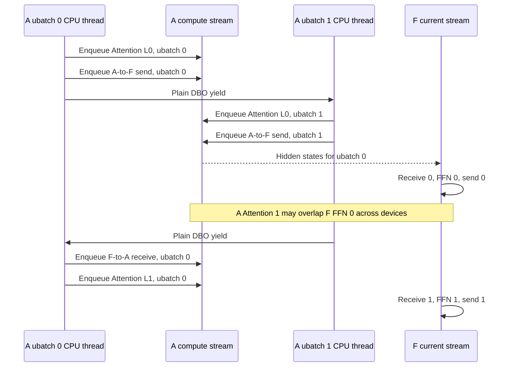

# NV GPU DBO execution and overlap analysis

## Scope

This document records a static code analysis of Dual Batch Overlap (DBO) on
the CUDA `P2pNcclAFDConnector` path. It explains what currently overlaps, why
enabling DBO may show little or no performance benefit, and what must change to
build a complete asynchronous Attention-to-FFN-to-Attention pipeline.

This is not a benchmark result. The conclusions below identify code-level
capabilities and performance hypotheses that must be confirmed with a GPU
timeline on the target system.

## Executive conclusion

The current NV GPU implementation is not missing asynchronous NCCL submission:
`PyNcclCommunicator.send()` and `recv()` enqueue NCCL work on a CUDA stream.
The missing part is end-to-end asynchronous scheduling:

- AFD submits P2P communication to the current compute stream instead of the
  DBO communication stream.
- The A-side DBO hook performs a CPU-thread yield without switching streams or
  recording CUDA event dependencies.
- The F side processes each layer and ubatch as a serial
  `receive -> FFN -> send` sequence on its current stream.
- The control plane blocks once at the beginning of each scheduler step before
  the F side can post data-plane receives.

DBO still creates a partial two-device pipeline: while F computes ubatch 0, A
can compute Attention for ubatch 1. It does not currently overlap communication
with computation on the same GPU. Therefore incomplete asynchronous scheduling
is a primary explanation for missing DBO gains, but it is not a sufficient or
exclusive explanation. Smaller-kernel efficiency, doubled message count,
A/F imbalance, and fixed control-plane overhead can independently consume the
theoretical gain.

## Three meanings of asynchronous

It is useful to distinguish three levels that are otherwise easy to conflate:

1. **Host-asynchronous API:** the CPU enqueues `ncclSend` or `ncclRecv` without
   waiting for the device transfer to finish. The current connector has this.
2. **Stream-level overlap:** communication runs on a communication stream while
   independent kernels run on a compute stream, with CUDA events expressing
   buffer readiness and completion. The current connector does not wire this
   into DBO.
3. **Pipeline-level overlap:** Attention for one ubatch runs on A while FFN for
   another ubatch runs on F. The current two-ubatch schedule has part of this.

Changing to another API named "async" would not by itself add the second or
third level.

## DBO activation and batch splitting

The Attention runner obtains the upstream DBO decision and adds an AFD-specific
single-DP-rank decision in
[`AFDAttentionModelRunner._determine_batch_execution_and_padding`](../../afd_plugin/v1/worker/attention_model_runner.py).
This matters because upstream vLLM normally returns early when DP size is one.
The AFD path checks the configured decode/prefill threshold and prevents an
empty trailing ubatch.

When DBO is active, `AFDUBatchWrapper` builds two ubatch contexts and executes
the model from two CPU threads. Only one ubatch CPU thread runs at a time; a
manual yield transfers submission control to the other thread. Both contexts
receive the same compute stream, while the wrapper also creates a shared
communication stream.

The presence of `--enable-dbo` alone is not proof that a particular scheduler
step was split. A trace or debug log should confirm that `should_ubatch` is true
and `ubatch_slices` contains two non-empty slices for the measured steps.

## Current data-plane execution

### Attention side

The AFD DeepSeek forward path in
[`deepseek_v2.py`](../../afd_plugin/model_executor/models/deepseek_v2.py) has
the following layer loop:

```text
if this is not the first layer:
    receive the previous layer's FFN output
run the Attention-side layer work
send hidden states to F
yield to the other ubatch thread

after the final layer:
    receive the final FFN output
```

Delaying the receive until the next layer gives the other ubatch a chance to
submit work. The yield is implemented by
[`maybe_apply_dbo_yield`](../../afd_plugin/v1/worker/dbo.py). On CUDA it calls
upstream `dbo_yield()`, which switches the active CPU thread but preserves the
current CUDA stream.

Upstream vLLM also provides
`dbo_yield_and_switch_from_compute_to_comm()` and
`dbo_yield_and_switch_from_comm_to_compute()`. Those operations record CUDA
events, switch streams, and install the required waits. The current AFD GPU
path does not call them. Native DeepEP DBO is a useful reference because it
uses these stream-switching operations and receive hooks around dispatch and
combine.

### P2P connector

The custom operators in
[`connectors/gpu/p2p.py`](../../afd_plugin/connectors/gpu/p2p.py) call:

```python
communicator.send(
    tensor,
    dst,
    stream=torch.cuda.current_stream(tensor.device),
)

communicator.recv(
    out,
    src,
    stream=torch.cuda.current_stream(out.device),
)
```

The DBO context starts on the compute stream, and the AFD yield does not change
that stream. Consequently, A-side Attention kernels, A-to-F sends, F-to-A
receives, and the next Attention kernels are ordered on the same CUDA stream.

The custom send operator returns no completion handle, and the receive operator
mutates its output without returning an event. Correctness currently relies on
same-stream ordering. Moving the calls to another stream therefore also
requires explicit completion events and buffer-lifetime management.

`AFDUBatchWrapper` creates a communication stream, but this execution path does
not switch to it. In addition, AFD replaces upstream DBO SM control with a null
context. If communication is later moved to a concurrent stream, NCCL/compute
SM contention will need to be measured and the SM-control decision revisited.

### FFN side

[`GPUFFNModelRunner._ffn_forward`](../../afd_plugin/v1/worker/ffn_model_runner.py)
uses a layer-major, stage-minor loop:

```text
for each layer:
    for ubatch 0, then ubatch 1:
        receive Attention hidden states
        execute FFN
        send FFN output
```

The F worker is not running these stages inside DBO ubatch contexts. It does
not pre-post the second receive on a communication stream while computing the
first ubatch, and it does not send one ubatch concurrently with computing the
other. Its stream-level data path is serial.

## Current two-ubatch sequence



An approximate A-side stream order is:

```text
Attn L0/u0 -> Send L0/u0 -> Attn L0/u1 -> Send L0/u1
-> Recv L0/u0 -> Attn L1/u0 -> Send L1/u0
-> Recv L0/u1 -> Attn L1/u1 -> ...
```

The useful overlap window is primarily `A Attention/u1 || F FFN/u0`. P2P work
on either GPU is not independently scheduled against compute work on that GPU.
An early receive on the same compute stream can also create head-of-line
blocking for kernels queued behind it.

## Control-plane behavior

Before each model step, the Attention runner constructs one payload containing
the per-stage token metadata and sends it to F. The implementation in
[`connectors/metadata.py`](../../afd_plugin/connectors/metadata.py) sends a size
tensor and an encoded payload with blocking `torch.distributed.send()` calls.
The FFN loop in
[`ffn_worker.py`](../../afd_plugin/v1/worker/ffn_worker.py) blocks in
`recv_dp_metadata_list()` before executing the data-plane loop.

This exchange occurs once per scheduler step, not once per layer, so it is not
normally the dominant A/F bandwidth cost. It is nevertheless a fixed decode
latency, includes device/host materialization on receive, and prevents F from
posting data receives before the step metadata arrives. DBO keeps the number
of control transactions per step constant but increases the payload from one
stage entry to two.

## Communication volume and operation count

The current P2P path transports full hidden states. For `B` tokens, hidden size
`H`, and element size `D` bytes, the round-trip payload per layer is:

```text
2 * B * H * D bytes
```

For example, `B=64`, `H=7168`, and BF16 (`D=2`) produce approximately
1.75 MiB per layer for the A-to-F plus F-to-A round trip.

Splitting into two ubatches does not reduce these bytes. It changes one message
in each direction into two smaller messages, approximately doubling the
send/receive operation count and associated launch/protocol overhead. Smaller
messages may also achieve lower effective bandwidth. DBO can only hide this
traffic; it does not eliminate it.

Computing routing on A and transferring only dispatched expert-token payloads
is a separate optimization. It can reduce replicated or irrelevant traffic,
but requires an A-side gate, dispatch metadata, expert ownership mapping, and a
combine path. It should not be conflated with stream-level DBO overlap.

## Performance model

Let:

- `X` be full-batch A compute plus A-to-F transfer time;
- `Y` be full-batch F compute plus F-to-A transfer time;
- `Xh` and `Yh` be the corresponding times for one half batch.

Without DBO, the simplified per-layer time is:

```text
T_no_dbo = X + Y
```

With two jobs in an ideal two-stage pipeline:

```text
T_dbo = Xh + max(Xh, Yh) + Yh + overhead
```

If the two sides are balanced and half-batch execution scales linearly,
`Xh=X/2` and `Yh=Y/2`; DBO reduces elapsed time by 25% and improves throughput
by about 33%. If one side is three times slower than the other, the ideal
elapsed-time reduction falls to about 12.5%. With a ten-to-one imbalance, it is
only about 4.5%.

For balanced sides, ignoring fixed overhead, each half-batch stage must take
less than roughly two thirds of the full-batch stage time for two-ubatch DBO to
win. A concrete example is:

```text
Full batch: X=1.0 ms, Y=1.0 ms
No DBO:     2.0 ms

Ideal halves: Xh=0.5 ms, Yh=0.5 ms
Ideal DBO:    0.5 + 0.5 + 0.5 = 1.5 ms

Inefficient halves: Xh=0.75 ms, Yh=0.75 ms
Actual DBO:        0.75 + 0.75 + 0.75 = 2.25 ms
```

Thus a correct two-device pipeline can still lose when smaller Attention/MoE
kernels, extra communication launches, CPU yields, graph padding, or control
overhead make half-batch execution insufficiently cheaper.

## Findings and confidence

| Finding | Static evidence | Expected effect |
| --- | --- | --- |
| NCCL P2P is host-asynchronous | PyNccl send/recv receive a CUDA stream | CPU does not wait for transfer completion at the API boundary |
| A-side P2P uses the compute stream | Connector uses `torch.cuda.current_stream`; AFD only calls plain `dbo_yield` | No same-GPU communication/compute overlap |
| A/F compute has partial overlap | Two A ubatch threads alternate after each send | F ubatch 0 can overlap A Attention ubatch 1 |
| F stages are serial | Layer/stage loop performs receive, compute, send in order | No F receive/FFN/send overlap across ubatches |
| DBO does not reduce bytes | Both halves transport full hidden-state slices | Same total payload, more messages |
| Control plane is blocking per step | Blocking send/recv of encoded DP metadata | Fixed step latency and delayed F receive posting |
| Half-batch efficiency is unknown | Requires target-GPU profiling | Can erase all ideal pipeline gains |

The first six rows follow directly from the current code structure. The final
performance impact and the dominant bottleneck require measurement.

## Required measurements

The first profiling pass should answer the following questions:

1. Did the measured decode/prefill steps actually create two non-empty
   `ubatch_slices`?
2. Do NCCL send/recv kernels appear on the same CUDA stream as Attention and
   FFN kernels on both roles?
3. How much of `A Attention/u1` overlaps `F FFN/u0` today?
4. What are `X`, `Y`, `Xh`, and `Yh` for representative concurrency and token
   counts?
5. Does halving the batch reduce major GEMM/kernel time close to 50%, or only
   modestly?
6. What fraction of each step is control-plane time, NCCL time, device idle
   time, CUDA graph replay, and CPU scheduling?
7. Are P2P kernels limited by message size, NCCL launch overhead, link
   bandwidth, or SM contention?

Use Nsight Systems to inspect CUDA stream lanes and cross-process NVTX ranges,
then use Nsight Compute or focused kernel timing only after the timeline has
identified the dominant kernels. Compare DBO on/off at the same total token
count and concurrency; otherwise scheduler batching differences can dominate
the comparison.

## Proposed GPU asynchronous execution design

A complete implementation should be event- and lifetime-driven rather than an
API substitution:

1. After A computes an ubatch, record a compute-done event.
2. On an A communication stream, wait for that event, send the hidden states,
   and post the matching F-to-A receive into a dedicated ubatch buffer.
3. Immediately allow the A compute stream to run independent Attention work
   for the other ubatch.
4. Before the next layer consumes an FFN result, wait on a receive-complete
   event instead of placing an early blocking receive on the compute stream.
5. On F, pre-post receives for both ubatches on a communication stream. Launch
   FFN when the corresponding receive event completes.
6. Send an FFN result on the communication stream while the compute stream
   starts independent FFN work for the other ubatch, when resource contention
   permits.
7. Use per-ubatch ping-pong buffers. Do not overwrite an A hidden-state buffer
   with the FFN result until its A-to-F send has completed.
8. Preserve deterministic NCCL P2P matching order across ranks and streams.
9. Establish eager-mode correctness and timeline overlap before adding
   multi-stream CUDA graph capture/replay.
10. Re-evaluate SM allocation because NCCL kernels and FFN/Attention kernels
    can contend even when they occupy different streams.

The current custom-op contract may need an explicit event or work-handle layer,
or the connector must manage events internally. Merely submitting the existing
operators on `comm_stream` would risk reading incomplete receives or reusing
buffers before sends finish.

## Decision rule

The working diagnosis is:

> Incomplete stream-level asynchronous scheduling is a primary limitation of
> current NV GPU DBO, but DBO should not be expected to improve performance
> until a trace also shows that half-batch kernel efficiency and A/F balance
> leave enough latency to hide.

The implementation priority should therefore be: verify the current timeline,
measure half-batch scaling, prototype event-based communication streams on both
A and F, and only then tune graph capture, SM allocation, or token-level
dispatch/combine.
