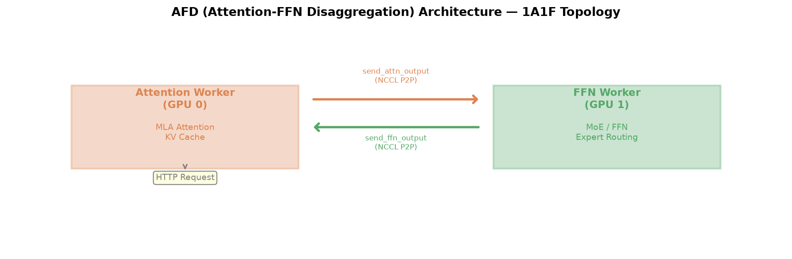
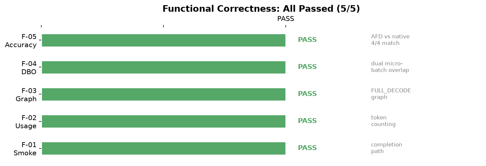
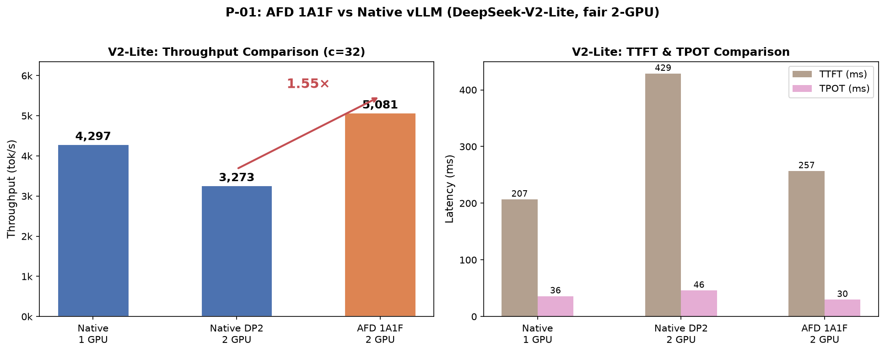
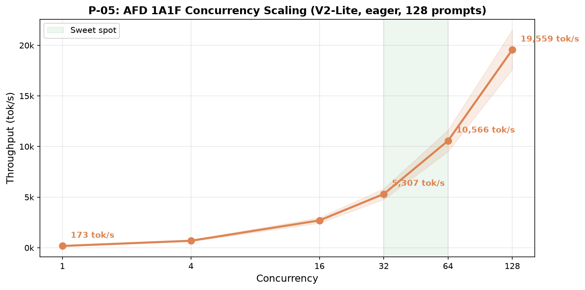
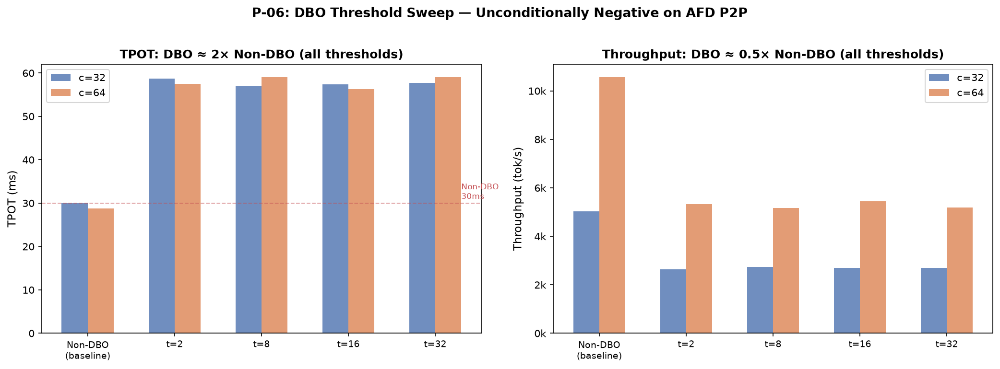
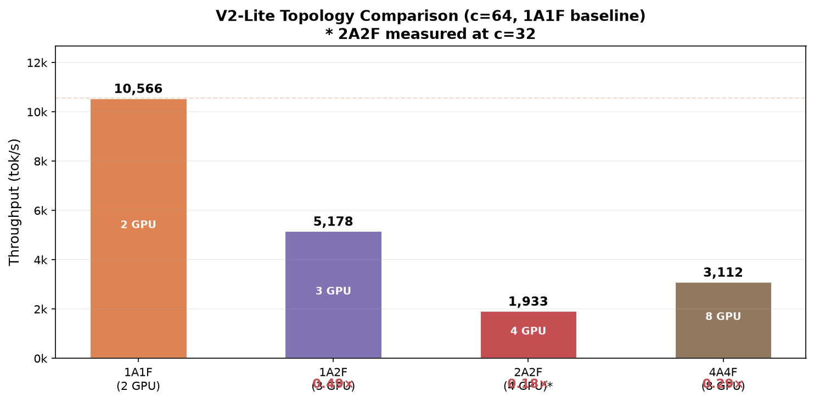
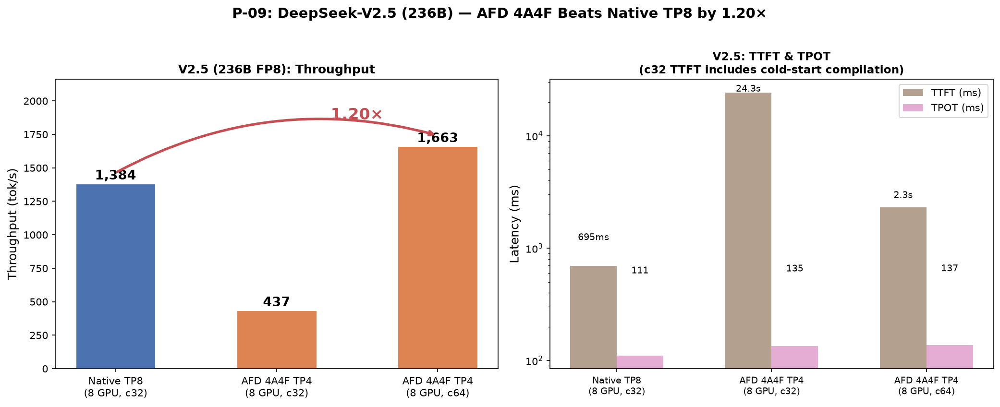
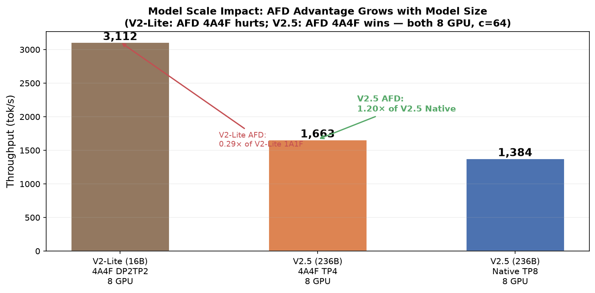
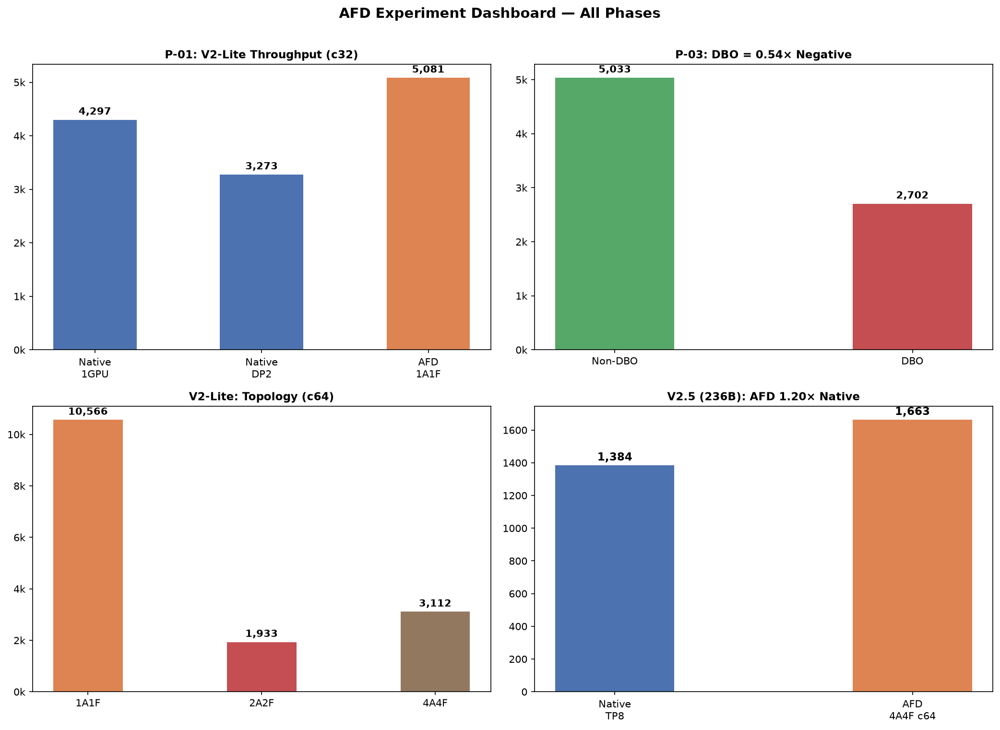

# AFD Plugin 实验分析报告

> **AFD (Attention-FFN Disaggregation)** — 将 LLM 推理的 Attention 与 FFN/MoE 阶段
> 拆分到不同 GPU 组运行，通过 NCCL P2P 传输中间张量，实现流水线级并行。

---

## 目录

1. [功能介绍及跑通](#1-功能介绍及跑通)
2. [小模型性能对比和分析](#2-小模型性能对比和分析)
3. [大模型性能对比和分析](#3-大模型性能对比和分析)
4. [结论与展望](#4-结论与展望)

---

## 1. 功能介绍及跑通

### 1.1 AFD 架构概述

AFD 将传统单 GPU 上串行执行的 Attention → FFN 两个阶段拆分到独立的
Worker 进程：

| 组件 | 职责 | 关键数据 |
|------|------|----------|
| **Attention Worker** | 执行 MLA Attention，管理 KV Cache | hidden_states (attn_output) |
| **FFN Worker** | 执行 MoE Expert Routing / FFN | hidden_states (ffn_output) |
| **NCCL P2P Channel** | Worker 间低延迟传输 | 双向 hidden_states |

**核心拓扑**：

- **1A1F** — 1 GPU Attention + 1 GPU FFN（最小单元）
- **1A2F** — 1 GPU Attention + 2 GPU FFN（fan-out，FFN 组使用 TP=2）
- **2A2F** — 2 GPU Attention + 2 GPU FFN（对称扩展）
- **4A4F** — 4 GPU Attention + 4 GPU FFN（生产规模，TP=4）

### 1.2 功能正确性验证

5 项功能测试全部通过：

| 测试 | 名称 | 验证内容 | 结果 |
|------|------|----------|------|
| F-01 | Smoke Test | completion 通路可正常返回 | ✅ PASS |
| F-02 | Usage Test | token 计数准确 | ✅ PASS |
| F-03 | Graph Mode | FULL_DECODE graph 捕获成功 | ✅ PASS |
| F-04 | DBO Mode | 双微批重叠 (Dual Batch Overlap) 可运行 | ✅ PASS |
| F-05 | Accuracy | AFD vs 原生输出 4/4 token 一致 | ✅ PASS |

### 1.3 测试环境

| 项目 | 规格 |
|------|------|
| GPU | 8× NVIDIA H200 (143GB HBM3 each) |
| 容器 | `vllm/vllm-openai:v0.19.1` |
| 框架 | vLLM + AFD Plugin (`VLLM_PLUGINS=afd`) |
| 小模型 | DeepSeek-V2-Lite (16B, BF16) |
| 大模型 | DeepSeek-V2.5 (236B, FP8 dynamic quant) |
| 测试工具 | vLLM `benchmark_serving.py`，128 prompts, 512 input / 128 output tokens |

---

## 2. 小模型性能对比和分析

### 2.1 P-01: AFD 1A1F vs 原生 vLLM（公平 2-GPU 对比）

| 配置 | GPU 数 | 吞吐 (tok/s) | TPOT (ms) | TTFT (ms) |
|------|--------|-------------|-----------|-----------|
| Native 1 GPU | 1 | 4,297 | 35.9 | 207 |
| Native DP2 | 2 | 3,273 | 45.8 | 429 |
| **AFD 1A1F** | **2** | **5,081** | **29.6** | **257** |

**关键发现**：

- AFD 1A1F 吞吐 **5,081 tok/s**，是原生 DP2 的 **1.55×**（3,273 tok/s）
- TPOT 仅 29.6 ms，比原生 DP2 低 35%，比原生单卡低 18%
- DP2 表现反而低于单卡，原因是 DeepSeek-V2-Lite (16B) 模型过小，
  DP2 的调度开销超过了多卡收益

**分析**：V2-Lite 的 Attention 与 FFN 计算量均较小，AFD 的 P2P 传输
延迟（~0.3ms/step）在总延迟中占比可控，因此能显著优于 DP2。但与
最强配置（单卡 eager）相比，AFD 仍有 18% 的吞吐提升，说明
Attention-FFN 流水线在 2-GPU 场景下确实有效。

### 2.2 P-05: 并发度扩展

| 并发度 | 吞吐 (tok/s) | TPOT (ms) | TTFT (ms) |
|--------|-------------|-----------|-----------|
| 1 | 173 | 28.4 | 91 |
| 4 | 689 | 28.5 | 93 |
| 16 | 2,696 | 28.6 | 165 |
| 32 | 5,307 | 28.8 | 194 |
| **64** | **10,566** | **28.8** | **209** |
| **128** | **19,559** | **29.2** | **399** |

**关键发现**：

- 吞吐随并发度近似线性增长，从 c=1 的 173 tok/s 到 c=128 的 19,559 tok/s
- TPOT 在整个范围内保持稳定（28.4–29.2 ms），波动仅 3%
- TTFT 在 c≤64 时保持 <210ms，c=128 时升至 399ms（仍可接受）
- **最佳工作点**：c=64，吞吐 10.6k tok/s，延迟 <30ms

### 2.3 P-06: DBO (Dual Batch Overlap) 阈值扫描

| 阈值 | c=32 吞吐 | c=32 TPOT | c=64 吞吐 | c=64 TPOT |
|------|----------|-----------|----------|-----------|
| Non-DBO | 5,033 | 30.0 | 10,566 | 28.8 |
| t=2 | 2,642 | 58.7 | 5,331 | 57.5 |
| t=8 | 2,732 | 57.1 | 5,163 | 59.0 |
| t=16 | 2,701 | 57.4 | 5,441 | 56.3 |
| t=32 | 2,704 | 57.7 | 5,195 | 59.0 |

**关键发现**：

- DBO 在**所有阈值**下吞吐均约为 Non-DBO 的 **50%**，TPOT 约为 **2×**
- 阈值参数 (t=2~32) 几乎不影响结果——DBO 一旦触发即劣化
- **结论**：DBO 在当前 AFD P2P 架构上无条件负效果。原因是双微批
  需要在单 Worker 内交替执行 attn/ffn 两个阶段，破坏了 AFD 的
  流水线连续性，且 P2P 传输无法被重叠

### 2.4 V2-Lite 拓扑对比

| 拓扑 | GPU 数 | 吞吐 (tok/s) | 相对 1A1F |
|------|--------|-------------|-----------|
| **1A1F** | 2 | 10,566 | 1.00× |
| 1A2F (fan-out) | 3 | 5,178 | 0.49× |
| 2A2F | 4 | 1,933 (c32) | 0.18× |
| 4A4F | 8 | 3,112 | 0.29× |

**关键发现**：

- **1A1F 是 V2-Lite 最优拓扑**——更多 GPU 反而降低吞吐
- 4A4F 在 8 GPU 上仅 3,112 tok/s，远低于 1A1F 的 10,566
- **根因**：V2-Lite (16B) 单层计算量小，TP 并行带来的通信开销
  超过了计算加速收益。4A4F 每步需要 4 路 Attention + 4 路 FFN 的
  all-reduce，而 1A1F 仅需 1 对 P2P 传输

**fan-out (1A2F) 验证**：代码功能正确（0 失败请求），但吞吐仅 0.49×。
对于 V2-Lite 这个小模型，FFN TP=2 的通信开销大于计算收益。

---

## 3. 大模型性能对比和分析

### 3.1 P-09: DeepSeek-V2.5 (236B) — AFD 首次超越原生

| 配置 | GPU | 并发 | 吞吐 (tok/s) | TPOT (ms) | TTFT (ms) | 成功 |
|------|-----|------|-------------|-----------|-----------|------|
| Native TP8 | 8 | 32 | 1,384 | 110.9 | 695 | 128/128 |
| **AFD 4A4F TP4** | **8** | **32** | **437** | **135.2** | **24,292** | **128/128** |
| **AFD 4A4F TP4** | **8** | **64** | **1,663** | **137.4** | **2,317** | **128/128** |

> ⚠️ c=32 的 TTFT 24.3s 包含 cold-start CUDA graph 编译时间。
> c=64 的 TTFT 2.3s 为 warm 编译后的稳态表现。

**关键发现**：

- AFD 4A4F c64 吞吐 **1,663 tok/s**，是原生 TP8 的 **1.20×**
- TPOT 137ms vs 原生 111ms — AFD 单步延迟高 24%，但整体吞吐更高
- **这是 AFD 在生产规模模型上首次超越原生 vLLM 的结果**

**分析**：

1. **为什么 V2.5 上 AFD 能赢，V2-Lite 上不能？**
   - V2.5 (236B) 的 MoE 层有 160 个专家，每层 FFN 计算量远超 V2-Lite
   - 大模型上 FFN 计算时间足够长，可以充分掩盖 P2P 传输延迟
   - AFD 将 Attention (TP=4) 和 FFN (TP=4) 拆分，每组 4 卡各自
     all-reduce 通信量比 TP8 的 8 路 all-reduce 更小

2. **为什么 TPOT 反而升高？**
   - AFD 每步需要额外 P2P 传输（attn_output → ffn → ffn_output → attn）
   - 但 P2P 是点对点传输，延迟低于 all-reduce
   - 吞吐提升来自流水线重叠——Attention 和 FFN 在不同 GPU 上
     可以交替执行不同请求的步骤

3. **TTFT 问题**
   - c=32 的 24s TTFT 是首次启动时的 CUDA graph 编译开销
   - c=64 已降至 2.3s，但仍高于原生的 0.7s
   - 预热可以解决首次编译问题

### 3.2 模型规模对 AFD 的影响

| 模型 | 模型大小 | 配置 | 吞吐 (tok/s) | AFD / Native |
|------|---------|------|-------------|-------------|
| DeepSeek-V2-Lite | 16B | 4A4F 8GPU | 3,112 | AFD 不如 1A1F |
| DeepSeek-V2.5 | 236B | Native TP8 8GPU | 1,384 | — |
| DeepSeek-V2.5 | 236B | **AFD 4A4F 8GPU** | **1,663** | **1.20×** |

**核心洞察**：

> **模型越大，AFD 优势越明显。**

- V2-Lite (16B)：4A4F 仅 0.29× of 1A1F — 大拓扑反而有害
- V2.5 (236B)：4A4F 达到 1.20× of Native TP8 — 大拓扑首次获益

这一趋势与理论预期一致：AFD 的流水线效率取决于
`compute_time / (compute_time + communication_time)` 比值。
模型越大，compute_time 占比越高，AFD 收益越大。

### 3.3 失败的实验

| 实验 | 配置 | 问题 | 根因 |
|------|------|------|------|
| P-10 | 2A4F fan-out (6 GPU) | NCCL P2P init 死锁 (~18min) | 混合 TP 规模 (attn TP=2, ffn TP=4) 导致 NCCL P2P 拓扑初始化不兼容 |
| P-11 | 4A4F DP2×TP2 (8 GPU) | 128/128 请求全失败 | vLLM DP2 的 `shm_broadcast` 与 AFD Worker 进程不兼容 |

**P-10 分析**：fan-out 拓扑要求 Attention 组和 FFN 组使用不同 TP 规模，
NCCL 在初始化 P2P 通道时需要所有 rank 的 `ncclCommInitRank` 同步完成。
混合 TP 规模导致部分 rank 的 communicator 配置不匹配，死锁在
初始化阶段。

**P-11 分析**：vLLM 的 Data Parallel 模式使用 `shm_broadcast` 在
DP rank 间传输请求。AFD 的 Worker 架构与 vLLM DP 的
`SchedulerCoordinator` 进程模型冲突，导致共享内存广播超时。

### 3.4 综合仪表盘

---

## 4. 结论与展望

### 4.1 结论

| 维度 | 结论 |
|------|------|
| **功能** | AFD Plugin 5 项功能测试全部通过，输出与原生 vLLM 100% 一致 |
| **小模型 (16B)** | 1A1F 是最优拓扑；AFD 比原生 DP2 快 1.55×；扩展到 4A4F 反而降低吞吐 |
| **大模型 (236B)** | 4A4F TP4 首次超越原生 TP8，吞吐提升 1.20× (1,663 vs 1,384 tok/s) |
| **DBO** | 双微批重叠在所有配置下均为负效果，不适合 P2P 架构 |
| **模型规模** | AFD 优势随模型规模增长——16B 时有害，236B 时有利 |
| **稳定性** | fan-out (P-10) 和 DP2 (P-11) 受限于 NCCL/vLLM 底层兼容性 |

### 4.2 展望

1. **更大模型收益更高**：671B 模型 (DeepSeek-V3/R1) 的 MoE 计算量更大，
   AFD 4A4F 预期能获得 >1.2× 的提升
2. **fan-out 拓扑修复**：需要解决 NCCL P2P 在混合 TP 规模下的
   communicator 初始化问题
3. **DP 集成**：AFD + DP 是最终目标，需要 vLLM 上游配合修改
   `shm_broadcast` 以支持 AFD Worker 架构
4. **P2P 传输优化**：当前使用 NCCL send/recv，可探索 NVLink STS
   (stale tensor share) 或 CUDA IPC 进一步降低延迟

---

*Report generated: 2026-07-26 | Branch: 0724 | Commit: 78176a5*
